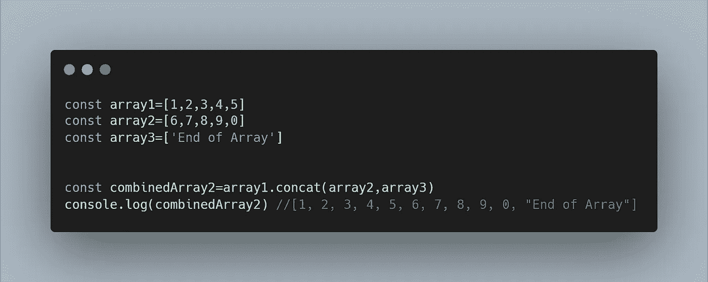
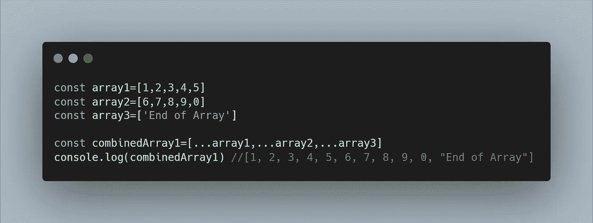

# 如何在 JavaScript 中以两种不同的方式合并数组

> 原文：<https://javascript.plainenglish.io/how-to-merge-arrays-in-2-different-ways-in-javascript-b3c261d58ed3?source=collection_archive---------13----------------------->

## 关于在 JavaScript 中组合数组，您只需要知道


Photo by [Edge2Edge Media](https://unsplash.com/@edge2edgemedia?utm_source=medium&utm_medium=referral) on [Unsplash](https://unsplash.com?utm_source=medium&utm_medium=referral)

操纵数组是每个 JavaScript 开发人员都应该掌握的技能。

在今天的文章中，我将和你分享在 JavaScript 中组合数组的两种方法。

让我们直接进入它。

# **1。使用数组。Concat()**

第一种方法使用数组。Concat()方法来组合多个数组。

它的语法如下:

```
*array.concat(array2,array3,….)*
```

下面我还有一个展示数组的例子。Concat()的实际应用:



Using Array.Concat() to combine 3 Different Arrays

***注:*** *关于阵的一些注意事项。Concat()的一个优点是它不改变现有的数组，而是返回一个新的数组。*

# 2.使用扩展运算符

第二种方法是使用 JavaScript spread 操作符来合并数组。

其语法如下:

```
newArray=[…array1,…array2,…]
```

下面是一个使用 spread 运算符合并数组的示例:



Using the spread operator to merge arrays

# 结论

感谢您阅读完我的文章**‘如何在 JavaScript 中以两种不同的方式合并数组’**。我希望你有美好的一天。如果你是中级新手，你可以点击这里的[链接加入](https://bookeraziz.medium.com/membership)

[](/the-6-javascript-arithmetic-operators-you-need-to-know-about-4255ae8f2502) [## 您需要了解的 6 个 JavaScript 算术运算符

### JavaScript 中的数学不一定是可怕的…

javascript.plainenglish.io](/the-6-javascript-arithmetic-operators-you-need-to-know-about-4255ae8f2502) [](/8-react-native-libraries-you-absolutely-need-to-know-about-28f6038d0b76) [## 你绝对需要了解的 8 个 React 原生库

### 当谈到使用 React Native 创建应用程序时，找到正确的库可以使开发过程变得更加…

javascript.plainenglish.io](/8-react-native-libraries-you-absolutely-need-to-know-about-28f6038d0b76) [](/5-great-resources-to-kick-start-your-computer-science-career-ffb243ec8e6d) [## 启动你的计算机科学职业生涯的 5 大资源

### 如果让我重来一次，我会选择的路。

javascript.plainenglish.io](/5-great-resources-to-kick-start-your-computer-science-career-ffb243ec8e6d) 

*更多内容看* [***说白了。报名参加我们的***](http://plainenglish.io/) **[***免费每周简讯点击这里***](http://newsletter.plainenglish.io/) ***。*****