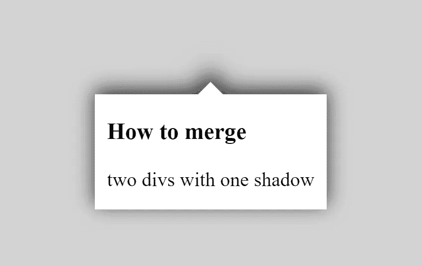
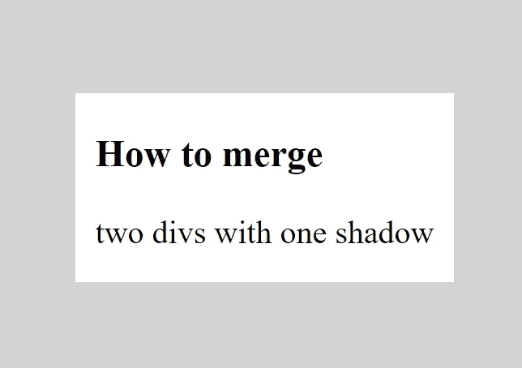
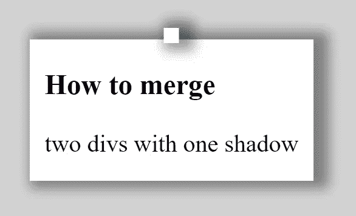
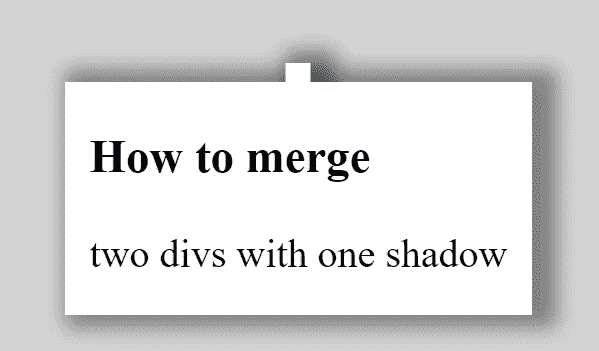
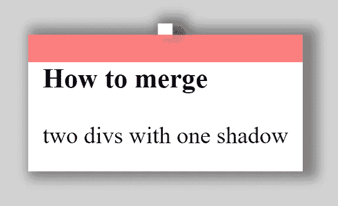
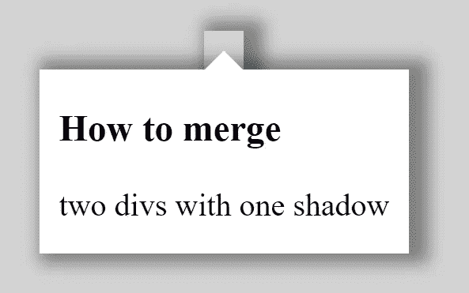
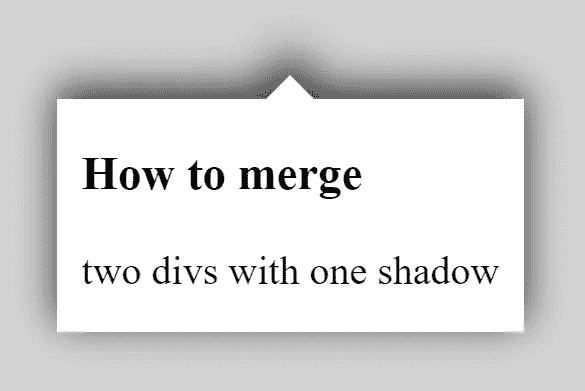

# 如何用一个阴影合并两个 div

> 原文：<https://javascript.plainenglish.io/how-to-merge-two-divs-with-one-shadow-444ccb8ad2fb?source=collection_archive---------6----------------------->

## CSS ::before 和::after 伪选择器创建一个只有一个阴影的不规则形状

在这篇文章中，我们将讨论如何用阴影创建一个如下的形状。这通常是很多开发者问的关于如何将两个

合并成一个阴影的问题。

(顺便说一下，你最好知道如何[创建一个三角形](https://ckmobile.medium.com/how-to-create-a-triangle-with-css-border-d0be06be491a)和[创建一个简单的工具提示](https://ckmobile.medium.com/create-tooltip-by-using-css-d56ff8d1ccc3)，视频教程可以在[这里](https://www.youtube.com/watch?v=X1rybfFNcBk&t=2s)和[这里](https://www.youtube.com/watch?v=9CV0K46KWxc)找到。)



[访问源代码](https://www.youtube.com/channel/UCu4-4FnutvSHVo9WHvq80Ww/join)

但实际上，我们不打算创建两个

，而是使用:after 和:before 伪元素。

首先，我们将在 index.html 内部创建以下 div。

```
<div class="card"><h3>How to merge </h3><div>two divs with one shadow</div></div>
```

然后我们在 styles.css 中添加下面的 css，主体的 CSS 是为了让卡片居中。`.card`用于创建卡片样式。

```
body{height:100vh;background-color:lightgray;display:flex;justify-content:center;align-items: center;}.card {width: 40%;background-color:white;width:fit-content;position: relative;padding:0.1px 10px 15px 10px;}
```



## 在卡片上加一个小方块

我们在卡片上加了一个小方块。对于内容、变换和左等属性，已经在“[如何创建工具提示](https://ckmobile.medium.com/create-tooltip-by-using-css-d56ff8d1ccc3)”教程中进行了解释。

```
.card::before{position:absolute;height: 10px;width:10px;content:'';background-color:white;left:50%;transform: translate(-50%,-80%);}
```

如果我们给`.card`和`.card::before`都加上阴影

```
.card, .card::before{box-shadow: 5px 0px 8px 5px rgba(0,0,0,0.4);}
```



我们可以看到它们不是一体的，它们是分开的，有各自的影子。

## 使用::after 覆盖阴影

如果我们像下面这样加上`.card::after`。我们设置背景颜色和`.card`一样。

```
.card:after {height:100%;width:100%;background:white;position:absolute;top:0;left:0;content:'';}
```

你会看到卡上的所有内容都被覆盖了。所以我们需要调整高度，所以它只覆盖顶部的阴影。



如果你把这部分变成红色(或其他颜色)并降低不透明度，你会看到它是如何覆盖阴影的。



## 如果卡片顶部的形状不是正方形，则略有不同

这一次，我们用一个三角形代替顶部的正方形。

```
.card::before{position:absolute;content:'';border: 10px solid  transparent;border-bottom-color: white;left:50%;transform:translate(-50%,-100%);}
```



你可以结果，它不是一个带阴影的三角形，而是一个带阴影的透明正方形。因为它实际上是一个正方形，我们只是使它的一部分透明。

为了解决这个问题，我们使用“投影”而不是“方框阴影”。

```
.card,.card:before{filter: drop-shadow(0 -4px 8px #333);}
```



# 关注我们: [YouTube](https://www.youtube.com/channel/UCu4-4FnutvSHVo9WHvq80Ww?sub_confirmation=1) ， [Medium](https://ckmobile.medium.com/) ， [Udemy](https://www.udemy.com/user/cyruschan2/) ， [Linkedin](https://www.linkedin.com/company/ckmobi/) ， [Twitter](https://twitter.com/ckmobilejavasc1) ， [Instagram](https://www.instagram.com/ckmobile8050) ， [Gumroad](https://app.gumroad.com/ckmobile)

加入分支机构赚钱

[](https://ckmobile.gumroad.com/affiliates) [## Gumroad

### 申请成为会员很容易。填写下表，让 Ckmobile 知道您将如何推广他们的…

ckmobile.gumroad.com](https://ckmobile.gumroad.com/affiliates) 

*更多内容请看*[*plain English . io*](http://plainenglish.io/)*。报名参加我们的* [*免费周报在这里*](http://newsletter.plainenglish.io/) *。*