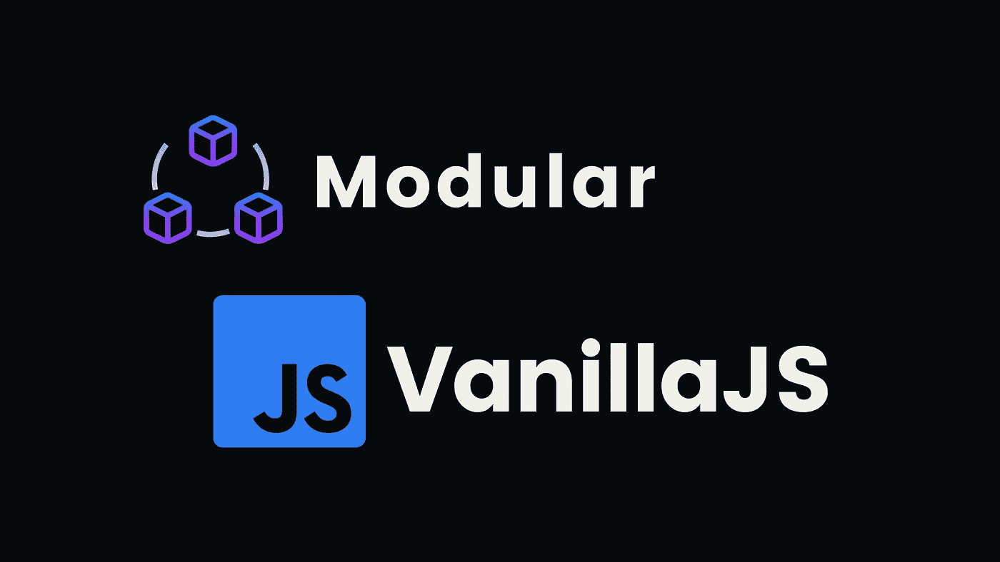
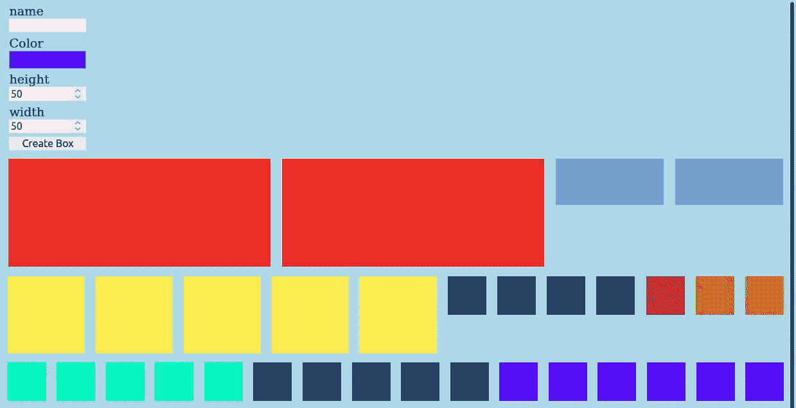

# 如何使用“导入”和“导出”将普通 JavaScript 中的代码模块化

> 原文：<https://javascript.plainenglish.io/how-to-modularize-code-with-vanilla-javascript-use-import-export-ce41c5481957?source=collection_archive---------0----------------------->



**简介**

在这篇博客中，我们将讲述如何使用关键字`import`和`export`来将一个普通的 JavaScript 项目模块化。最好的部分是我们将只使用纯 HTML、CSS 和 JavaScript。没有`node`或`npm`，只是普通的老式 JavaScript。

首先，创建一个新的项目文件夹，文件结构如下:

```
my-project-name /─┐
 js/─┐
     ┊ classes.js
     ┊ selectors.js
     ┊ main.js
 index.html
 style.css
```

也许这一切中最好的部分就是它真的很容易做到。简单地把一个脚本放到你的 HTML 文档的`<head></head>`中。

注意:**如果你只是想知道*如何做的答案，*复制并粘贴下面的代码片段。**

有了这个设置，我们现在可以在文件中使用`import`和`export`。

# 盒子创建者——编码。

为了演示如何使用`import`和`export`，我们将创建一个盒子生成器，没什么特别的，只是一些简单的样式和一些基本代码。

首先，继续为您的`style.css` 文件设置一个样式表。您可以通过将以下内容添加到文档的`<head></head>`中来实现。

然后我添加一些基本的风格。

然后将添加一些输入到我们的 HTML 文档以及一个按钮来创建所说的框。

# 现在来看看 JavaScript

现在我们有了一些样式，我们可以开始添加 JavaScript 了。在`selectors.js`文件中，我们将放入以下内容。

注意我们是如何使用`export`的。如果你不熟悉 Webpack，关键字`export`允许我们在文件上使用`import`，然后是用户函数和变量等。重要的是要记住，如果你在一个值不是函数的变量上使用`export`，这个变量将只有一个自身的实例。

我喜欢让我的代码尽可能的有条理，看起来也漂亮，所以我决定最好是把所有的选择器都放在一个文件里。当普通 JavaScript 中的项目变得更加广泛时，您将不得不在同一个元素上多次使用`querySelector` ,所以最好有一种只编写一次代码的方法。

现在在我们的`classes.js`文件中，让我们为`Box`创建一个定制的 JavaScript 对象，首先需要为所有的盒子和来自`selectors.js`的`createBox` 函数`import`创建一个数组。

**注意:**因为我们没有使用 Webpack，所以我们没有清除文件路径的简单方法。这意味着我们必须非常具体地说明我们使用的文件扩展名以及文件所在的目录。如果我们试着这样`import`一个文件:

我们会被抛出一个错误。所以要确保你所有的导入看起来都是这样的，`'./myfileLocation.whateeverExt'`如果你这样做了，你就准备好了。

接下来，我们想要创建一个`class`、`Box`，它将接受一个`name`、`color`、`height`和`width.`

这将允许我们拥有同一个对象的多个实例。请记住，我使用的是`Math.random()` 内置对象方法，因为在 0 和 1 之间有无限可能的数字，所以我们两次获得相同数字的可能性几乎为零。然而，这并不是生成`ID`的好方法，如果您真的要将它存储在 DB 中，那么使用`cuid NPM`包会更好。然而，我只是将它用于演示目的。

我们需要有一种方法将所有输入值添加到`Box`类中。所以在`main.js`文件中，让我们为此创建一个函数，并为我们的按钮添加一个`eventListener`。

将`classes.js`中的`Box`和 `import` 中的`class`以及所有的输入选择器、储盒元件，以及`selectors.js`中的按钮。

现在将创建一个向 DOM 添加一个框的函数。

并添加一个事件侦听器，该事件侦听器将在按钮被单击时使用该函数。

您会注意到，如果我们尝试并测试我们的代码，什么都不会工作，这是因为我们必须向我们的 Box 类添加一个实例方法。回到我们的`classes.js`文件中，让我们将下面的代码添加到 Box 类中。

现在，回到 main.js 内部，我们可以使用我们的实例方法来初始化这个盒子。

最后，为了结束代码，我们需要创建一个函数，将我们创建的每个框附加到 DOM 中。

请记住，`initBox`方法将`div`元素推入 box 数组，我们从`clasess.js.`导入`boxes` 数组

当该说的都说了，该做的都做了，我们应该能够成功地创建一个盒子，并给它一个名称、颜色、高度和宽度。

决赛成绩



Box Creator For Modular Vanilla JavaScript

# 结论

希望本教程在某种程度上对你有所帮助。这是有益的，特别是如果你被要求为未来的雇主创建一个普通的 JavaScript 项目，以证明你在不使用 Webpack 或 Node 的情况下模块化代码的技能。如果你对本教程有任何问题，或者有任何建议的编辑，我鼓励你留下评论，或者如果你有什么想让我进一步解释的细节。