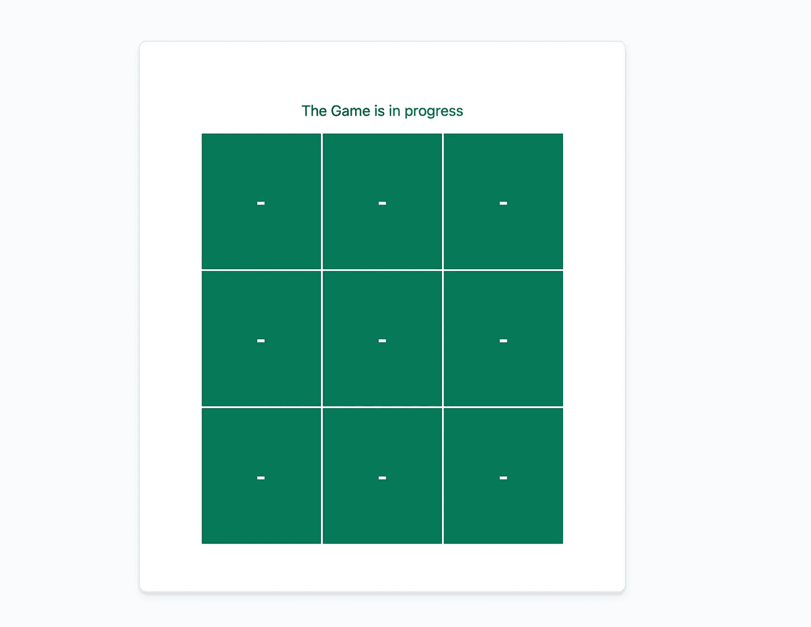

# 如何从有棱角的动作平稳地做出反应

> 原文：<https://javascript.plainenglish.io/how-to-move-from-angular-to-react-smoothly-76db1ff20bfb?source=collection_archive---------4----------------------->

## 使用 Typescript 的提示和技巧。

## 想使用 React 的 Angular 用户指南。

Photo by [Juanjo Jaramillo](https://unsplash.com/@juanjodev02?utm_source=medium&utm_medium=referral) on [Unsplash](https://unsplash.com?utm_source=medium&utm_medium=referral)

当你长时间使用 Angular 时，你会有这样的印象:把你的脚放在 **React** 中就像接受生活在丛林中一样。我重复一遍，这是一个**印象**😅，至少当时是**矿**。

这种**印象**是由这样一个事实驱动的，即**良好实践**因人而异，大多数良好实践仅仅是由他人的经验驱动的。我有一种印象，而且不仅仅是一种印象，每个人都以自己的方式组织事情，并且没有一个通用的指导方针来确保一个新的开发人员能够在 React 中很好地组织他们的增长。

这种做事方式允许你快速地做某事，但不是以一种可持续的方式。在这个漫长的秘密实验之后，我决定写一篇文章，给那些新来的反应者提供一条更容易遵循的道路，尤其是那些来自 Angular 的人。

在本文的最后，您会发现一个演示项目的链接，它将帮助您更清楚地了解这里陈述的技巧。

Tic-Tac-Toe Demo App

***走吧！***

# 1.使用类型脚本

使用 TypeScript 有助于您的迁移做出反应，因为您保留了在使用 Angular 时获得的一组良好实践。这可以让你远离许多不好的习惯。

尽管使用 TypeScript 受到了许多 React 爱好者的谴责，他们发现这是又一个需要学习的元素，但在我看来，正确使用 **JavaScript** **的能力仍然是正确的方式**。

您可以通过以下命令使用 TypeScript 创建 React 应用程序:

`**npx create-react-app name-of-app --template typescript**`

而对于还在犹豫要不要学 Typescript 的，我让你链接到官网。**享受打字稿！**

 [## 带有类型语法的 JavaScript。

### TypeScript 通过向语言中添加类型来扩展 JavaScript。TypeScript 通过以下方式加速您的开发体验…

www.typescriptlang.org](https://www.typescriptlang.org) 

# 2.在学科中自由

我们必须承认，React 提供的自由使它成为前端开发中的一个基本元素。与 Angular 相比，这种自由度使其学习曲线更低。**有一样东西仍然很重要，你不能滥用它！**

即使 React 类似于雷德·哈斯汀斯的《没有规则的规则》一书，我们也应该承认，建立良好的实践会让我们轻松地使用这种自由。

我们将在下面几行中看到一些最佳实践，它们是我从早期发现的经验证的 React 用户那里复制的，也是我从 Angular 导入的。

## a.成分

React 和 Angular 一样是面向组件的。在其组织中，它更加灵活，因为它不需要像它的竞争对手那样将组件链接到模块。所以它的组件的重用更容易，没有太多曲折。

## a.1.了解 JSX

> JSX 是 JavaScript 的语法扩展

JSX 是 React 组件中定义用户界面的新方法，它不是 HTML，即使它在语法上看起来更像 javascript，而是 JavaScript 的扩展，允许用 Javascript 编写 HTML。

通过下面的链接熟悉这种语法及其应用。

 [## 介绍 JSX - React

### 考虑这个变量声明:这个有趣的标记语法既不是字符串也不是 HTML。它叫 JSX，是一个…

reactjs.org](https://reactjs.org/docs/introducing-jsx.html) 

## a.2 组件声明

React 给出了两种声明组件的方法，这在我看来还是很有意思的。

 [## 组件和道具-反应

### 组件可以让你将用户界面分割成独立的、可重用的部分，并独立地考虑每一部分。这一页…

reactjs.org](https://reactjs.org/docs/components-and-props.html) 

## a.2.1 个组件作为类别

您可以将组件定义为一个类，为此您应该掌握使用状态的概念和 React 组件的生命周期。

为了深化主题，您可以遵循这两个链接上的文档。

 [## 状态和生命周期-反应

### 本页介绍了 React 组件中状态和生命周期的概念。你可以找到详细的组件 API…

reactjs.org](https://reactjs.org/docs/state-and-lifecycle.html)  [## 做出反应。成分-反应

### 该页面包含 React 组件类定义的详细 API 参考。它假设您熟悉…

reactjs.org](https://reactjs.org/docs/react-component.html) 

## a.2.2 组件作为功能

React 提供了一种通过函数定义组件的强大而令人信服的方法。这是在 React universe 中定义组件的最常见方法。

为了在这个组件定义中取得成功，React 提供了钩子，允许使用定义为函数的组件，就像使用类型类的组件一样。

为了更好地理解钩子、它们的实用程序和它们的使用，React 通过下面的链接提供了优秀的文档。

 [## 介绍钩子-反应

### 钩子是 React 16.8 中的新增功能。它们允许您使用状态和其他 React 特性，而无需编写类。这个…

reactjs.org](https://reactjs.org/docs/hooks-intro.html) 

## **b .服务业**

将服务用于应用程序的业务逻辑，服务将表示不直接链接到组件但可以在组件中使用的操作。

不要将你的应用程序的业务逻辑与一个组件耦合，这将导致你的几个组件的冗余，这与 **DRY** (不要重复你自己)逻辑相反。

对于这个建议，应用 React 在其文档中建议的代码分割逻辑来减轻应用程序的负担。

 [## 代码分解-反应

### 大多数 React 应用程序会使用 Webpack、Rollup 或 Browserify 等工具“捆绑”文件。捆绑是一个过程…

reactjs.org](https://reactjs.org/docs/code-splitting.html) 

服务只是我从角组织取的名字，你可以随意命名这个部分。

## c.构建你的。/src 文件夹

尽管结构化有时会有所不同，但是在您的组织内定义良好的实践以避免迷失方向是很重要的。/src 文件夹

例如，一个好的组织需要:

- **组件**有它们自己的文件夹，在其中它们根据共同的任务或者不是共同的任务被分组(取决于你是在构建一个大的还是小的应用程序)

- **页面**根据路由是否将用户发送到一个页面或另一个页面来分组。(一个页面可以由一个或多个组件组成)

- **服务**在它们的文件夹中，文件夹由包含应用程序业务逻辑的文件组成。(例如:文件`subscriber.service.tsx`包含了**用户**的所有必要操作——crud)

简而言之，在学科中享受反应的自由将允许一个或另一个组织更好地完成它的工作。尤其是给这些工程师发展所需的生产力。

当你从棱角分明的地方学起反应来并不奇怪。掌握这两种环境可以让你对市场需求更加开放。毕竟你是老板，你会看到什么对你好。

这篇文章想帮助那些想尝试 React 但是对 Angular 粉丝俱乐部有很多偏见的人。我希望能为你的学习之路提供指导。

点击此处了解演示项目👇

 [## GitHub - ShekMak/tic-tac-toe:创建这个示例应用程序是为了提供一种从…

### 创建此示例应用程序是为了提供一种使用 typescript 开始 React 的方法，并提供一些好的提示。…

github.com](https://github.com/ShekMak/tic-tac-toe) 

如果可能的话，通过部署的应用程序与朋友一起玩，因为这样更有趣😊。

 [## React 应用

### 使用 create-react-app 创建的网站

shekmak.github.io](https://shekmak.github.io/tic-tac-toe/) 

# 参考

 [## react——用于构建用户界面的 JavaScript 库

### React 使得创建交互式 ui 变得不那么痛苦。为应用程序中的每个状态设计简单的视图，并反应…

reactjs.org](https://reactjs.org) 

视频:

1️⃣[2021 年 React 初学者速成班](https://www.youtube.com/watch?v=Dorf8i6lCuk)

2️⃣ [向斯克林巴学习反应](https://scrimba.com/learn/learnreact)

3️⃣[react 组件从初学者到大师的打字稿](https://www.youtube.com/watch?v=z8lDwLKthr8)

*更多内容看* [***说白了. io***](http://plainenglish.io/)