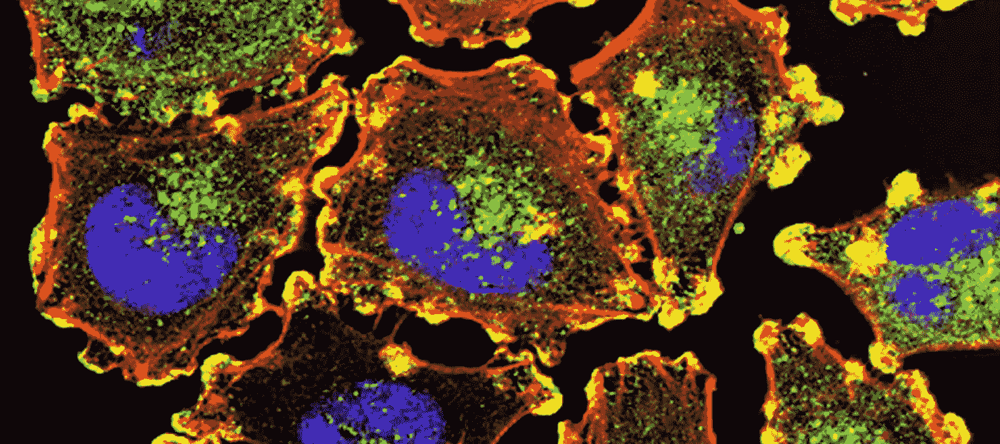

# 如何在不使用 JavaScript 框架的情况下观察 DOM 的变化

> 原文：<https://javascript.plainenglish.io/how-to-observe-changes-to-the-dom-without-using-a-javascript-framework-38eee2c65822?source=collection_archive---------10----------------------->

## 使用变异观察器来观察和识别任何 DOM 元素发生的变化



Photo courtesy of the National Cancer Institute on Unsplash

大约十年前，我在 web 应用程序中使用 jQuery 来操作文档对象模型(DOM)。jQuery 已经被 Angular、Backbone 和 React 等其他框架所取代。这些框架几乎已经成为 web 开发的标准。

几年前，我遇到过这样一种情况，我必须观察特定 DOM 元素的变化，并删除 WebView 中由另一个框架添加的任何子元素。虽然在该框架中更改代码而不添加这些不必要的 DOM 元素会更理想，但我没有这个选择。

# 欢迎突变观察者

变异观察器允许您监控对 DOM 所做的任何更改，并在需要时运行您自己的代码。如果添加、删除任何元素或者添加或更改属性，则可以使用该代码。突变观察者是我们从浏览器免费获得的 Web APIs 之一。

我们使用这个 API 的一个常见场景是，如果一个`div`元素被添加到一个特定的部分，并且我们想要添加一个事件监听器用于鼠标悬停。

MutationObserver 需要一个构造函数，该函数用于处理这些突变。构造函数将突变列表和一个观察器作为参数。

在定义了一个 MutationObserver 之后，您还需要选择想要观察的元素或节点，并在 MutationObserver 对象上调用 Observer 函数。observe 函数有两个参数，一个是要观察的元素，另一个是我们要传递给观察者的选项。

# 变异观察器选项

变异观察器让我们传递许多不同的选项来观察我们想要观察的东西。您可以观察正在观察的 DOM 元素的树结构下的所有项目。您还可以观察元素的属性变化。为了让观察者观察到一个节点，至少`childList`、`attributes`和/或`characterData`必须为真。以下是您可以传递的不同选项的列表。

*   子树
*   子列表
*   属性
*   属性过滤器
*   attributeOldValue
*   字符数据
*   characterDataOldValue

# 单击监听器示例

一个我们如何使用变异观察器的例子是，如果我们向一个 HTML 中的元素添加一个 div 元素，并且我们想在鼠标经过该元素时向 div 元素添加一个事件监听器。“让我们”创建一个 id 为“div_section”的节；

```
<section id="div_section"></section>
```

现在让我们写一些 JavaScript 来添加一个`div`元素到这个部分。

```
const section = document.querySelector('#div_section');let my_div_element = document.createElement('div');my_div_element.className = 'div_element';my_div_element.textContent = `My content goes here`;section.appendChild(my_div_element);
```

一旦 JavaScript 被执行，产生的 HTML 将如下所示。

```
<section id="div_section"> <div class="div_element">My content goes here</div></section>
```

现在，让我们编写一个事件处理程序，在事件被触发时打印 console.log。

```
function eventMouseOver(event) { console.log('This element was just moused over');}
```

现在，我们可以编写一个变异观察器，以便在任何时候向我们的部分添加一个带有类`div_element`的新的`div`元素时添加这个事件监听器。

现在，每当有人将鼠标放在我们的 div 元素上时，我们都会得到一条 console.log 消息，表明鼠标已经被放在上面。

下面是一个完整的例子。

# **结论**

正如我们在上面的例子中看到的，变异观察者给了 web 开发人员很多控制 DOM 的能力。尤其是在用例中，我们可能需要使用另一个框架，这个框架可能以我们无法控制的方式操纵我们的 HTML。

我的场景中有一些框架不断遍历整个 DOM 寻找变化。当您使用突变观察者 API 时，这是不必要的。查看下面的文档。

[](https://developer.mozilla.org/en-US/docs/Web/API/MutationObserver) [## 变异观察器-Web API | MDN

### MutationObserver 接口提供了监视对 DOM 树进行更改的能力。它被设计成…

developer.mozilla.org](https://developer.mozilla.org/en-US/docs/Web/API/MutationObserver) 

*最初发布于*[*https://fek . io*](https://fek.io/blog/how-to-observe-changes-to-the-dom-without-using-a-java-script-framework/)*。*