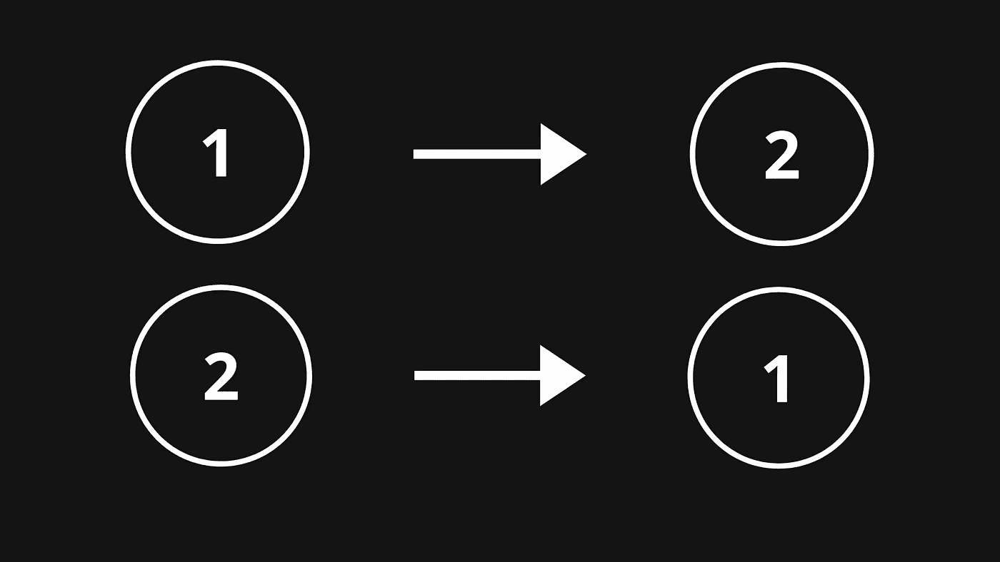
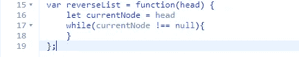
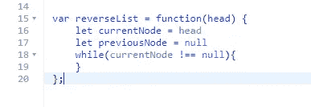
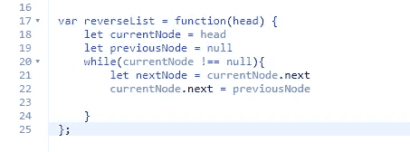
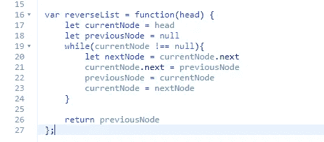

# 如何在 JavaScript 中优化反转链表

> 原文：<https://javascript.plainenglish.io/how-to-optimally-reverse-a-linked-list-in-javascript-bb330060764b?source=collection_archive---------19----------------------->



## **简介**

你在求职中可能会遇到的一个非常常见的编码面试问题是一个经典问题“你能反转一个链表吗？”。在这篇博客中，我将向你展示如何使用 JavaScript 中的迭代解决方案来逆向链表。注意:解将是 O(n)时间和 O(1)空间复杂度，最终代码在文章底部。

## **遍历链表**

如果你想遍历一个链表，你需要实现一个 while 循环来检查你的节点是否到达了链表的末尾。为此，您需要跟踪当前节点，并检查它是否等于 null，如下所示:



## **设置上一个节点**

我们将使用这个循环结构来遍历链表，但是现在我们必须考虑如何反转它。这其实比你想象的简单多了！理论上我们要做的就是把我们的当前节点设置成指向它的前一个节点。所以如果我们有 1 -> 2，我们设置 2 指向 1。这将意味着我们以 2 -> 1 结束。但是我们必须弄清楚如何获取链表中头部的前一个节点(第一个元素)。前一个节点类似于最后一个节点之后的下一个节点，因为它不存在。所以我们可以说我们之前的节点是空的，就像这样:



## **指向前一个节点**

现在我们可以开始填充循环，让我们迭代的每个节点指向列表中的前一个节点。我们将通过设置一个“next node”变量来实现，我们将在这个变量中存储列表中的下一个节点。之后，我们希望当前节点指向前一个节点。我们通过设置指针(。next)到前一个节点，就像这样:



## **到达下一个节点**

现在我们要做的就是将我们的前一个节点设置为列表中的下一个节点，这将是我们的当前节点(把它想象成向后)。我们希望将当前节点设置为下一个节点，如下所示:



如你所见，一旦我们跳出循环，我们将返回最后一个先前的节点，它现在是我们的头节点。

## **代码**

```
var reverseList = function(head) {
    let currentNode = head
    let previousNode = null
    while(currentNode !== null){
        let nextNode = currentNode.next
        currentNode.next = previousNode
        previousNode = currentNode
        currentNode = nextNode
    }

    return previousNode
};
```

**结论**

这就是你反转链表的方法！这可能有点令人困惑，所以我建议为每一行创建一个 console.log，看看这个循环是如何工作的。感谢阅读！

**来源:**

[](https://leetcode.com/problems/reverse-linked-list/) [## 反向链表- LeetCode

### 提高你的编码技能，迅速找到工作。这是扩展你的知识和做好准备的最好地方…

leetcode.com](https://leetcode.com/problems/reverse-linked-list/) 

*更多内容请看*[***plain English . io***](https://plainenglish.io/)