# 如何优化浏览器中的长任务(阻塞 Javascript)

> 原文：<https://javascript.plainenglish.io/how-to-optimize-long-tasks-blocking-javascript-in-browsers-d49508f72c9?source=collection_archive---------5----------------------->

## 如何优化可能在浏览器中阻塞和减慢操作的 JavaScript 任务。

Photo by [Danial Igdery](https://unsplash.com/@ricaros?utm_source=medium&utm_medium=referral) on [Unsplash](https://unsplash.com?utm_source=medium&utm_medium=referral)

在本文中，我们将了解 JavaScript 执行如何阻止浏览器执行的重要操作。其中一些对于增强*用户体验的***核心 Web 生命周期非常关键，尤其是对 100ms 内的用户交互做出响应(稍后将详细介绍)。****

****我们还将介绍如何找到这些阻塞任务以及优化它们的策略。这将导致一个更高性能的网站，从而更好的用户体验。****

# ****浏览器中是什么阻塞了 Javascript 还是一个长任务？****

****浏览器使用单线程，也称为 ***主线程*** ，来执行多种操作，如解析 HTML、javascript 执行、样式计算、重排、将像素渲染到屏幕等。****

****每当这个主线程忙于执行一个需要超过***50 毫秒*** 才能完成的任务时，这个主线程就被称为*阻塞，这个任务就被称为 ***长任务。********

****在其他任务中，主线程最常见和最繁重的任务通常是 Javascript 的 ***解析和执行。不足为奇的是，通常是 javascript 执行阻塞了主线程(需要超过 50 毫秒才能完成)。*******

# ****什么原因导致 JavaScript 任务需要超过 50 毫秒才能完成？****

****最常见的情况是，在两种情况下，javascript 执行需要超过 50 毫秒才能完成:****

1.  ****一个 ***同步*** 函数，可能会被递归调用或做一些繁重的处理等。****
2.  ****具有多个`**.then**` (或`.catch` ) 处理程序的承诺链。由于 promise 处理程序在微任务队列中排队，并且微任务队列中的任务被连续执行，直到队列为空，它可能最终阻塞主线程的时间超过 50 毫秒(我们将在后面的示例中看到这一点)。****

*****为什么选择 50ms 作为长任务的阈值？这将在下一节中介绍。*****

# ****我们为什么要关心这些漫长的任务？****

****如前所述，大多数任务都是由主线程完成的。如果我们的主线程被 javascript 执行阻塞，比如在页面加载的初始阶段，一些重要的任务可能会被延迟。这可能会对 [**核心网页要害**](https://web.dev/vitals/) 事件产生不利影响，像 [**第一内容油漆**](https://web.dev/fcp/) 和 [**最大内容油漆**](https://web.dev/lcp/) 这些事件对页面排名起主要作用。*通常，一些长任务属于第三方库。*****

****此外，根据 [RAIL 模型](https://web.dev/rail/#response:-process-events-in-under-50ms)，如果用户在 100 毫秒内没有对他们的输入、按钮点击等行为做出任何反应，他们倾向于认为网站缓慢或滞后。****

*****这就是选择 50 毫秒作为长任务阈值的原因。这个想法是允许主线程每隔 50 毫秒(如果没有长任务)处理一次用户输入的事件处理程序。执行这些事件处理程序可能需要一些时间，为此，我们保留了 50 毫秒的缓冲时间，因此用户输入和网站反应之间的总延迟达到 100 毫秒。*****

****这在这个[页面](https://web.dev/rail/#response:-process-events-in-under-50ms)上有详细介绍，值得一读！****

## ****网速或 CPU 速度慢****

****除了我们的代码，对网站性能起重要作用的另外两个主要因素是网络速度和 CPU 能力。并非所有用户都拥有最佳的网络速度或 CPU 能力，尤其是移动用户。****

****比方说，如果长任务由于 CPU 速度慢而阻塞了主线程，主线程可能没有机会处理用户输入。如果网站没有针对这种情况进行优化，用户可能会不耐烦并很快离开。****

## ****灯塔绩效评分****

****除了上面提到的对第一内容油漆和最大内容油漆的潜在影响，长任务是降低灯塔测试中测量的[总阻塞时间](https://web.dev/tbt/) (TBT)的主要因素。****

****TBT 测量从第一次内容丰富的绘画(FCP)到[交互时间](https://web.dev/interactive/) (TTI)之间执行的所有长任务(每个任务的 50 毫秒阈值除外)所用的总时间。优化它们的另一个原因。****

# ****我如何找到或衡量这些长时间的任务？****

****根据经验，我们应该在优化之前进行测量。为了实现这个目标，我们有两个选择****

1.  ****[长任务 API](https://developer.mozilla.org/en-US/docs/Web/API/Long_Tasks_API)(Firefox 尚不支持)****
2.  ****Chrome DevTools (Firefox 在 DevTools 中有一个名为“Performance”的对等词)****

****我发现 Chrome DevTools 中的 Performance 标签对此更方便，所以我将用它来分享细节。然而， *Chrome DevTools 可能会很快与你的 RAM 发生激烈的争论*，如果你明白我的意思的话。****

## ****使用 Chrome DevTools 进行性能分析****

****你可以在这个[页面](https://developer.chrome.com/docs/devtools/evaluate-performance/)的 Chrome DevTools 中的 Performance 选项卡上找到所有细节。它有大量的特性可以帮助你更好地理解和分析你的网站的性能，但是它超出了本文的范围。****

****现在，让我们继续我们需要采取的步骤来确定长期任务—****

****按`F12`打开 Chrome 中的 DevTools，点击 Performance 选项卡，你会看到类似下面截图的东西。****

****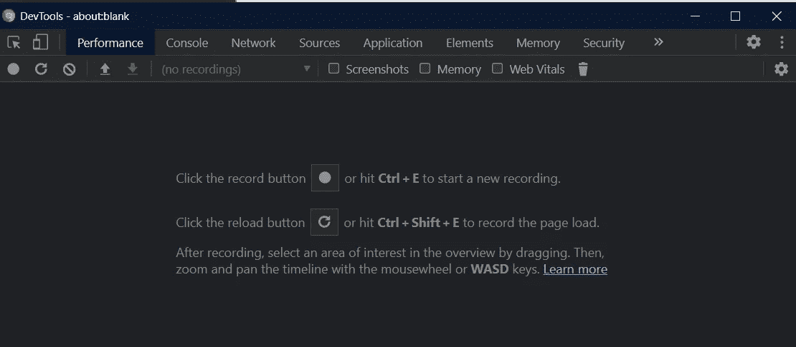****

****The position of the Performance Tab might be different in your case as you can re-order these tabs by simple drag-n-drop. Yeah, chrome does make it convenient for us!****

****点击第二排右上角的*档位*图标，如下图(红色高亮显示)，选择**网速:*快速 3G*** 和 **CPU 节流: *4x 或 6x 减速*** *。*建议在记录性能之前调节 CPU 和网络速度，以模拟更真实的环境。****

****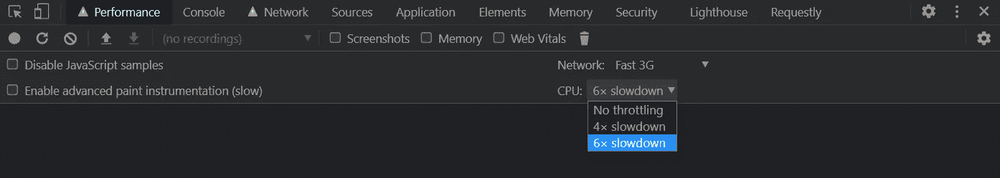****

## ****同步码的性能分析****

****创建一个 HTML 文件，其中包含一个简单的按钮和一个事件处理程序`handleButtonClick`，附加到它的 click 事件。`handleButtonClick`函数通过运行 while 循环(同步代码)来保持主线程忙碌。****

****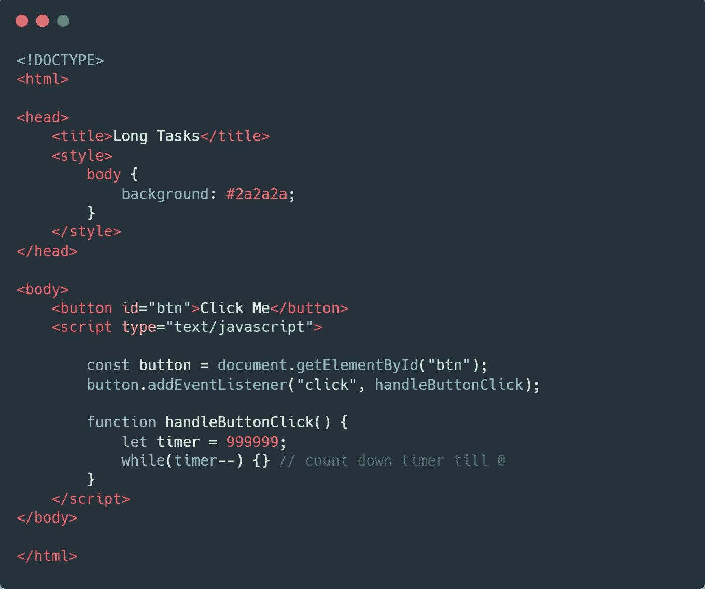****

****现在，在浏览器中打开页面后，打开 Chrome DevTools 中的 Performance 选项卡，按下*记录按钮*。录音时，点击“点击我”按钮，约 2 秒后点击*停止*按钮停止录音。****

****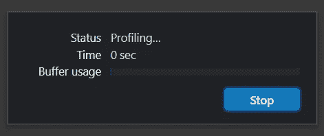****

****Use the stop button to stop the recording****

****一旦报告准备好了，chrome 将显示类似下面的结果。****

****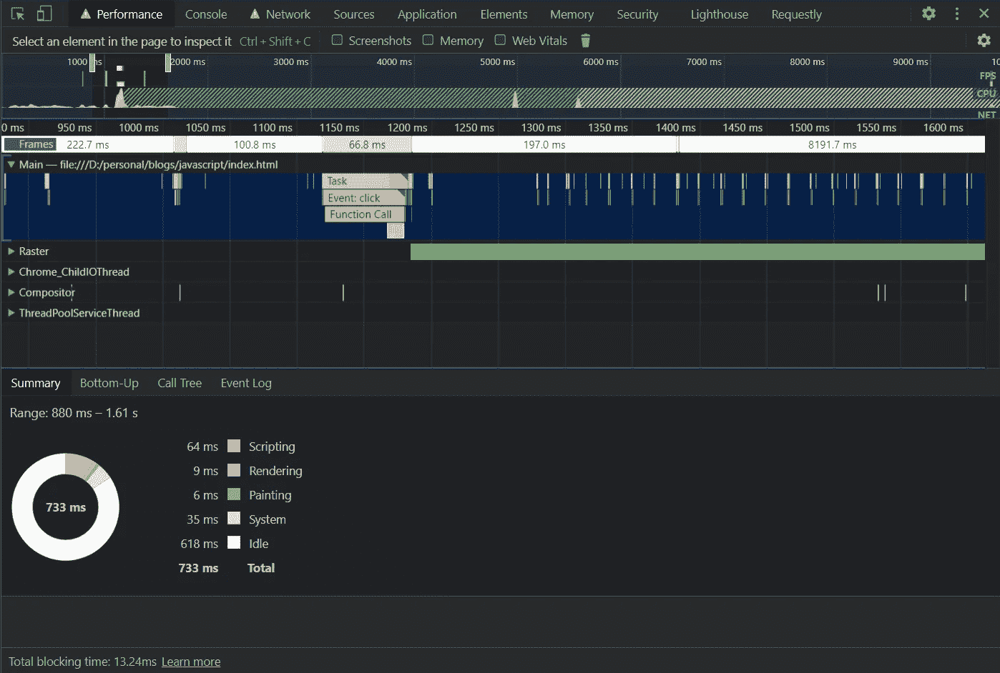****

****这份报告中有很多细节，但我们将把重点放在对我们来说重要的那些上。首先确保我们已经展开了 ***主*** 部分，其中包含了由主线程执行的任务*的*火焰图*。
在下面的截图中，你可以看到右上角有一个带有**红色标记**的**任务**块。这个标记是 Chrome 加的，代表一个长任务。该块也用红色斜线**部分突出显示**,表示长任务占用的 50 毫秒以上的阻塞时间。*****

***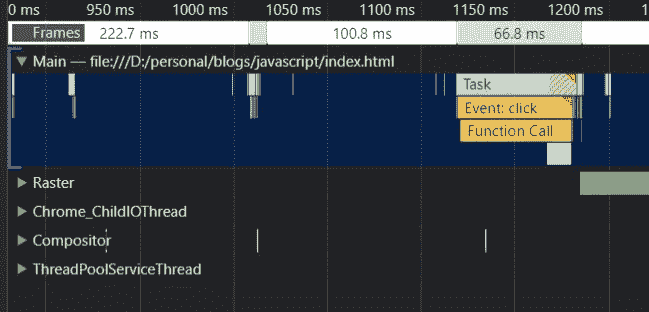***

***我们可以通过单击这些模块来查看更多详细信息。将打开一个类似于下面截图的部分，其中包含一些有用的见解。例如，通过点击*函数调用*块，我可以简单地看到这里指的是哪个函数(注意下面右边截图中的`handleButtonClick @ index.html:20`)。***

****您还可以查看提供嵌套函数调用信息的其他选项卡，以及每个函数调用花费了多长时间来完成****

***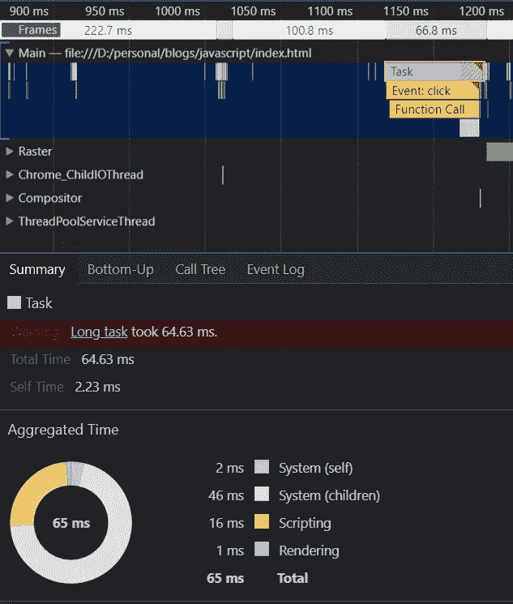******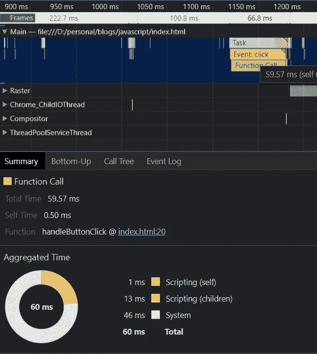***

***Details for Task Block (Left) | Details for Function Call (Right)***

***为什么这个任务最终变成了一个漫长的任务？
`handleButtonClick`函数内的 while 循环保持主线程阻塞，直到`counter`变为 0。***

## ***异步代码的性能分析***

***让我们看一个承诺链的例子。考虑下面的 HTML 片段，它有一个承诺链，其中每个`.then`处理程序阻塞主线程 50 毫秒。尽管如此，`handleButtonClick`函数阻塞主线程的时间超过 200 毫秒。summary 选项卡显示了该任务块所用的*总时间:216ms(承诺链为 200ms)。****

***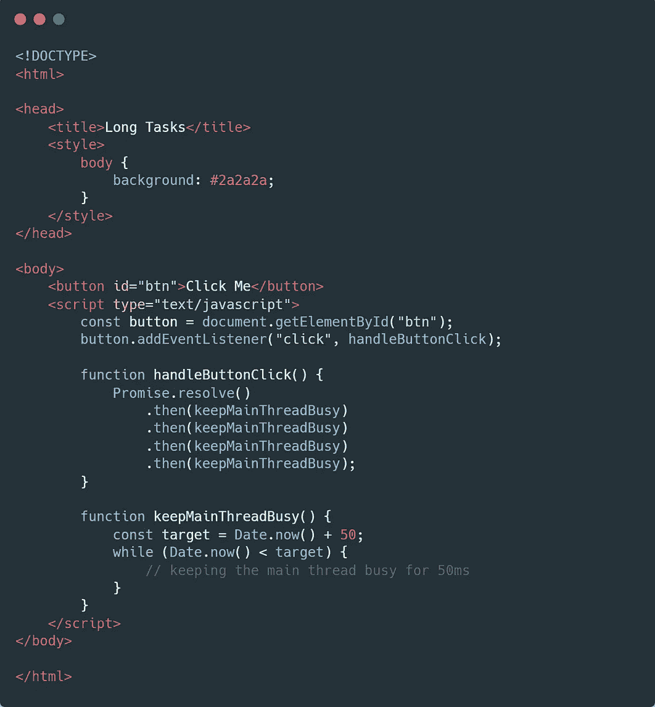******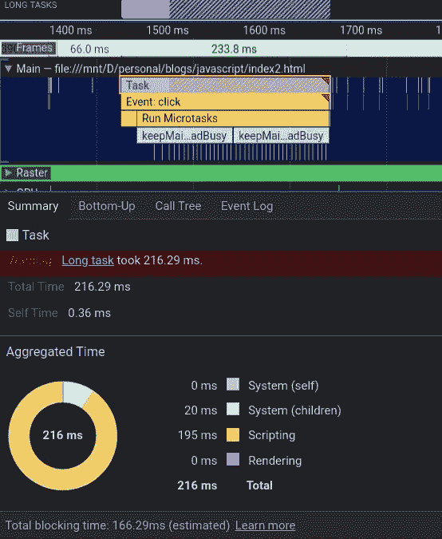***

***How .then handlers in the Promise chain can block the main thread***

*****为什么这个任务最后变成了一个长任务？** 一旦调用栈为空，事件循环就检查*微任务队列*，它是 *CPU 密集型的*。所有的承诺处理者都在这里排队。如果有任务在这里等待，事件循环会执行所有的任务，并保持主线程阻塞，直到队列变空。***

***`handleButtonClick`由一个包含 4 个对`keepMainThreadBusy`函数调用的承诺链组成，最终被添加到*微任务队列*。因为这 4 个调用都是连续执行的，所以总时间加起来大约为 200 毫秒，而单个调用花费了大约 50 毫秒。***

# ***那么，如何优化这些长任务呢？***

## ***网络工作者***

***优化某事最简单的方法就是不去做。考虑周到，不是吗？我们可以通过 ***不使用主线程*** 来实现这种优化。浏览器允许我们使用单独的线程通过 [Web Workers](https://developer.mozilla.org/en-US/docs/Web/API/Web_Workers_API/Using_web_workers) 来执行。然而，这也有一些限制，比如缺少对 DOM 的直接访问，等等。***

## ***在宏任务队列中调度回调***

***在*宏任务队列*中排队的任务被区别对待。与*微任务队列*不同，事件循环在一个周期内只执行*宏任务队列*中的一个任务。我们可以利用这些知识尽可能地将长时间运行的任务分解成更小的任务。想法是保持这些较小任务的执行时间≤50 毫秒***

*   *****同步代码分解成较小任务的例子** 这里有一个我们如何分解潜在阻塞任务并批量执行它们的人为例子。请注意下图中的小块，它们代表批处理调用***

***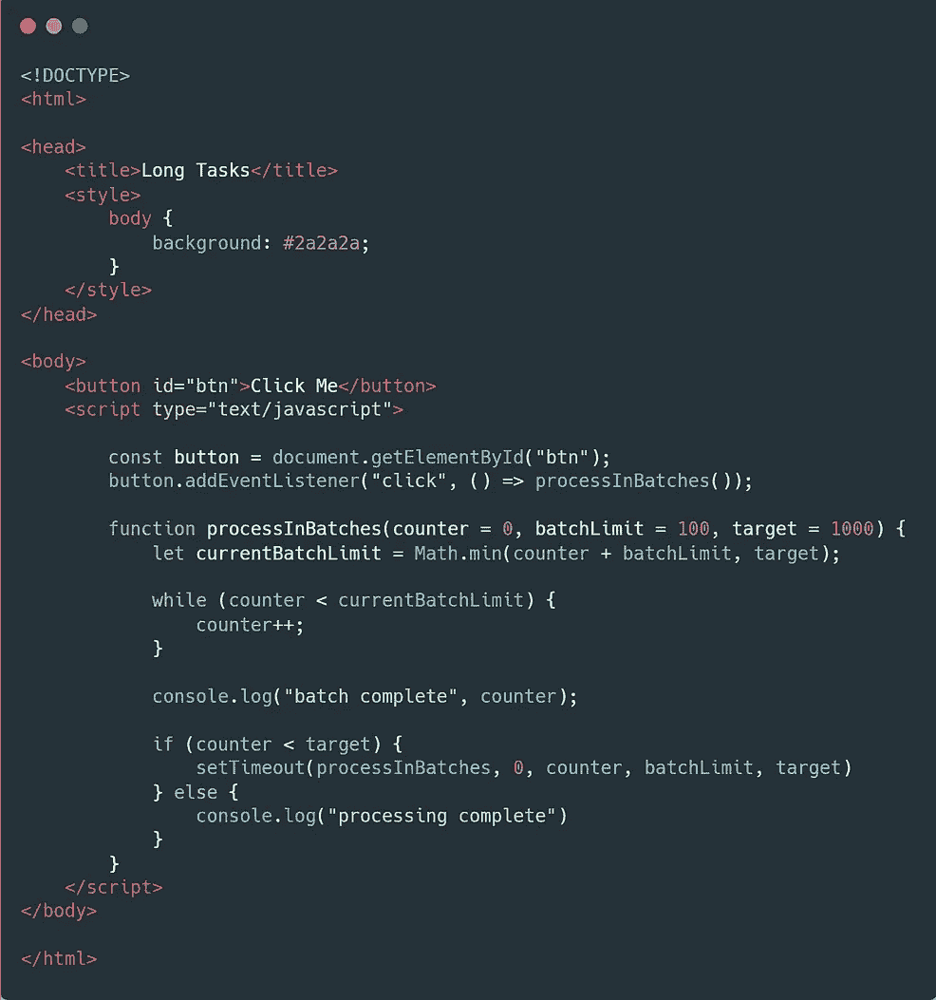******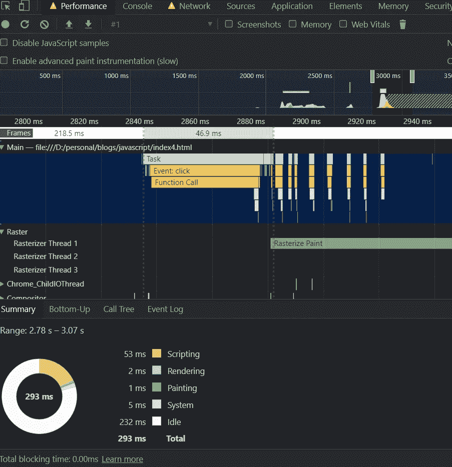***

*   *****异步代码分解成更小任务** 的例子这里有一个用`setTimeout`调用`keepMainThreadBusy()`的例子。因为传递给`setTimeout`的回调被添加到*宏任务队列*中，所以*事件循环的每个周期只执行一个回调。这允许主线程执行其他操作，如执行事件处理程序和响应用户交互(如果有的话)。****

***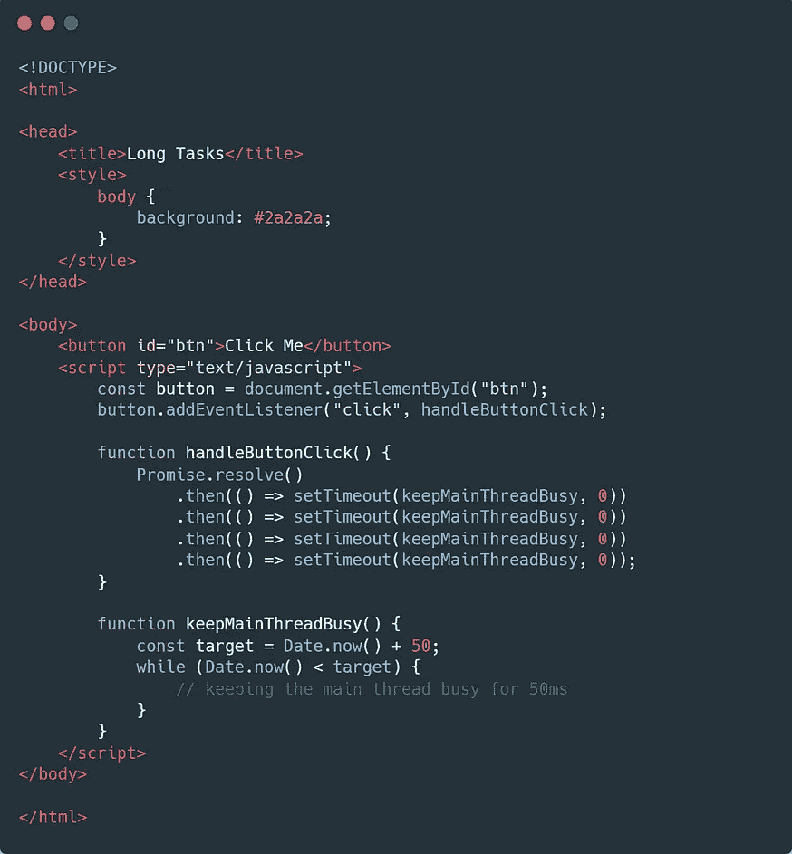******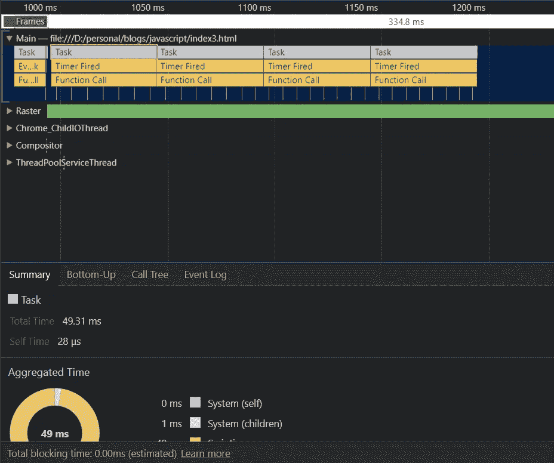***

***Calling the function with setTimeout allows the browser to use the main thread for other important operations***

# ***结论***

***使用我们讨论过的两种方法，我们可以实现更好的性能、用户体验，更重要的是更好的页面排名(核心 Web 生命分数):***

1.  ***通过在单独的线程上使用 Web Workers 执行我们的代码，并允许主线程专注于其他重要任务，如 HTML 解析、准备渲染树、渲染像素、响应用户输入等。***
2.  ***或者使用`setTimeout`函数将我们的 javascript 代码(特别标记为长任务)分解成更小的任务。这将使主线程尽可能有效地工作，并在没有任何不可接受的延迟的情况下执行所有操作***

***虽然这种策略确实把长任务分解成了小任务，但是你可能想聪明地分解任务。对于长任务，javascript 任务一次执行完毕，中间没有中断。然而，在使用了`setTimeout`之后，中断的 JavaScript 任务可能会在两个较小的任务之间有一些额外的延迟，因为浏览器可能会使用主线程来执行不同的操作。确保您了解您正在中断什么任务，以及它会对整体功能产生什么影响。***

***我希望这个策略能帮助你减少长任务的数量，改善你的总阻塞时间，从而改善用户体验。***

****如果你觉得这篇文章有帮助，可以考虑分享和鼓掌*:)***

## ***关于作者***

***[*Divyanshu bhat nagar*](https://www.linkedin.com/in/divyanshubhatnagar/)是 [*AdPushup*](http://adpushup.com/) 的软件工程师，这是一个收入优化平台，帮助出版商使用自动化 A/B 测试、标题竞价、创新广告格式和 adblock 恢复来增加广告收入。AdPushup 正在积极招聘 JavaScript 工程师。如果你感兴趣，你可以在这里查看空缺职位。***

****更多内容请看*[***plain English . io***](http://plainenglish.io/)***