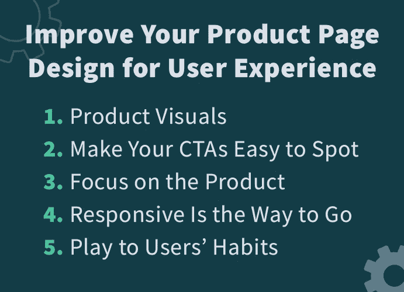
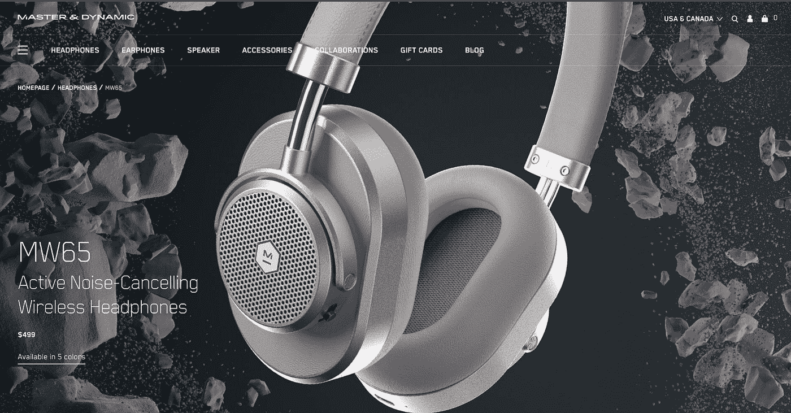
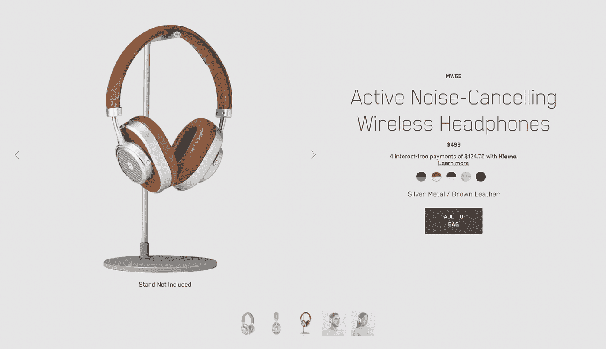
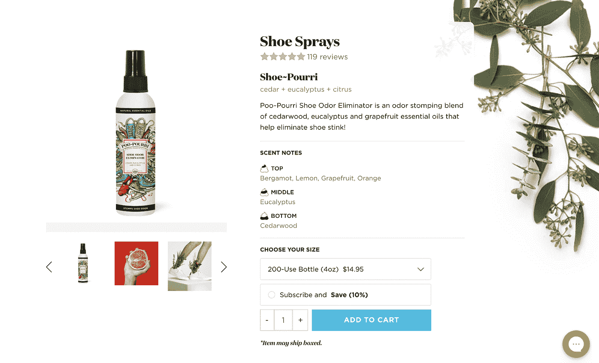
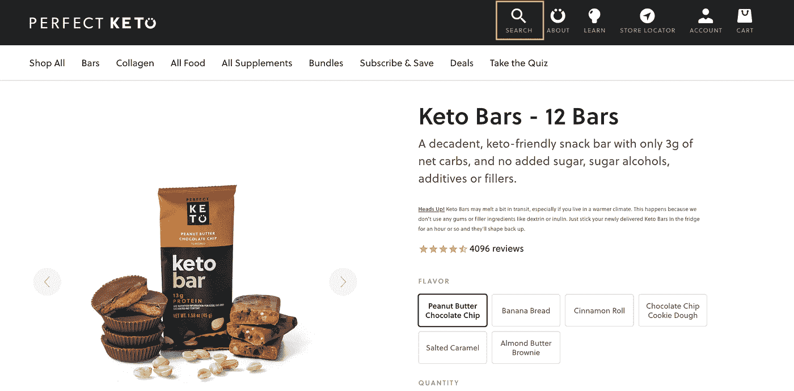
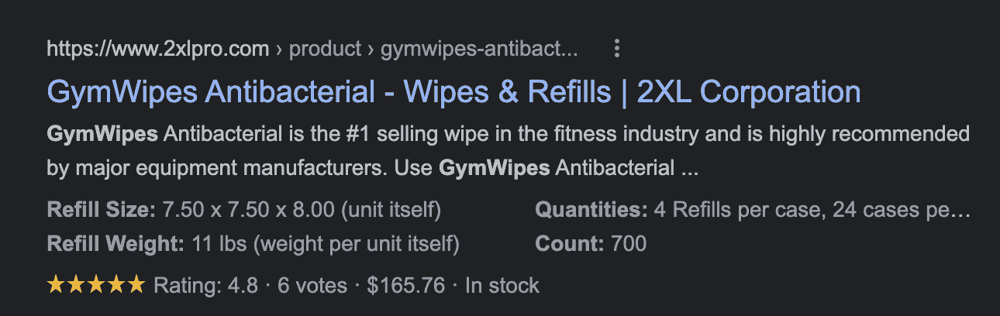
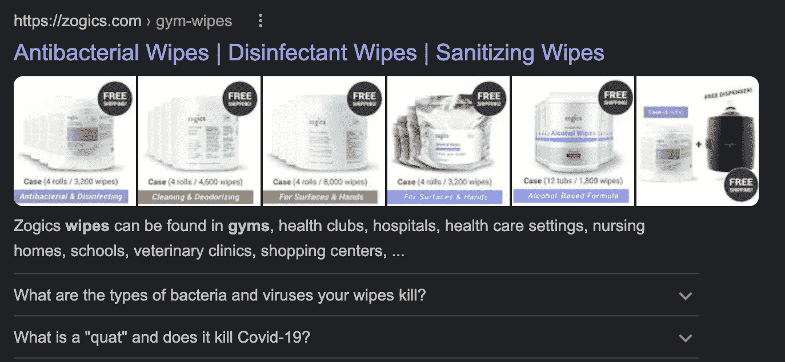
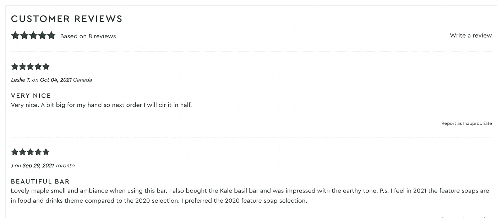

# 如何针对 SEO、转化率和用户体验优化产品页面— Prerender

> 原文：<https://javascript.plainenglish.io/how-to-optimize-product-pages-for-seo-conversions-and-user-experience-prerender-149e1032a02e?source=collection_archive---------22----------------------->

Photo by [Myriam Jessier](https://unsplash.com/@mjessier?utm_source=medium&utm_medium=referral) on [Unsplash](https://unsplash.com?utm_source=medium&utm_medium=referral)

产品页面对于商店来说就像销售人员一样。这些页面旨在展示您的产品及其变化，提供良好的体验，并完成销售。

考虑到这一点，优化产品页面的可发现性(SEO)和转化率(CRO)是任何希望增加收入的电子商务网站的基本任务。

在这篇文章中，我们将讨论不同的优化角度，你需要记住在你的产品页面工作。这些最佳实践可以在规划阶段或现有产品页面中实施，因此无论您的业务处于哪个阶段，您都会发现一些有用和实用的东西。

尽管我们倾向于先讨论 SEO 毕竟，这是我们在 Prerender 所做的很大一部分工作，让我们从产品页面的一个重要优化开始:用户体验。

# 为用户体验改进你的产品页面设计

许多因素会影响用户的体验。然而，产品页面的设计将决定页面的第一印象和“感觉”。

毕竟，电子商务非常依赖于它的视觉表现。因为消费者无法走进你的商店去触摸、感受你的产品并与之互动，所以你需要使用另一种渠道来帮助他们做出购买决定。

当设计产品页面时，一切都取决于你如何计划和展示每一个元素。当然，所有的产品页面都是不同的，但是有一些典型的元素他们都应该有。

这是 Tubik 工作室的[产品页面元素清单](https://blog.tubikstudio.com/product-page-design/):

*   项目的名称/标题
*   照片
*   价格
*   项目可用性
*   添加到购物车/添加到包/添加到购物篮/购买按钮
*   添加到收藏夹/保存到愿望列表按钮
*   描述
*   社交证明:评分、评论、之前购买者的数量、现在查看该商品的人数等。
*   颜色的选择
*   型号选择
*   选择要购买的商品数量
*   尺码指南或计算器(用于衣服和鞋类)
*   扩展细节(材料、技术规格、尺寸、重量、特殊功能等。)

如果这些元素不符合您客户的需求，您不需要添加所有这些元素，但这些是我们在创建产品页面时经常使用的元素。

为什么重要？因为这为我们剩下的工作提供了一个框架，因为我们在设计布局、撰写文案和优化 SEO 时会用到它们。

# 1.产品视觉效果

产品页面的一个关键要素是你如何展示你的产品。您在页面中使用的视觉效果需要向客户传达产品及其变体的外观、使用感觉以及风格。

这些视觉效果不仅仅是一张照片。可以是视频、动画、360 度视图，甚至是 AR 演示。

Master Dynamics 在他们的英雄版块中使用了一个大而惊人的图片。以 [MW65 耳机](https://www.masterdynamic.com/products/mw65-active-noise-cancelling-wireless-headphones)为例，图片展示了其漂亮的设计和高质量、耐用的材料。

但在接下来的部分，它们允许用户在颜色和不同的产品角度之间切换。

因为这些是耳机——大多数人已经知道它们是如何工作的——Master Dynamics 专注于展示产品的风格，使用大字母作为标题，并保持导航相当简单。

以下是一些可以遵循的最佳实践:

*   **所有的视觉效果都必须是高质量的。**避免像素化的照片或糟糕的视频。视觉效果会极大地影响客户的决策，所以你希望他们留下最好的印象。
*   **牢记职能。**对于短裤和 t 恤，使用不同角度的照片，并使用模特来帮助顾客想象自己使用你的衣服。然而，对于更复杂的产品，如电子产品，有一个视频演示如何使用产品本身是一个更好的选择。
*   优化您的网络资产。请记住，客户必须下载您页面上的所有资源，因此如果您的图像和视频文件太大，将会对整体用户体验产生负面影响。
*   **让他们脱颖而出。原创想法增加了参与度，从而使客户在网站上停留更长时间。将您的风格和品牌添加到您的产品可视化中。**

# 2.让你的 CTA 容易被发现

行动号召(CTA)是一个指示，告诉用户在他们的旅程中最好的下一步。对于大多数产品页面，这将是购买或添加到购物车按钮。

设计 CTA 时，请确保:

*   每页或每节仅添加一个 CTA。
*   通过使用对比、不同的字体等，使其尽可能容易看到。
*   编写一个易于遵循的指令，要求用户一次只做一件事。

便便大多使用白色背景，所以他们的 CTA 使用蓝色背景。在看到图片后，用户的眼睛会很快聚焦在“添加到购物车”按钮上，从而缩短了他们到达页面后的定位时间。

# 3.专注于产品

我们可能会尝试添加尽可能多的信息、图片、互动和元素来说服访问者改变信仰。然而，这往往会分散用户对真正重要的东西的注意力:你的产品。

页面上的所有内容都应该让你的产品脱颖而出，并作为传达产品优势和感觉的一种方式。

尝试删除任何不直接支持这个目标的东西，让你的产品来说话。这也意味着关注元素的层次结构。产品图片和标题应该易于识别，帮助用户快速浏览页面。

可以按照[倒金字塔方法](https://www.nngroup.com/articles/inverted-pyramid/)来。虽然这种方法是为写作而开发的，但是你的布局应该遵循同样的原则。

用户需要知道的一切都必须放在首位，并显示在页面的顶部，而值得知道或看到的东西应该放在后面。

# 4.快速响应才是正道

为移动设备优化你的网站不再是一个选择。对于用户和搜索引擎来说，优秀的移动体验都是必须的。

您将希望使您的页面行为和结构在所有设备上保持一致，同时不要忘记您的设计需要正确地适应更小的屏幕和更弱的互联网连接。

在移动设备上保持一致设计的一个好方法是使用网格方法。让每个元素适合一个网格意味着每个元素可以堆叠在另一个之上，而不会丢失布局的本质。

# 5.迎合用户习惯

虽然我们都想创新，但有些惯例我们必须遵守。网站不仅仅是纯粹的艺术表达。它们有明确的功能和目标要实现，而实现这一目标的第一步就是易用性。

例如，如果我们改变通常用来表示搜索字段的东西:放大镜图标，大多数用户会感到沮丧或迷惑。

当我们设计产品页面时，这些普遍接受的惯例对我们很重要，因为用户认识这些符号。因此，它们使我们的产品页面更容易导航。

# 为搜索引擎优化你的产品页面

既然我们的产品页面设计得很好，以用户为中心，是时候关注一下了。

如果没有人上门，拥有最吸引人的商店就没有意义。这就是搜索引擎优化(SEO)的由来。

[“谷歌每天处理超过 35 亿次搜索”，“46%的产品搜索始于谷歌”](https://www.oberlo.com/blog/google-search-statistics)，据 Oberlo 称。仅凭这些数字，你就能理解出现在谷歌搜索结果中会对你的业务产生怎样的影响。

搜索引擎的目标是尽可能向用户展示最好的结果。这就是用户体验如此重要的原因。

**让我们来探索你需要优化的最重要的元素，开始对你的产品页面进行排名:**

# 1.做你的关键词研究

关键词研究是许多开发者和企业主在创建页面时忽略的东西，但它是任何 SEO 工作的基础。

与博客帖子和其他信息页面不同，产品页面有明确的转化目标。他们的目的是销售产品，而不仅仅是介绍产品。

考虑到这一点，以下是一些可以遵循的建议:

## 寻找具有交易意图的关键字

从这个意义上说，当对产品页面进行关键词研究时，角度必须是找到具有明确购买或交易意图的查询。

不去探究[搜索意图](https://yoast.com/search-intent/)的本质，大部分有交易意图的用户都是准备购买的人。

例如，寻找“如何清洁我的地板”的人最有可能是在寻找一个分步指南(信息意图)，但那些搜索“木地板蜡”的人是在探索产品选项(交易意图)。

## 使用现有广告数据

如果你有谷歌广告活动，寻找搜索量大、点击率高的关键词。这些可能是你搜索引擎优化工作的最佳目标。

高点击率意味着这个词有购买动机，所以这些关键词的排名可能会带来流量，从而增加销售额。

## 记住相关性是关键

不要仅仅根据搜索量来决定关键词。使用对你的产品有意义的关键词。

请记住，搜索引擎希望显示尽可能好的结果，如果你的产品不符合查询背后的意图，再多的时间和金钱也不会让他们排名。

总是问自己:我的产品是这个特定术语的最佳结果吗？

# 2.创建独特的标题和元描述

正如你可能已经发现的，产品页面没有那么多内容，至少没有信息页面那么多，所以每一点文字都很重要。

标题和元描述是搜索引擎和消费者的第一接触点。当抓取你的网页时，机器人(谷歌，必应等。)将使用标题和元描述来确定页面的内容。

此外，这是搜索引擎将在结果页面上显示的文本，因此可以将其视为您商店的广告牌。

在构思标题时，请记住:

*   添加产品的名称和型号
*   添加您的品牌
*   添加您的关键字
*   保持在 60 个字符以内

元描述有更多的回旋余地:

*   在文本中包含您的主要关键字或相关关键字
*   以一个钩子开始，让读者感兴趣
*   保持在 160 个字符以内
*   展示你产品的独特功能或优势

**注:**如果你在撰写元描述时需要帮助，CanIRank 的团队总结了十种[撰写杀手元描述的方法](http://www.canirank.com/blog/10-ways-to-write-a-killer-meta-description/)。看看吧！

# 3.添加常见问题和相关信息

常见问题是增加产品页面价值的好方法。这些可以通过解决买家的疑虑来帮助转化，也可以通过向搜索引擎添加更多的信号来帮助 SEO。

例如，对于像面霜这样的化学产品，人们可能会担心他们可能会在网上搜索健康问题。你可以添加一个 FAQ 来回答这些问题，以缓解他们的思想，增加他们在相关查询中排名的机会。

# 4.使用结构化数据来标记您的产品页面

结构化数据，也称为模式标记，是一种标准化的代码格式，以机器人可以理解的语言向搜索引擎传达有关页面内容的附加信息。

这允许你给谷歌更多的上下文，帮助它更好地理解你的页面，使它更容易索引。

虽然 schema 不会直接影响排名，但是 Product 和 Review schema 对产品很有用，可以在 SERPS 中显示丰富的片段。

[评论模式](https://schema.org/Review)变成评论星，[产品模式](https://schema.org/Product)可以导致价格、股票和其他重要信息显示在搜索结果中。

而 [FAQPages 模式](https://developers.google.com/search/docs/advanced/structured-data/faqpage)将在搜索结果中显示 FAQ 本身。

结果来自 [Zogics 抗菌湿巾](https://zogics.com/gym-wipes)结果丰富

可以想象，丰富的结果会让你的链接从其他结果中脱颖而出。吸引更多的点击将转化为更多的成交机会。

**注意:**这里有一个关于[使用结构化数据进行 SEO](https://prerender.io/structured-data-for-seo/) 的完整指南，并有代码示例可供实现。

# 5.让您的产品页面快速加载

加载速度慢是导致跳出率高、用户体验差的关键因素之一。没有客户愿意一直等到你的产品页面准备好。

大多数情况下，人们一看到空白页面就会离开。

为了[提高页面速度](https://prerender.io/google-pagespeed-insights/)，您可以执行一些快速任务:

*   **使用**[**TinyGPG**](https://tinypng.com/)**压缩您的照片和图像。**图片是你页面上最大的文件，所以要确保它们被适当压缩以使它们加载更快。
*   将你的视觉资产与实际展示的内容结合起来。换句话说，在最大屏幕只加载 1280 x 720 的情况下，不要使用 4000 x 4000 的图像。
*   **减少 JavaScript 执行时间。**在加载必要的 JavaScript 文件之前，浏览器会延迟内容所在的 HTML 和 CSS 文件的执行，使你的网站对用户来说速度变慢。一个好的做法是推迟 JavaScript 加载，让优先文件先加载。

Prerender 的 CTO Zoltan·贝滕布克写了一篇关于页面速度优化的[详细而实用的指南，值得一读。](/how-to-improve-your-websites-page-load-speed-7394bea11ac2)

然而，2020 年 5 月[谷歌宣布了核心网络重要指标更新](https://www.searchenginejournal.com/core-web-vitals/)。这些新的排名因素旨在通过分析以下各项，以更严格的方式衡量用户体验:

*   最大内容绘制(LCP):加载页面上最大的元素所需的时间。
*   第一次输入延迟(FID):页面变为交互式所需的时间。
*   累积布局偏移(CLS):当页面的布局随着加载而移动时。

核心网站是页面速度优化不可或缺的一部分。谷歌为每个因素提供一个分数，你的页面需要通过每个因素才能从排名的提升中受益。

在本文中，我们不会对此展开过多讨论，但是您可以查看我们的[如何通过核心网站生命指南](https://prerender.io/how-to-pass-core-web-vitals/)以获得更深入和实用的提示。每个技巧都很容易遵循，并且会对您的指标产生明显的影响。

也就是说，前面提到的一些优化可以帮助你解决一些核心的网络问题，所以一定要先实现它们。

# 6.修复技术问题

技术问题可能会阻止搜索引擎抓取您的页面，或者完全阻止它们访问内容。

为了识别技术问题，您需要运行技术站点审计。为此，您可以使用类似尖叫青蛙、Ahrefs、Moz 和 PageSpeed Insights 这样的工具。这些工具将抓取您的网站，并报告他们检测到的任何问题。

使用我们的[完整的技术搜索引擎优化网站审计清单](https://prerender.io/how-to-conduct-a-technical-seo-audit/)来发现所有可能阻碍你的网站的问题。一旦确定了问题，您就可以创建一个策略来解决它们。

根据我们的经验，**这些是产品页面面临的最常见的技术问题:**

*   【JavaScript 背后锁定的内容。搜索引擎无法与您的页面互动，因此无法访问任何需要用户触发事件的内容。常见的情况是在点击事件中添加链接，而不是在<和>标签中使用 href 属性。这里有更多关于[常见 javascript 问题以及如何解决它们的例子](https://prerender.io/common-javascript-seo-problems/)。
*   **内容重复而单薄。**同样，并非所有产品页面都有大量文本，因此它们可能会被视为内容单薄。另一个常见的问题是相似的产品被标记为重复的。解决这个问题的一些方法是在页面上添加常见问题、好处和评论，以增加更多内容，并在有意义的地方组合产品，如颜色或尺寸变化，可以是一个带有选项选择器的列表。
*   **自动生成的网址。每个 URL 都应该是唯一的、可读的、清晰的。避免符号、数字，除非它们与模型相关，以及胡言乱语。此外，如果要更改的话，也不要太频繁。**
*   **缺货商品页面显示为 404 页。**除非产品不会回来，否则避免将缺货商品重定向到 404 错误页面。这将使他们的排名下降，让他们回来将是极其困难的。
*   **抓取问题。**这在拥有数百个网址的大型电子商务网站中尤为常见。如果你发现谷歌没有正确抓取你的网站或者遗漏了很多页面，请遵循我们的指南[搜索引擎优化的抓取预算](https://prerender.io/crawl-budget-seo/)。

# 7.创建支持页面

支持页面大多是信息或资源页面，通过发送相关流量来帮助你最重要的支柱或产品页面排名更高。

我们以[图梅里](https://www.turmerry.com/)为例。Turmerry 是一家专注于销售床单、床垫和更多家居用品的电子商务商店。

作为他们 SEO 策略的一部分，他们撰写了类似于“[你应该多久洗一次床单？](https://www.turmerry.com/blogs/dreamerry/how-often-should-you-wash-and-change-bed-sheets)“吸引相关流量到自己的站点。在这种情况下，相关流量包括对床单感兴趣的人。

此外，建立信息页面的反向链接比建立产品页面的反向链接更容易。毕竟，为什么会有人链接到一个产品页面？

但是，通过建立到这些支持页面的链接，您可以将内部链接指向您的产品页面以传递一些权限。

# 优化您的产品页面，以提高转化率

设计？检查！可发现性，又名，SEO？检查！是时候在顶部添加樱桃:转化率优化(CRO)。

虽然我们最后离开 CRO，但这并不意味着这三大支柱之间有严格的等级制度。你可能已经注意到设计，搜索引擎优化和 CRO 一起工作。

大量的搜索引擎优化和设计优化将有助于你的页面更好地转换，因为你向正确的受众展示了正确的内容。

我们不会再提到常见问题，不是因为它们对转换没有帮助，而是因为我们已经将它们作为 SEO 优化过程的一部分。

也就是说，这里有六个策略可以用来提高产品页面的转化率:

# 1.让结账过程更简单

许多顾客会立即从一个又长又复杂的结账页面中跳出来。如果他们在这种体验中感觉不舒服，他们就不会完成购买。

为了简化流程，请确保:

*   从你的结帐页面中删除任何外部链接
*   将过程控制在一两页内
*   让您的客户无需创建帐户即可购买
*   提供多种付款方式

一个好的方法是在每一个结账页面上展示产品，让顾客记住它。

# 2.添加社会证明

人们希望确保他们做出了正确的选择。放置客户的反馈和评论(特别是如果他们可以直接写在网站上)将有助于你与新客户建立信任。

# 3.避免隐性费用，管理预期

永远保持你的定价透明。没有什么比到达收银台以为他们将支付 11 美元，然后意识到税后和运费实际上是 30 美元更让顾客害怕的了。

运费和税费应在产品页面上讨论，以向客户提供做出决定所需的所有信息。它还有一个额外的好处，就是过滤掉那些不准备购买的访问者。如果他们已经知道他们将支付的确切金额，这应该会增加你的成功率。

# 4.提供明确的退货政策

与亲自购买不同，人们无法真正接触和感受到你的产品。这意味着他们需要足够信任你的业务，才会向你购买。

一个明确的退货政策将会消除顾客心中的压力，因为他们知道如果他们的产品发生任何问题，他们仍然可以拿回他们的钱。

退货政策不需要是一个创造性的杰作，但必须清晰简洁。这里有一个关于如何写有效退货政策的指南，你可以用它来写你自己的退货政策。

# 5.撰写引人注目的产品描述

你的产品描述就是产品的卖点。它的目标是告诉顾客产品是什么，是什么使它独一无二，并迫使他们购买。

Shopify 为[编写产品描述](https://www.shopify.com/blog/8211159-9-simple-ways-to-write-product-descriptions-that-sell)提供了一个简单的框架:

*   你的产品解决了什么问题？
*   顾客从你的产品中获得了什么？
*   是什么让它比竞争对手更好？

产品描述既要有创意，又要有说服力，还要根据你的目标关键词进行优化。

回到倒金字塔，你的产品描述应该包含客户必须知道的所有信息，不能有任何闪失。

# 包扎

好吧，你做到了！非常感谢您与我们分享这一旅程。我们希望你喜欢这篇文章，并学习了一些技巧来尝试。现在是时候把你所有的新知识付诸实践了。

如果您不知道从哪里开始，我们建议您进行一次全面的技术审核，以找到立竿见影的效果和需要解决的关键问题。它还将指导你哪些任务需要优先处理，哪些任务需要委托给开发人员和设计人员。请在我们的[推特](https://twitter.com/prerender?s=20)上向我们发送您的所有问题。我们很乐意帮忙！

这篇关于产品页面搜索引擎优化的文章[最初出现在 Prerender 的博客上，](https://prerender.io/product-page-optimization/)是一个渲染 javascript 的解决方案[在这里，你可以通过为爬虫提供一个静态 HTML 版本的 javascript 网站来获得更高的排名，而不会损害你的客户体验。](https://prerender.io/)

*更多内容请看*[***plain English . io***](http://plainenglish.io/)