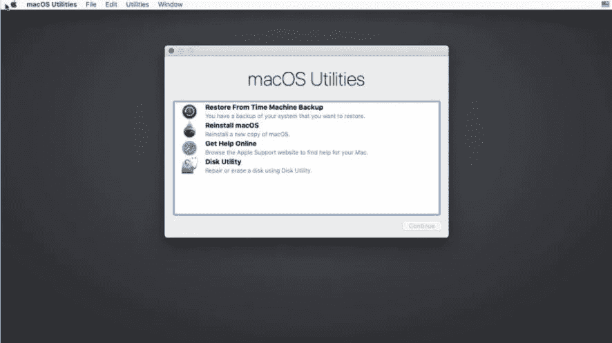
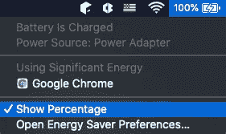
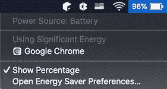
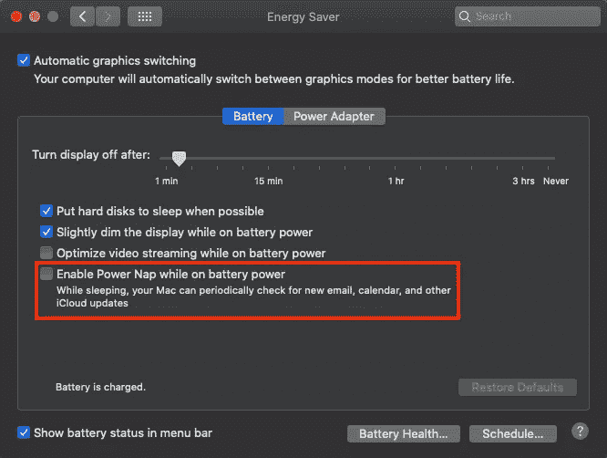
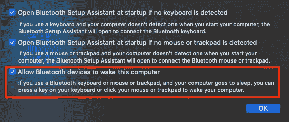
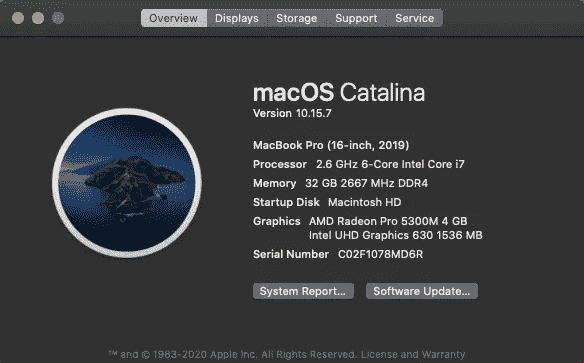
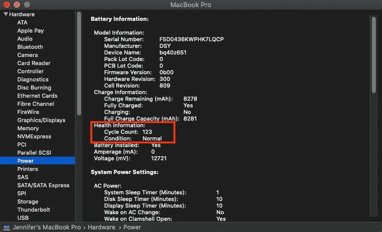

# 如何优化 Mac 的电池使用

> 原文：<https://javascript.plainenglish.io/how-to-optimize-your-macs-battery-usage-65e30c46208d?source=collection_archive---------7----------------------->

关于如何从电池耗尽中恢复 Mac 以及如何最佳使用电脑电池的学习体验。


Photo by [Oliur](https://unsplash.com/@ultralinx?utm_source=medium&utm_medium=referral) on [Unsplash](https://unsplash.com?utm_source=medium&utm_medium=referral)

我曾经让我的 Mac 处于电池睡眠状态，离开了一个星期，回来后电池完全耗尽。我把 Mac 插上交流电源，电脑就开机了。我被要求输入登录密码。有了正确的密码，进度条显示出来，达到 100%。然后，就卡在了 100%。不管等待的时间有多长，都没有进一步的进展。


这不是虚构的。这是一个关于我的 Macbook Pro 的真实故事，它是基于英特尔的，安装了 macOS Catalina。

每一次经历都是学习和成长的机会。从这个黑暗的时刻开始，我有机会学习如何从启动失败中恢复 Mac，并找到了使用电池的最佳方式。

在这篇文章中，我想分享我的学习经验。

# Mac 开机失败怎么恢复？

显然，Mac 可能无法打开是一个常见问题。有许多关于如何解决这个问题的在线指南。不情愿地，我成为了一名 Mac QA，尝试了所有这些解决方案。

## 运行电源循环

已断开交流电源线并按住电源按钮 10 秒钟。已重新连接交流电源线，并按下电源按钮重新启动。

这个重置技巧在很多情况下简单有效，但对我的 Mac 电脑不起作用。

## 拔掉所有附件

拔下连接到 Mac 的所有附件，如外部显示器、打印机、鼠标和键盘的 USB 集线器等。进行了一次能量循环。

它无法启动 Mac 电脑。显然，我的 Mac 的外围设备没有导致启动序列的问题。

## 在安全模式下启动 Mac

已打开 Mac 的电源。重启过程中，按住`Shift`键直到登录屏幕出现。如果 Mac 可以在安全模式下启动，问题可能与某个启动项目有关。这些项目可以从`System Preferences > Users & Groups`中移除。

我无法在安全模式下启动它。

## 重置 NVRAM

NVRAM 是非易失性随机存取存储器的缩写名称，它在没有施加电源的情况下保留数据。这些数据，比如音量设置、鼠标设置、键盘设置、时钟设置、屏幕分辨率等。可以通过 NVRAM 快速访问。

按住所有这些键:`Option (Alt)`、`Command`、`P`、`R`和电源键 20 秒，直到第二次开机的声音。

因为按住四个键太难了，我重复了几次这个过程。但是重置 NVRAM 没有帮助。

## 重置 SMC

SMC 是系统管理控制器的首字母缩写，它控制许多与键盘背光、电源适配器灯、电池管理、风扇速度控制、触控板等相关的基本 Mac 功能。

已断开交流电源线并按住电源按钮 10 秒钟。已重新连接交流电。按住所有这些键:`Shift`、`Control`、`Option (Alt)`和电源按钮 10 秒钟。已按下电源按钮重新启动。

重置 SMC 没有帮助。

## 在恢复模式下运行磁盘工具

已打开 Mac 的电源。重启过程中，按住`R`键直到苹果 logo 出现。登录电脑，到达`macOS Utilities`窗口。



点击了`Disk Utility`菜单，然后选择了 Mac 的驱动器`Macintosh HD`。在驱动器上运行`First Aid`。

`Disk Utility`未报告任何问题。

## 在恢复模式下重新安装 macOS

在这一点上，很明显我的 Mac 问题与硬件无关。不幸的是，也没有简单的软件修复。

我没有为 Mac 崩溃做好准备。我直到最后一刻才备份文件。但是，我用尽了办法，除了重装 macOS。

我从`macOS Utilities`中点击了第二个选择`Reinstall macOS`。将计算机保持在交流电线上，并根据屏幕上的指导重新配置 WiFi。完成安装很简单，尽管重新安装需要几个小时。

## 解决重新安装 macOS 后的问题

重新安装 macOS 后，一切都很好，除了 xcode，这是一个为 Mac，iPhone，iPad，Apple Watch 和 Apple TV 创建应用程序的开发者工具集。

通过以下命令修复了该问题:

```
sudo xcode-select --reset
xcode-select --install
```

重装 xcode 后，我的 Mac 从此过上了幸福的生活。

# 寻找使用电池的最佳方式

有一句中国习语说，羊跑了以后，亡羊补牢，为时不晚。

我应该如何避免这种情况在未来再次发生？后来我学到了一些东西。

## 显示电池百分比



默认情况下，菜单栏上的电池图标会显示它是否在充电，以及它有多满。打开显示百分比的选项来获得准确的数字是一个好主意。

## 睡眠期间的电池使用情况

我让充满电的 Mac 睡眠 10 小时，它显示电池容量减少到 96%。



什么东西在睡眠中耗尽了 4%的电量？

*   外部 USB 设备使用电源。如果 Mac 处于休眠状态，每个端口在 5 V 时提供的最大电流为 500 mA。
*   后台进程和未退出的进程使用电源。
*   Power Nap 使用电源来允许 Mac 继续检查新电子邮件以及日历和其他 iCloud 更新。可以通过`System Preferences > Energy Saver`进行配置:



*   蓝牙键盘或鼠标需要电源才能通过击键或按钮唤醒计算机。可以从`System Preferences > Bluetooth > Advanced`开始配置:



## 关机期间的电池使用

当 Mac 关机时，所有活动都会停止。它将停止所有无意中退出的进程。

由于我的 Mac 电池已经耗尽并崩溃，可能有一些正在运行的进程消耗了太多的电力。Mac 应该不时关机进行全面清理。

如果长时间不使用 Mac，建议在关机时让它保持 50%的电量。

## 电池错误和故障

如果出现电池错误和故障，系统日志文件会提供更多信息。以下是 Mac 上的系统文件。

*   系统日志文件夹:`/var/log`
*   系统日志:`/var/log/system.log`
*   Mac 分析数据:`/var/log/DiagnosticMessages`
*   系统应用日志:`/Library/Logs`
*   系统报告:`/Library/Logs/DiagnosticReports`
*   用户应用日志:`~/Library/Logs`
*   用户报告:`~/Library/Logs/DiagnosticReports`

以下是一个错误示例:

```
$ grep error /var/log/system.log
Jun 19 10:12:34 Jennifers-MBP com.apple.xpc.launchd[1] (com.apple.xpc.launchd.domain.pid.mdmclient.17599): Failed to bootstrap path: path = /usr/libexec/mdmclient, error = 108: Invalid path
Jun 19 10:12:34 Jennifers-MBP com.apple.xpc.launchd[1] (com.apple.xpc.launchd.domain.pid.LWWeeklyMessageTracer.17600): Failed to bootstrap path: path = /System/Library/CoreServices/loginwindow.app/Contents/Resources/LWWeeklyMessageTracer, error = 2: No such file or directory
```

以下是一个故障示例:

```
$ grep fault /var/log/system.log
Jun 19 10:14:51 Jennifers-MBP syncdefaultsd[17817]: objc[17817]: Class SYDClient is implemented in both /System/Library/PrivateFrameworks/SyncedDefaults.framework/Versions/A/SyncedDefaults and /System/Library/PrivateFrameworks/SyncedDefaults.framework/Support/syncdefaultsd. One of the two will be used. Which one is undefined.
Jun 19 10:14:51 Jennifers-MBP syncdefaultsd[17817]: objc[17817]: Class SYDJournal is implemented in both /System/Library/PrivateFrameworks/SyncedDefaults.framework/Versions/A/SyncedDefaults and /System/Library/PrivateFrameworks/SyncedDefaults.framework/Support/syncdefaultsd. One of the two will be used. Which one is undefined.
```

## 电池循环计数

打开`About This Mac`，出现以下画面。



点击`System Report`按钮，显示`Hardware`、`Network`和`Software`的 Mac 信息。

在硬件下，选择`Power`，有`Health Information`部分。目前，其循环计数为 123，处于正常状态。



在累积充电过程中，当电池电量完全用完时，充电周期就开始了。电池被设计为在其最大循环计数时保持其原始充电容量的 80%。Macbook Pro 的最大循环次数是 1000 次。

为了获得最佳性能，建议在电池达到最大循环计数时更换电池。我的 Mac 的循环计数是 123，因此，它仍然处于良好状态。

## 插上交流电源

Mac 应该插在交流线上吗？

是的，应该是。Mac 应该避免使用电池来消耗不必要的周期计数。

然而，苹果不建议让 Mac 一直插着电源。据说为了让电池工作，电子需要四处移动。这意味着应该使用电池，至少一个月一次。

# 结论

在本文中，我们讨论了如何从电池耗尽崩溃中恢复。在此基础上，我们正在寻找使用电池的最佳方式，以避免电池耗尽并延长电池寿命。

每种方式都有利弊。做事情并不只有一种正确的方法。在正常情况下，我会把我的 Mac 电脑插上交流电源，但每个月至少让它开一次电。在短暂的休息期间，我会让系统休眠。为了更长的休息时间，我将关闭计算机。

你的选择是什么？

感谢您的阅读。我希望这有所帮助。你可以在这里看到我的其他媒体出版物。

*注:感谢 Andre Nakkurt 帮我修复 xcode 问题。*

*更多内容尽在*[***plain English . io***](http://plainenglish.io/)