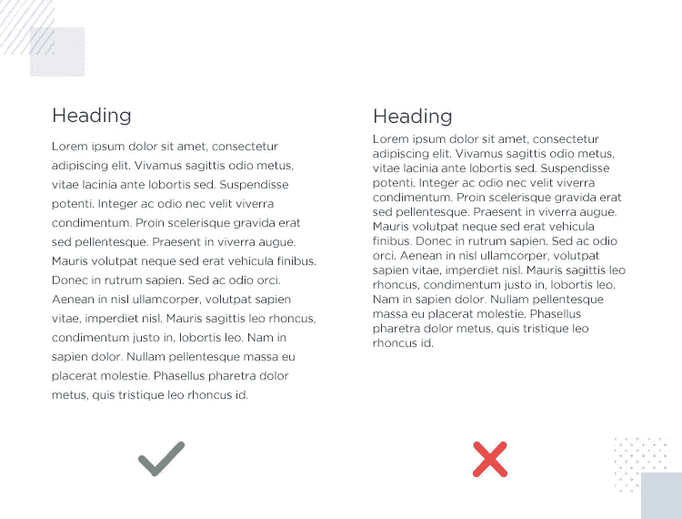

# 如何优化你的网站可读性

> 原文：<https://javascript.plainenglish.io/how-to-optimize-your-website-for-readability-ec749acbdd98?source=collection_archive---------19----------------------->

## 并为您的用户提供更好的体验。

Photo by [Pankaj Patel](https://unsplash.com/@pankajpatel?utm_source=medium&utm_medium=referral) on [Unsplash](https://unsplash.com?utm_source=medium&utm_medium=referral)

可读性是一个重要的用户体验特征，每个网页设计者/开发者都应该努力确保它的实现。向你的用户倾斜一个惊人的用户体验将确保与你的内容长期互动，让他们花更多的时间在你的网站上。

从商业角度来看，它可以帮助你提高网站的用户保留率，从而带来更多的收入。

这多酷啊？

即使运行一个小网站，拥有高可读性也会提升你在读者中的形象。请记住这样一种情况，你有很好的内容，但你的可读性分数低于平均水平，这是令人沮丧的，我理解。这仅仅意味着你会因为你的可读性太差而实时失去用户，这就是你失去用户的原因，他们会觉得下次访问你的网站不值得。

## 什么时候应该注重可读性？

嗯，最确定的是，它应该在你的软件开发过程的早期和后期实现。作为前端开发人员或设计人员，这主要是一个前端相关的问题，应该认真加以考虑。

随着用户体验的不断进步，在早期阶段实现它将确保您在保持可读性的同时更快地适应其他最新和最流行的趋势。

举个例子，你已经开发了你的产品，但是你没有考虑可读性，你仍然有时间去扩展和改进。尽管如此，当你进一步扩展你的资源时，你仍然可以重新发明和改进。

唯一不应该冒的风险是完全忘记确保可读性。—你会把事情搞砸的。

## **我们如何确保可读性？**

我们已经讨论了在你的网站或产品中实现可读性的各种原因和迫切需要，现在我们如何确保我们获得可读性并改善我们的用户体验，同时确保更高的用户参与度。

## **空白的魔力**

当你想确保你的内容有很高的可读性时，空白是一个非常重要的考虑因素。将空白视为给元素的间距，它确保元素不会混杂在一起。它作为元素之间的一个呼吸空间。在确保这一点的同时，它为眼睛提供了舒适和放松，因此导致了高接触时间和容易的可读性。

Image by Author

以上面显示的例子为例。比较这两个元素，我们肯定会同意，与左边的内容相比，右边的内容是杂乱的，不容易阅读。

巧妙地实现空白可以提高你的元素可读性和网站的整体内容参与度。有了这个，你就可以保证更高的参与时间。考虑到这是一个商业平台，你将能够在你的网站上留住更多的客户，因此最终可能带来更高的收入。

## **字体样式**

为内容和元素使用正确的字体会给你的网站带来巨大的好处。在您希望用户/客户使用您的内容的情况下，不建议使用某些字体样式，如书法。

它们对眼睛来说不容易，并且会很快导致厌倦。你应该害怕使用它们，或者如果必要的话，确保你尽可能少地使用它们。您可以利用某些字体样式，这些样式看起来很舒服，可以改善元素的上下文。考虑一下上面的字体，它们对眼睛来说非常容易，可以提高可读性。

## **正确的审美**

在这种情况下，审美只与你如何在网页上设置东西有关。举个例子，你有一个博客版块，并且在同一个页面上，你有很多围绕内容的版块。

对于你希望你的作者参与的内容来说，这是不公平的。首先也是最重要的，它会让你的用户被内容旁边的其他部分分散注意力。记住可读性的目标是确保用户/客户对你的内容有更长的参与时间。

以这篇博客文章为例，如果你从侧面看，你会注意到内容的侧面没有任何部分会让你分心。嗯，这样做是为了确保你只与内容互动，而不是其他任何东西。意识到这有多酷。

因此，为你的网站选择和拥有正确的审美对于确保你的内容具有更高的可读性是非常重要的。

## **为什么要考虑可读性？**

可读性非常重要，尤其是当你想确保你的用户/客户与你的内容有最好的互动时。我知道你想知道为什么我们应该确保我们的内容参与。让我们从这个商业角度出发。

假设你是一个用户，你有两个网站可以选择，其中一个(A)可读性最差，而另一个(B)可读性最好，你想从这两个网站购买产品。我敢肯定，如果没有偏见，每个人都会从网站 B 购买，首先是因为他们考虑到你的情况，确保你得到最好的用户体验，而不是网站 a。

购买对企业意味着什么，收入增加吗？虽然 A 不关心它的用户，但它的销售被 B 抢走了，这确保了他们的用户获得最佳的用户体验。

## **最终想法**

确保您的网站具有更高和更容易的可读性将确保您的用户或客户有更高的参与时间，从而可以导致您的收入增加。

感谢您阅读本文，希望对您有所帮助。如果你觉得其他人可能会从这篇文章中受益，不要犹豫，分享出来。

## **延伸阅读:**

 [## 掌握 CSS 继承需要知道的一切

### 通过示例了解初始化、继承、取消设置和恢复。

javascript.plainenglish.io](/all-you-need-to-know-to-master-css-inheritance-948d6911be0a)  [## 关于跨来源资源共享你需要知道的一切(CORS)

### 通过例子了解 CORS。

javascript.plainenglish.io](/everything-you-need-to-know-about-cross-origin-resource-sharing-cors-ca4385f81076) 

*更多内容尽在*[***plain English . io***](http://plainenglish.io/)