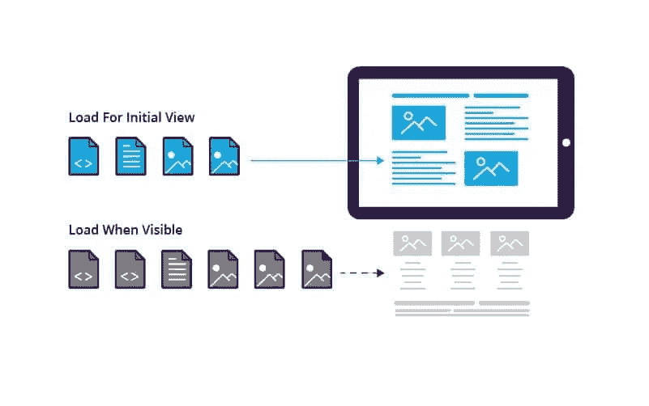
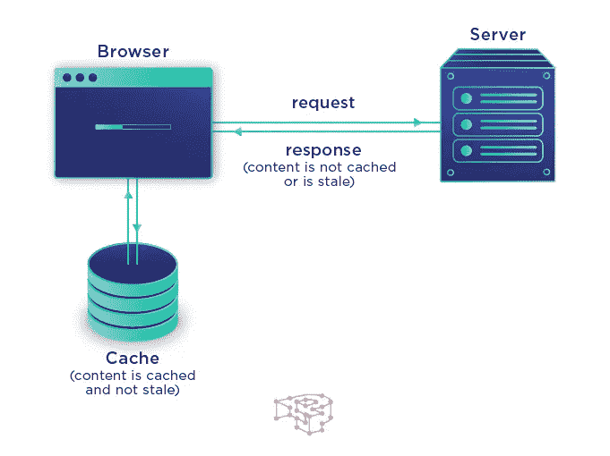

# 如何优化你的网站速度

> 原文：<https://javascript.plainenglish.io/how-to-optimize-your-website-for-speed-96b6b42857ed?source=collection_archive---------11----------------------->

## 加速您的网站以提高性能并实施最佳实践

Photo by [Chris Peeters](https://www.pexels.com/@krizz59?utm_content=attributionCopyText&utm_medium=referral&utm_source=pexels) from [Pexels](https://www.pexels.com/photo/man-riding-bicycle-12838/?utm_content=attributionCopyText&utm_medium=referral&utm_source=pexels)

随着互联网的新曙光，拥有一个网站是一件非常令人向往的事情。不管你处于什么样的小众，你都需要有一个网站。对于不了解你的人来说，你的网站更像是你在网上的自我。

拥有一个成熟的、优化的网站是必不可少的，特别是如果你把用户放在最前面，希望他们在访问你的网站时有更好的体验。科技巨头谷歌进行的研究显示，53%的移动用户放弃了加载时间超过 3 秒的网站。

这对你和你的用户意味着什么？如果你优化了你的网站，使其加载速度快于你的竞争对手，那么你就站在了用更高的加载速度从竞争对手那里抢夺用户的最前沿。

在这篇文章中，你将会看到一些你可以用来提高网站性能和速度的方法。这包括加载时间、交互时间和许多其他东西。

## **1。优化图像**

Image by Kinsta

如今，图片在网站中发挥着巨大的作用。除了影响视觉表现，他们也很容易吸引用户。同样，打印会降低你网站的速度，尤其是当你大量使用它们而没有优化的时候。

这些是你可以用来改善和优化网站图片表现的一些方法。

*   **开始实施使用 webP 图片**

根据开发者谷歌的说法，“WebP 是一种现代图像格式，为网络上的图像提供了卓越的无损和有损压缩。WebP 允许 web 管理员和 web 开发者创建更小、更丰富的图像，使 web 速度更快。

与 png 相比，WebP 无损图像的大小要小 26%。在同等的 SSIM 质量指数下，WebP 有损图像比可比较的 JPEG 图像小 25–34%。

无损 WebP 支持透明性(也称为 alpha 通道),代价只是增加了 22%的字节。对于可接受有损 RGB 压缩的情况，有损 WebP 也支持透明，通常提供比 PNG 小 3 倍的文件大小。"

*   **利用图像内容交付网络(CDN)**

内容交付网络(CDN)类似于基于用户位置访问图像的应用程序编程接口(API)。他们将通过附近的服务器提供用户图像。这不仅改善了交付网络，还加快了响应和交付时间。

*   **压缩图像以减小文件大小**

大尺寸的图像总是很重，需要很多时间来完全渲染，而较小的图像只需要很少的时间来渲染。将图像压缩成较小的文件大小将有助于提高页面速度。

*   **使用合适尺寸的图像**

这包括在各种设备上显示正确的图像。你不想在移动设备上显示桌面大小的图像。我们可以为移动和桌面设备定制合适大小的图像。

## **2。利用延迟加载技术**

Image by Imperva

惰性加载已经成为提高和优化任何现代网站性能的关键。最著名的网站(媒体等。)以这样或那样的方式实现这些技术。

惰性加载提高了 web 性能，同时又不影响服务器的性能和速度。延迟加载确保在需要时向用户显示页面的必要组件/部分，而不是在用户访问页面时立即显示。

这也给了页面中要求更高的部分加载时间，而其他部分要等到初次打印。

## **3。实现浏览器缓存**

Image by Section

缓存包括将与您的网站相关的数据或文件的副本临时存储在浏览器或缓存中，以便可以更快地访问它们。

对于不经常改变的数据，你可以实现浏览器缓存，这样网站必须加载得更快，并且只加载经常改变的部分。

缓存可以确保浏览器只下载没有缓存的信息，这样可以节省大量的时间来加载整个页面。

## **结论**

在你的网站中实现上述技术将有助于提高页面速度，为你的用户提供更好的用户体验。也会提高你的用户留存率，对你的产品很有帮助。

概括来说，我们看到的一些方法包括。

*   实现浏览器缓存
*   利用内容交付网络
*   优化图像并使用现代图像格式(webP)

## **更读**

 [## 作为开发人员，用技术写作赚钱的 5 种方法

### 作为一名开发人员，我对通过技术写作赚钱的真实体验

javascript.plainenglish.io](/5-ways-to-make-money-with-technical-writing-as-a-developer-fffd263a37ed)  [## 如何为技术写作产生文章想法

### 我产生文章想法的方法

javascript.plainenglish.io](/how-to-generate-article-ideas-for-technical-writing-4184e779f506) 

*更多内容请看*[***plain English . io***](http://plainenglish.io/)