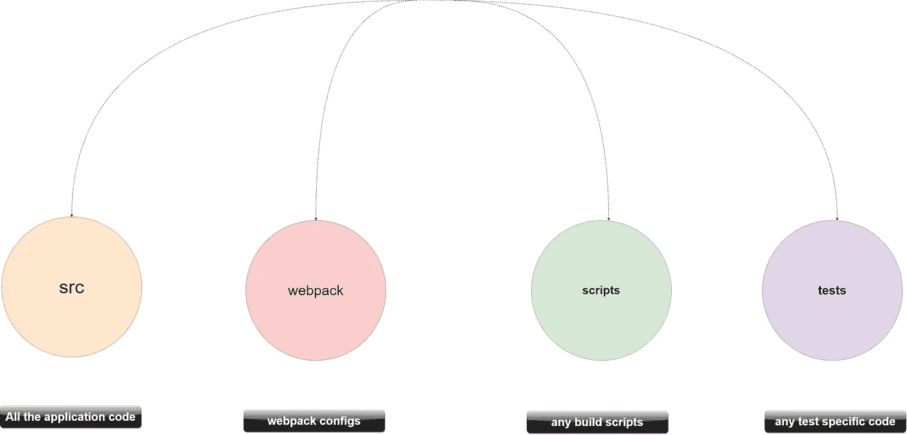

# 如何组织大型 React 应用程序

> 原文：<https://javascript.plainenglish.io/how-to-organize-large-scale-react-applications-aff84fba07cf?source=collection_archive---------3----------------------->

## 结构化文件和分解组件

# 文件夹结构

在 React 应用程序中没有这样精确的方法来组织文件，但是大多数 React 开发人员都推荐以下方法，因为在 React 应用程序中正确地组织文件可以在缩放时方便地管理它们。

*所有代码都保存在* **src:** 将文件保存在 **src** 文件夹中被推荐为现代应用程序中组织文件的最佳方式之一，因为当应用程序随着时间的推移而增长时，它可以轻松地浏览大量文件。在这个文件夹中，我们简单地添加了最终包含在您的最终包中的所有文件，不多也不少。这种方法非常有用，因为您可以告诉 ***babel*** 只查看一个目录，并确保它不会处理您的项目目录之外的任何不需要处理的代码，例如 ***webpack 文件、配置文件*** ，它们位于一个适当命名的文件夹中。

此外，当您使用应用程序时，导入文件变得很容易，因为当您将所有文件存储在 **src** 文件夹中时，它就成为了顶级目录。

# 反应组分

在设置了 **src** 文件夹后，我们必须存储 React 组件，您一定听说过将所有组件存储在 src 文件夹内的单独子目录中，例如 **(src/components)** ，如果您正在构建不需要长期维护的小型 React 应用程序，这种方法很好，但是如果我们在需要长期维护的大型 React 应用程序中应用相同的方法，当您将大量组件打包在一个目录中时，这种方法会变得难以应付。

我们应该将每个 React 组件存储在一个文件夹中，而不是将所有组件紧密地存储在一个文件夹中，该文件夹的名称是它们在应用程序中的功能。 ***以*** 为例，我们有一个名为 **Profile** 的文件夹，其中包含了与应用程序中 ***Profile page*** 相关的所有组件，还有一个名为 **Cart** 的文件夹，其中包含了应用程序中与 Cart 相关的所有组件。

**Importing React Components**

# 在大写字母上使用 JSX 扩展

我见过有人用大写字母命名他们的组件，当您需要修复应用程序中的错误或在应用程序部署后进行一些更改时，您会发现很难读懂组件的名称。不要像 **UserProfile.js** 或 **User.js 那样命名你的文件，**坚持用破折号作为分隔符的小写命名约定。

例如，我们可以将组件命名为 **user-profile.jsx.**

使用这种方法还有两个好处，因为现在您可以通过使用。 ***jsx*** 约定，如果需要，你甚至可以对这些文件应用特定的 ***webpack 插件*** 。

请注意，您不必坚持特定的命名约定，可以随意命名您的组件，但是要确保您只使用一个命名约定并坚持使用它，否则，您将会在您的项目中结束命名约定的组合，这使得很难阅读和导航到特定的组件，否则，随着您的应用程序的增长，它将成为一个噩梦。

# 避免较大的渲染方法

你必须确保你没有在你的 **React** 组件的渲染方法中添加太多东西，

***例如*** :假设我们有一个**配置文件**组件来渲染用户的配置文件，如果我们用几个**道具**在我们的渲染方法中添加所有的小组件，那么渲染需要来自设备的太多能量，并且很可能在几个设备上执行缓慢。

# 到处使用道具类型

在 **React** 中，您可以使用 [**prop-types**](https://www.npmjs.com/package/prop-types) 包，它允许您记录您在组件中定义的属性的名称和类型。使用 prop-types，您可以通过声明预期的 prop 的名称和类型来增强信心，并且您将知道哪个 prop 正在与每个组件一起工作。

如果你在想为什么我们需要记录我们的道具，例如***:***假设你的 React 应用程序需要在 8 个月后修复，你最终会不知道哪些**道具**与它们的动作相关联。

# 独立的 JavaScript 模块

在构建大规模 React 应用程序时，您会发现自己编写了大量与 React 无关的代码，因此当您发现自己处于这种情况时，您可以简单地将该逻辑从组件中移除。你可以创建一个文件夹作为 lib 或者充满非 React 组件的服务。

*将这些逻辑排除在组件之外有很大的好处，因为*你可以在不干扰 React 组件的情况下单独测试这些代码。

# 使用 Jest 进行测试

由**脸书**推出的 **Jest** 框架已经成为测试 **React** 应用的最佳选择之一。它真的很快，擅长处理大量的测试， ***在手表模式下运行，并提供快速反馈*** 和一些方便的功能来测试 React 应用程序。

如果您没有选择 Jest 作为您的测试伙伴，那么您将会在测试 React 应用程序时解决很多问题。

**例如:**假设您有一个名为 tests 的单独文件夹，其中包含所有的测试文件，如果我们有 **src/app/menu.jsx** 作为组件，那么在 ***tests*** 文件夹中，它将是 **tests/app/menu.test.jsx，**当应用程序变得更大时，这种方法的问题就越来越严重，找到正确的文件变得更加困难，如果您在【T20

# 结论

我们做到了！我希望你已经发现这是有用的。我错过了什么吗？如果有，一定要在评论里讨论。