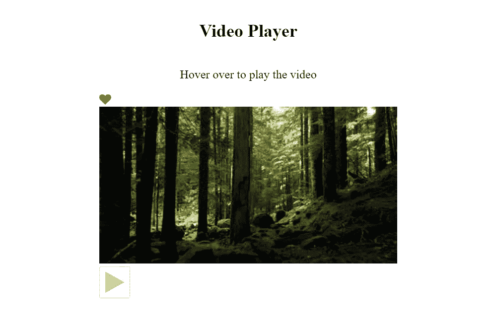
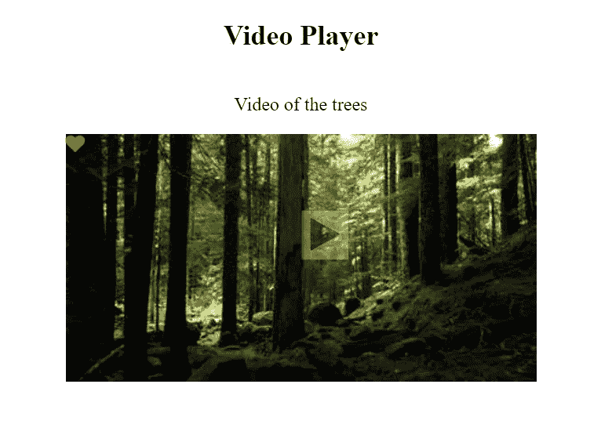
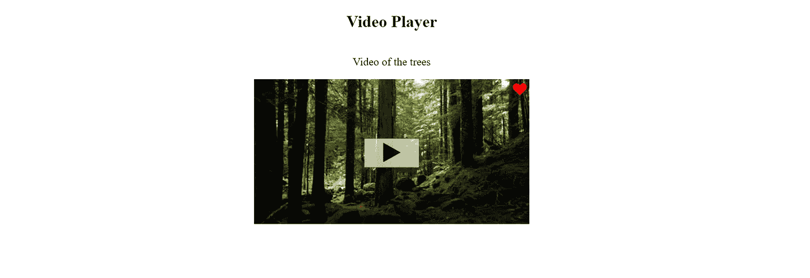

# 如何用 CSS 在图片上叠加图标

> 原文：<https://javascript.plainenglish.io/how-to-overlay-icons-on-top-of-the-image-b5919976e0fb?source=collection_archive---------5----------------------->

最近我在做一个项目，我们必须制作一个自定义的图库。这个需求需要我在图像上放置许多组件，比如图标、文本、另一个图像和许多其他东西。在此过程中，我了解了在我想分享的图片上叠加组件的步骤。让我们构建一个视频播放器页面来理解图标的叠加在 CSS 中是如何工作的。

让我们考虑下面的模板。我们有一个图像，我们需要在图像的中心放置 ***播放按钮*** ，在图像的右上角放置 ***喜欢按钮*** 。

```
<h2>Video Player</h2><p>Hover over to play the video</p><div class="container">
  <div href="#" class="like-button" title="Like Button">
    <i class="fa fa-heart fa-1x"></i>
  </div> <div class="overlay">
  <button href="#" class="play-icon" title="Video Play">
   <i class="fa fa-play"></i>
 </button>
</div></div>
```

首先，让我们从向页面和组件添加一些样式开始。

我们已经设计好了组件的样式，现在它们可以放在图片上了。通常当我们编写元素时，组件是垂直堆叠的，如下图所示。

但是我们需要将这两个图标叠加在图像上我们想要的位置。我们可以通过以下步骤来实现。



Before adding position property

# 第一步。分配职位

这是最重要的一步。第一步是将组件和图像封装成一个元素，并分配 CSS 属性`position: relative`。我们需要放在图像上的图标被赋予属性`position: absolute`。

在本例中，我们添加了类`.container`(它包含了图像和图标)`position: relative`，我们覆盖的图标被赋予了属性`position: absolute`。

你可以在下面的 CSS 中了解更多关于 position 属性的内容。

 [## 位置

### position プロパティは以下のキーワード値、グローバル値から１つを指定します。 要素は文書の通常のフローに従って配置され、 top, right, bottom, left…

developer.mozilla.org](https://developer.mozilla.org/ja/docs/Web/CSS/position) 

# 第二步。如有必要，将高于图像的 z 索引分配给图标

在这种情况下，我给图标(`.overlay`和`.like-button`)分配了一个 z-index，它高于图像的 z-index，这样它们就覆盖在图像上了。在某些情况下，如果组件的默认指标符合我们的要求，则不需要添加。但是一定要检查补充。

我们在下面的代码中添加了位置和 z 索引。



With position and z-index

下面可以了解更多关于 z 指数的内容。

 [## z 指数

### CSS の プロパティは、 位置指定 要素とその子孫要素、またはフレックスアイテムの z 順を定義します。より大きな z-index を持つ要素はより小さな要素の上に重なります。 位置指定されたボックス (つまり、 position が…

developer.mozilla.org](https://developer.mozilla.org/ja/docs/Web/CSS/z-index) 

# 第三步。使用其他 CSS 属性相应地定位图标

既然我们已经在图像上放置了图标，让我们使用一些属性将播放按钮移动到图像的*中心*并将类似按钮移动到图像的*右上方*末端。

当用户悬停在图标上时，我们添加了一些过渡，使页面看起来更漂亮。



Video-player page

# 结论

这就是总结！如果你有任何反馈，请在下面评论。请在此处找到项目[的示例。感谢您的阅读。](https://github.com/Sanchithasharma/IconsOverImage)