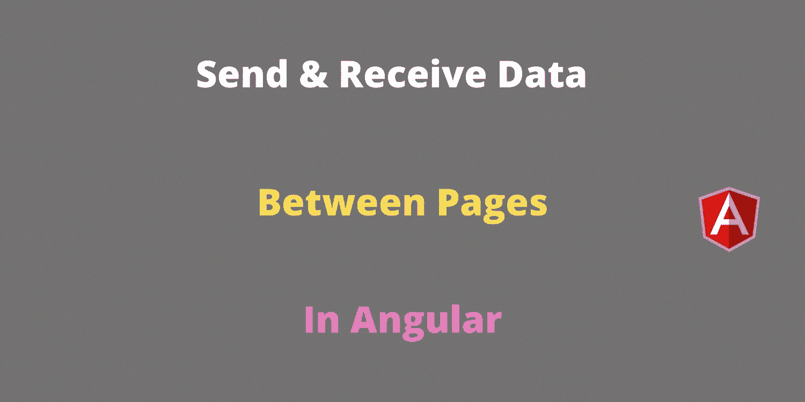

# 如何在 Angular 中将数据从一个组件传递到另一个组件

> 原文：<https://javascript.plainenglish.io/how-to-pass-data-from-one-component-to-another-in-angular-a9725733da12?source=collection_archive---------0----------------------->

## 如何在 Angular 中创建组件、路径以及通过这些路径发送/接收数据



在本教程中，我们将了解如何在 **Angular** 应用程序中将数据从一个组件传递到另一个组件。在 Angular 之前，服务器只处理数据发送和数据捕获活动。但是在 Angular 中，数据发送和数据捕获活动仅由 Angular 完成。我们可以使用多种方法将数据发送到另一个页面/组件。下面列出了几个选项。

1.  URL 参数
2.  查询参数
3.  附加状态

本教程重点介绍布线参数。让我们一个一个来看。

# **网址参数**

URL 参数主要用于 SEO 目的。只需查看示例 URL。

```
[http://localhost:4200/user/raja](http://localhost:4200/user/raja)
```

这里的 **raja** 将被称为 URL 参数。在大多数应用程序中，使用这种类型的 URL。现在让我们看看如何从头开始在 Angular 中创建这种类型的 URL。

因此，首先，使用下面的命令创建一个用户组件。

```
ng g c user
```

在 **app.routing.ts** 文件中为用户组件创建一个路由。

这里的 **:userId** 是捕获用户名的占位符。用来表示它的冒号是一个占位符。我们将使用占位符名称来获取值。

我们创建了一个组件，并为该组件创建了路线。为了捕捉 URL 参数，我们需要**activate route**类。所以在 **user.component.ts** 文件中导入 ActivatedRoute 类。

然后在 ActivatedRoute 类的构造函数中创建一个引用变量。

然后使用 activatedRoute 中的 **paramMap** 捕获 **userId** 占位符值，如下所示。

请记住。占位符名称在路由中定义。所以在获取值时使用相同的占位符名称。

您可以在**user.component.html**中显示用户标识，如下图所示。

```
<p>UserId: {{userId}}</p>
```

我们可以用各种方法测试上面的 URL 参数。直接在浏览器中输入下面的 URL 进行测试。

```
[http://localhost:4200/user/raja](http://localhost:4200/user/raja)
```

使用路由器导航到页面(组件)进行测试。

通过使用 routerLink 导航到页面(组件)进行测试。

所有的测试方法都会在浏览器中显示 raja 作为输出。现在我们非常清楚如何使用 URL 参数发送和接收数据。接下来，我们将看到如何处理查询参数。

# **查询参数**

下面给出了查询参数的示例 URL。

```
[http://localhost:4200/user/raja?souce=Google&page_id=10](http://localhost:4200/user/raja?souce=Google&page_id=10)
```

这里的**源**和 **page_id** 是查询参数。我们可以使用同一个 ActivatedRoute 类来捕获这些数据。

您可以在**user.component.html**中显示信号源，如下图所示。我只接受一个查询参数。您可以使用 N 个查询参数。

```
<p>Source: {{source}}</p>
```

我们可以用各种方法测试上面的 URL 参数。在浏览器中输入下面的 URL 进行测试。

```
[http://localhost:4200/user/raja?source=Application](http://localhost:4200/user/raja?source=Application)
```

使用路由器导航到页面/组件。

使用路由器链接导航到页面/组件。

```
<a [routerLink]="['/user/raja']" [queryParams]="{ source: 'Application'}">Query PARAM</a>
```

所有的测试方法都会将应用程序显示为浏览器中的输出。这里我实现了查询参数和 URL 参数。但是，URL 和查询参数是独立的。不需要将查询参数放在 URL 参数之后。

# 附加状态

如果您想发送一堆数据而不在 URL 中显示它们，那么在路由中使用 extras state 选项。

在您的 **home.component.ts** 文件中导入 NavigationExtras 类。

使用额外状态发送数据的示例代码。

这里我们在状态选项下传递数据。参数名为**用户**。您可以使用参数名称 user 来捕获数据。

为了捕捉数据，我们需要 Router 类。因此，将路由器类导入到 **user.component.ts** 文件中。

使用附加状态捕获数据的示例代码。

Extras 状态是发送和接收数据而不在浏览器中显示它们的一个很好的选项。但是它有一个很大的缺点。如果我们刷新页面，额外的状态数据将会消失。我们无法捕捉它。因此，在应用程序中实现它之前，请考虑这个问题，以及您将如何处理这种情况。

**完整源代码:**

[](https://github.com/bharathirajatut/angular-examples/tree/master/angular-send-data) [## bharathirajatu/angular-示例

### 角度示例源代码。为 bharathirajatu/angular-examples 的发展作出贡献

github.com](https://github.com/bharathirajatut/angular-examples/tree/master/angular-send-data) 

# **总结:**

在本教程中，您学习了以角度路径从一个组件向另一个组件发送数据的各种方法，以及如何接收数据。本教程将非常有用的角度应用初学者。

到目前为止，我们已经看到了以下主题。

1.  如何创建一个 **URL** 参数以及如何发送、接收 URL 参数中的数据。
2.  如何创建一个**查询**参数以及如何发送、接收 URL 参数中的数据。
3.  如何创建一个**附加状态**参数以及如何发送、接收 URL 参数中的数据。以及在群众演员状态下的劣势。

一些开发人员将使用本地存储在页面之间发送和接收数据。如果你愿意，可以试试本地存储。如果接收页面刷新，本地存储将是额外状态的解决方案。我们可以将额外的状态数据存储在本地存储中，如果页面被刷新，那么我们可以从本地存储中获取数据，而不是额外的状态。

希望你喜欢这个教程。敬请关注更多文章。

感谢您阅读这篇文章。

**角路由相关文章。**

[](https://medium.com/javascript-in-plain-english/angular-routing-and-navigation-example-998d14c01f8e) [## 角度路由和导航示例

### 创建组件并创建路线，然后导航到路线

medium.com](https://medium.com/javascript-in-plain-english/angular-routing-and-navigation-example-998d14c01f8e) [](https://medium.com/javascript-in-plain-english/how-lazy-loading-impacts-angular-app-performance-9c1ee0cb11ea) [## 惰性加载如何影响 Angular 应用性能

### 角形部件有什么问题？

medium.com](https://medium.com/javascript-in-plain-english/how-lazy-loading-impacts-angular-app-performance-9c1ee0cb11ea)