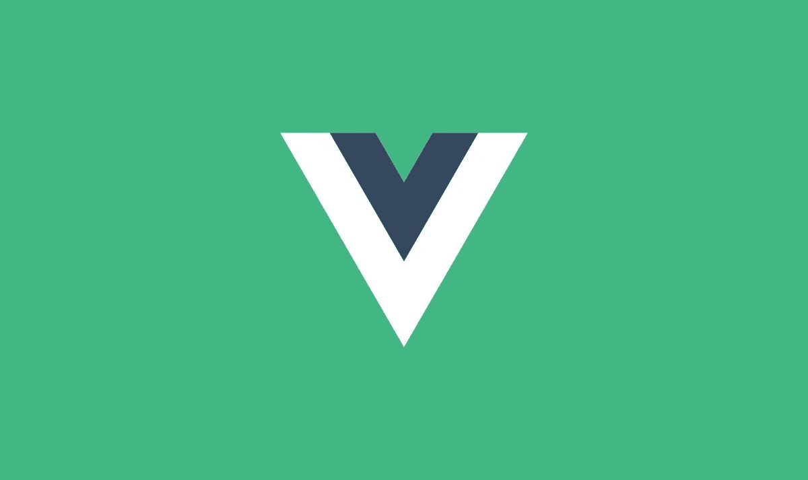

# 如何在 Vue.js 中进行数据绑定

> 原文：<https://javascript.plainenglish.io/how-to-perform-data-binding-in-vue-js-c22934f7721a?source=collection_archive---------17----------------------->

## Vue.js 中的数据和输入绑定，并附有示例。

Image by [theTribe](https://www.google.com/url?sa=i&url=https%3A%2F%2Fthetribe.io%2Fen%2Fvuejs-form-validation%2F&psig=AOvVaw27FkZo_VjO2n238R3p_QkN&ust=1628755742691000&source=images&cd=vfe&ved=0CAwQjhxqFwoTCNiLlNbDqPICFQAAAAAdAAAAABAm)

Vue.js 是一个前端 JavaScript 框架，在过去的时间里得到了更广泛的采用。

Vue.js 捆绑了一些令人惊叹的功能。它附带的特性之一是数据绑定特性。

在本文中，我们将了解如何在 Vue.js 中实现数据和输入绑定。对于这种情况，我们将制作一个简单的应用程序来演示它是如何工作的。

## **数据绑定**

在 Vue.js 中，数据绑定可以通过 Data 函数实现。数据函数保存我们可以在组件 UI 中呈现的组件状态。

仔细看看上面显示的代码片段。

上面显示的 Vue.js 的组件片段是我们可以确保 Vue.js 应用程序中数据绑定的方法之一。

## **小解说**

在代码片段中，我们有一个数据函数，它返回内部的一些状态。从数据状态，我们有一个名字和电子邮件，我们已经提供。

举个例子，我们希望将状态数据呈现给组件 UI。Vue.js 拥有惊人的双花括号(Mustache)语法，使我们能够无缝地向 UI 呈现状态。

查看我们的 H1 模板标签，我们在这里渲染来自美国的 ***userInfo.name*** 。我们使用双花括号将状态呈现给组件 UI。这是我们在 Vue.js 中执行数据绑定的简单方法之一

# **输入绑定。**

举一个例子，我们希望用户输入一些信息，并将相关信息存储在我们的应用程序中。我们如何做到这一点？

从上面的代码片段中，您可以看到我们有一个输入标签，上面有一些属性。Vue.js 有一些属性使我们能够在输入和状态之间执行双向数据绑定。

对于这种情况，您可以看到我们附加了一个 ***v-model*** 指令。根据 Vue.js 文档，指令是带有 ***v-*** 前缀的特殊属性。指令属性值应该是绑定表达式，

这个指令使我们能够通过输入标签无缝地更新状态。因此，在这种情况下，任何时候用户通过输入标签输入信息，它都会相应地更新状态，并呈现在它下面的 ***h1*** 标签中。

Vue.js 在其第三个版本 3.0 中引入了 composition-API。有了组合 API，我们不需要状态所在的数据返回函数(options API)，相反，它赋予我们在外部指定状态并确保反应性的权力。我们使用 ***refs*** 和 ***reactive*** 属性来确保状态和 UI 内的双向数据绑定。

如果您想了解更多关于 composition-API 的知识，请查看我不久前写的文章。

 [## Vue.js 中的选项 API 与组合 API—权威指南

### 我们应该使用哪一个？逐步比较。

javascript.plainenglish.io](/option-api-vs-composition-api-in-vue-js-a-definitive-guide-2a04a398b3ce) 

## **最终想法**

上面我们看到的方法是确保双向数据和输入绑定的 options-API 方法。Vue.js 引入了 composition-API 来弥补 options-API 的局限性。

与 options-API 相比，Composition API 有一些独特的优势，使我们的代码可读性和可维护性更强。

感谢您到目前为止阅读完这篇文章。我希望你觉得它很有帮助，并在 Vue.js 和 directives 中学到了一些关于数据绑定的东西。

如果你认为其他人可能会从这篇文章中受益，不要犹豫，与他人分享。

## **延伸阅读:**

 [## Vue.js 您应该采用的最佳实践

### 使用 Vue.js 时的最佳实践

javascript.plainenglish.io](/vue-js-best-practices-you-should-adopt-3f3b3a8abace)  [## 如何用 Dotenv 保护环境变量

### 使用 dotenv 保护环境变量的分步指南。

javascript.plainenglish.io](/how-to-secure-environment-variables-with-dotenv-c534fe46c8a) 

*更多内容尽在*[***plain English . io***](http://plainenglish.io/)