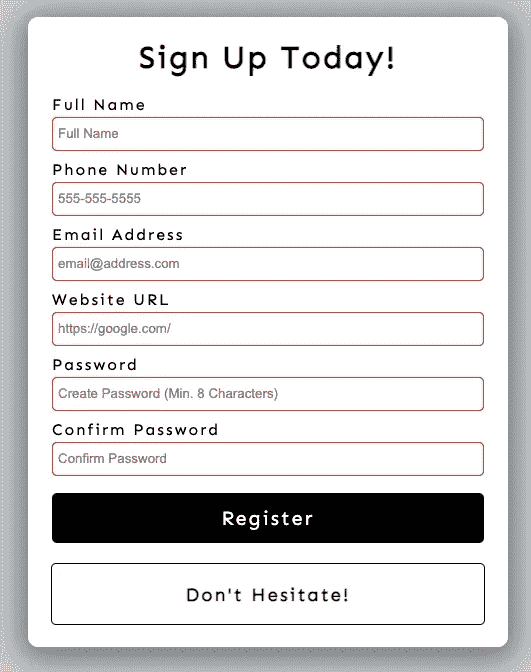
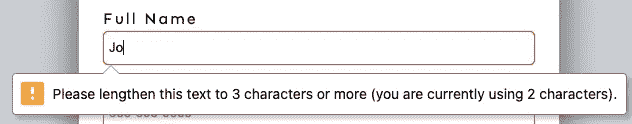
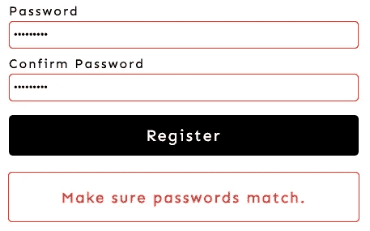

# 如何执行表单验证

> 原文：<https://javascript.plainenglish.io/how-to-perform-form-validation-10abadc45c6e?source=collection_archive---------20----------------------->


Photo by [Todd Mittens](https://unsplash.com/@toddmittens?utm_source=medium&utm_medium=referral) on [Unsplash](https://unsplash.com?utm_source=medium&utm_medium=referral)

# 为什么表单验证很重要

用户使用 web 表单注册或完成在线交易。如果您将用户输入保存到数据库，您最好确保收集的数据是正确的格式。有人会通过在表单中输入荒谬的值来破坏你的网站。

表单验证也可以是一种安全措施。让人们把他们想要的任何东西放进表单，会让您接触到 SQL 注入。表单验证之所以重要还有很多原因，但这是我见过的破坏网站的两个原因。

# 表单验证 101

在前端执行表单验证(在向服务器提交数据之前)称为[客户端表单验证](https://developer.mozilla.org/en-US/docs/Learn/Forms/Form_validation)。虽然您也可以在后端/服务器端验证数据，但我将重点放在客户端。

有两种类型的客户端验证:

*   内置表单验证( **HTML**
*   **JavaScript** 验证

内置的表单验证比 JavaScript 具有更好的性能，但是可定制性较差。在下面的例子中，我创建了一个带有空字段的表单。



[https://tingchun0113.github.io/form-validation/](https://tingchun0113.github.io/form-validation/)

尝试输入“Jo”并点击**注册**按钮:



修复后，输入字段的边框将从红色变为绿色:


您也可以尝试其他字段，但以下是我强加的规则(使用内置表单验证):

*   全名:*最小* 3 个字符；*最多 100 个字符*
*   电话号码:3 位数-3 位数-4 位数(11111111111 通不过)
*   必须包含电子邮件地址:“@”
*   网站网址:“http://”或“https://”必须包括在内
*   密码:1 个大写字符、1 个小写字符和 1 个数字

此外，我使用 JavaScript 验证来确保“密码”与“确认密码”相匹配。



# 是时候看看一些代码了

内置的表单验证(HTML)提供了一系列属性来帮助验证数据。以下是一些例子:

```
* required
* minlength="3"
* maxlength="100"
* pattern="[0-9]{3}-[0-9]{3}-[0-9]{4}"
* type="email"
```

将它们放入 HTML:

然后，使用 JavaScript 验证检查密码是否匹配:

```
if "Password" === "Confirm Password", passwords match
```

你可以在这个 [repo](https://github.com/tingchun0113/form-validation) 中找到完整的 [JavaScript 文件](https://github.com/tingchun0113/form-validation/blob/main/script.js)和其他项目文件。

# 最后的想法

只是不要忘记您可以(并且应该)在服务器端验证数据。是数据库前的最后一道防线。如果你觉得这篇文章有用或有任何问题，请在 [**LinkedIn**](https://www.linkedin.com/in/tingchunw/) 上联系我，或在 [**Medium**](https://tingchun0113.medium.com/) 上关注我以获取更多文章。

*更多内容请看*[***plain English . io***](http://plainenglish.io/)