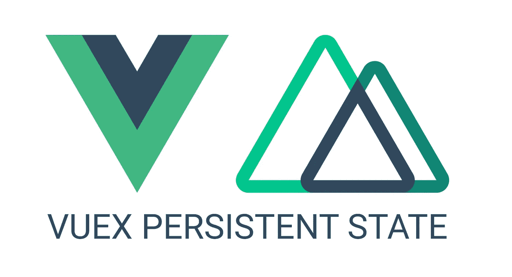
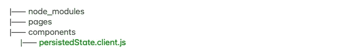
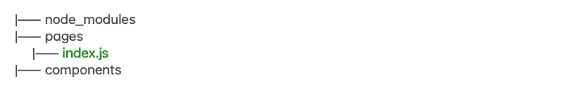
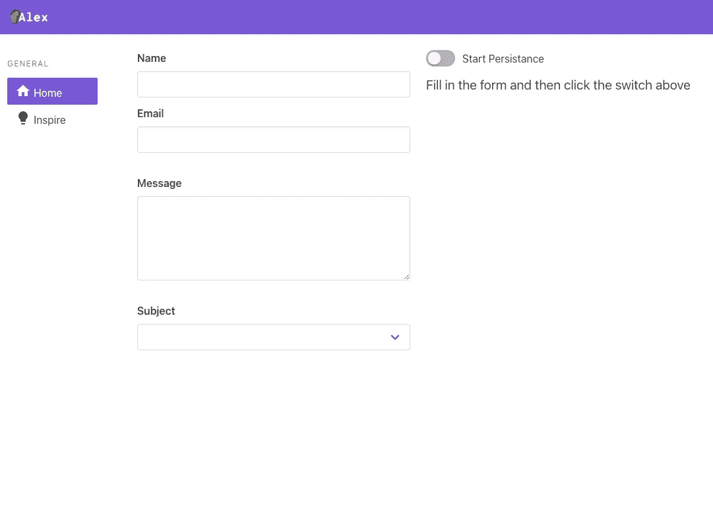
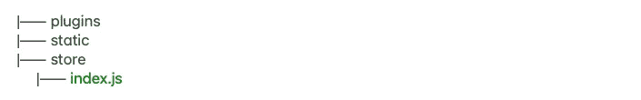
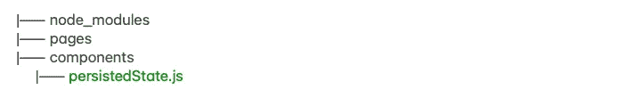
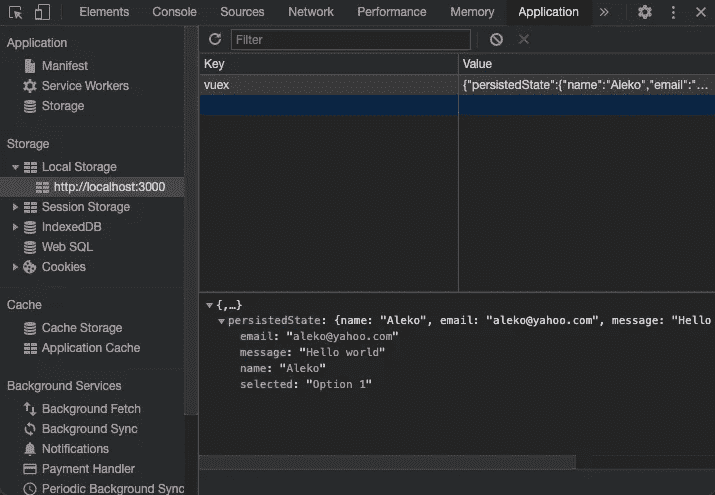

# 在 Nuxt.js 中，如何在页面重新加载之间保持和恢复 Vuex 状态

> 原文：<https://javascript.plainenglish.io/how-to-persist-and-rehydrate-your-vuex-state-between-page-reloads-in-nuxt-js-5c99b58752bb?source=collection_archive---------2----------------------->



在一个新项目中，我一直在做一个用户资料页面。我希望即使在用户重新加载页面后也能保存来自 Vuex 商店的表单数据，并且希望在注销时随意清除这些数据。我希望用户能够填写他们的个人资料详细信息，重新加载页面，并返回找到每个表单字段仍然填充有他们填写的数据。

**Vuex-persistedstate** 是一个 **npm 包**，它让我们将我们的 Vuex 状态存储到`localStorage`或`cookies`中。

[竣工工程](https://alexkasongo.github.io/vuex-persistedstate-nuxt-ssr/)🌱

[回购](https://github.com/alexkasongo/vuex-persistedstate-nuxt-ssr)🌱

# 装置

1.  将 Vuex-persistedstate 添加到项目中。

```
yarn add or npm install vuex-persistedstate
```

2.在单独的文件中创建一个新的插件实例。你可以随便叫它什么，我把它叫做`persistedState.client.js`,把你的插件命名为‘XXX . client . js’会让它只在客户端执行。



3.将插件添加到`nuxt.config.js`

```
// nuxt.config.js

...
/*
 * Naming your plugin 'xxx.client.js' will make it execute only on   the client-side.
 * https://nuxtjs.org/guide/plugins/#name-conventional-plugin
 */
plugins: [{ src: '~/plugins/persistedState.client.js' }]
...
```

4.在`index.vue`创建一个简单的表单，它可以在任何地方。我用的是 [Beufy](https://buefy.org/) ，它是基于[布尔玛](http://bulma.io/)的[vue . js](https://vuejs.org/)/[nuxt . js](https://nuxtjs.org/)的轻量级 UI 组件库。我绝对喜欢它🌱。



```
<template>
  <div class="p-5 columns">
    <div class="column">
      <section>
        <b-field label="Name">
          <b-input v-model="userName" type="text"></b-input>
        </b-field>

        <b-field label="Email">
          <b-input v-model="userEmail" type="email" maxlength="30"> </b-input>
        </b-field>

        <b-field label="Message">
          <b-input v-model="message" maxlength="200" type="textarea"></b-input>
        </b-field>

        <b-field label="Subject" class="mb-5">
          <b-select v-model="selected" placeholder="Select a subject" expanded>
            <option value="Option 1">Option 1</option>
            <option value="Option 2">Option 2</option>
          </b-select>
        </b-field>
      </section>
    </div>
    <div class="column">
      <section>
        <b-field>
          <b-switch @click.native="switchPersistance" v-model="isSwitch"
            >Start Persistance</b-switch
          >
        </b-field>
      </section>
    </div>
  </div>
</template>

<script>
import { mapState, mapActions } from 'vuex'

export default {
  name: 'HomePage',

  data: () => ({
    isSwitch: false,
    userName: '',
    userEmail: '',
    message: '',
    selected: '',
  }),
  computed: {
    ...mapState({
      persistedState: 'persistedState',
    }),
  },
  methods: {
    // persist to vuex store
    ...mapActions({
      switchPersistanceState: 'switchPersistanceState',
    }),

    switchPersistance() {
      // when the switch is turned on do this.
      if (this.isSwitch === false) {
        const userInfo = {
          userName: this.userName,
          userEmail: this.userEmail,
          message: this.message,
          selected: this.selected,
        }

        this.switchPersistanceState(userInfo)
      }

      // When the swith is turned off, do this.
      if (this.isSwitch === true) {
        this.userName = ''
        this.userEmail = ''
        this.message = ''
        this.selected = ''

        this.switchPersistanceState(null)
      }
    },
  },
  // Do this when the page reloads
  mounted() {
    // check if persisted state exists
    if (this.persistedState !== null) {
      this.isSwitch = true
      this.userName = this.persistedState.userName
      this.userEmail = this.persistedState.userEmail
      this.message = this.persistedState.message
      this.selected = this.persistedState.selected
    } else {
      this.isSwitch = false
    }
  },
}
</script>
```

您应该会看到类似这样的内容:



5.创建一个名为`index.js`的 **vuex 存储**文件



```
export const state = () => ({
  persistedState: null,
  alert: false,
})

export const getters = {}

export const actions = {
  switchPersistanceState({ commit }, payload) {
    commit('SET_STATE', payload)
    commit('SET_ALERT', true)
  },
}

export const mutations = {
  SET_STATE(state, payload) {
    state.persistedState = payload
  },
  SET_ALERT(state, payload) {
    state.alert = payload
  },
}
```

6.现在，我们终于可以使用 vuex-persistedstate 将数据持久化到本地存储了。



```
import createPersistedState from 'vuex-persistedstate'

export default ({ store }) => {
  createPersistedState({
    key: 'vuex',
    paths: ['persistedState'],
  })(store)
}
```

7.查看运行中的持久化数据。打开 devtools。我用的是谷歌浏览器。转到应用程序，点击本地存储。



## 结论

就是这样。希望这将帮助您创建在服务器端和客户端呈现之间持久化数据的“通用”应用程序。

阿列科🌱