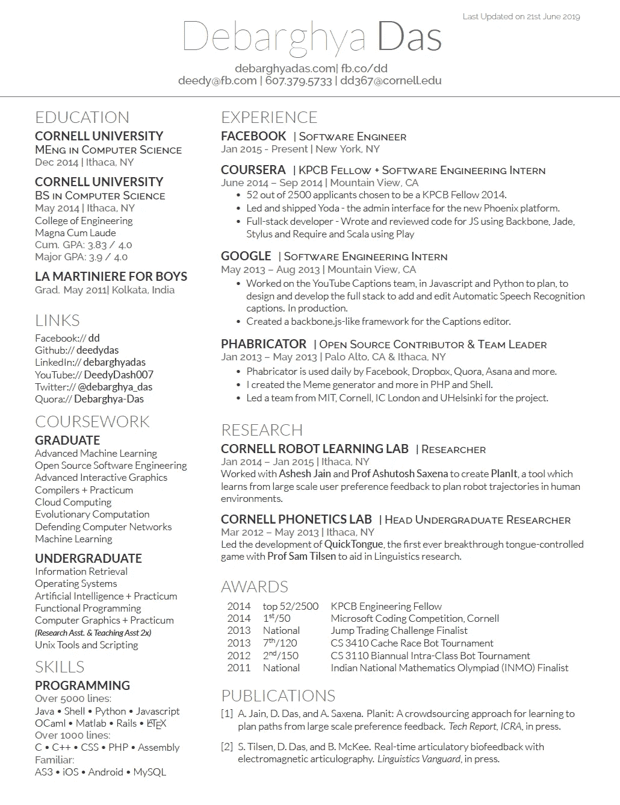
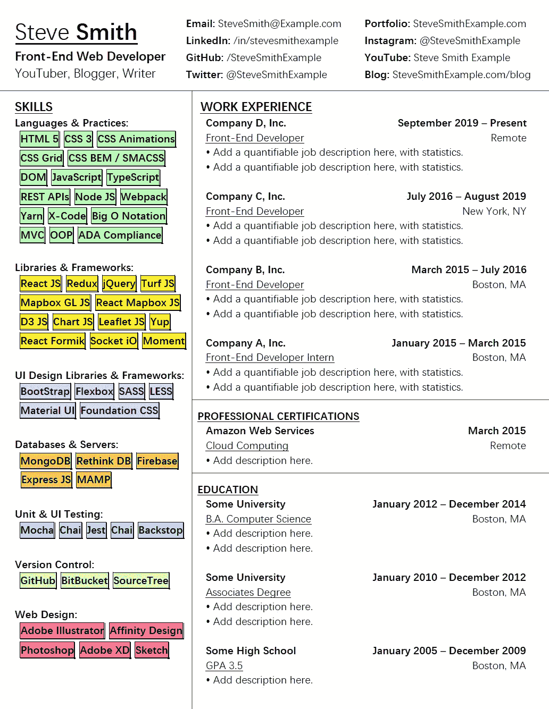

# 我通过这份简历获得了亚马逊、苹果和其他公司的技术面试

> 原文：<https://javascript.plainenglish.io/how-to-prepare-a-technical-resume-explained-w-examples-for-freshers-experienced-professionals-442d6ab427aa?source=collection_archive---------2----------------------->

在一个页面上向大人物展示经验和技能是……可能的。

Photo by [Jess Bailey](https://unsplash.com/@jessbaileydesigns?utm_source=medium&utm_medium=referral) on [Unsplash](https://unsplash.com?utm_source=medium&utm_medium=referral)

写一份技术简历是**的艰苦工作**——尤其是一份结构良好、可读性强、切中要害、没有任何瑕疵的简历，考虑到一个人可能拥有的各种技能和不同的工具。

招聘人员平均花费不超过 3-4 秒的时间浏览一份简历，筛选三天前收到的 1200 份求职申请。

任何一眼看上去难以理解的简历都可能自动被拒绝，而一份结构良好、外观简洁的简历更有可能被招聘经理收到。

那么，在与成百上千的求职者竞争的同时，怎样才能进入面试的大门呢？

***这需要策略。让我解释一下。***

暂且把你作为程序员的实际技术能力放在一边，你需要意识到拥有软技能很重要。我在这里所说的软技能不仅仅是在电话面试中以专业的方式展示自己的能力，而是在简历中展示自己的能力。

你的简历是你给招聘人员、招聘经理、你未来的潜在同事，甚至是公司首席执行官的第一印象。你在简历中投入的努力程度甚至可以看出你实际的职业道德。

这位候选人是否愿意花必要的时间反复检查他们的简历？是不是绝对 100%没有语法错误(*你可以用一个工具比如* [*Grammarly 的*](https://www.tkqlhce.com/click-100417643-11275706) *自动化工具在这里校对你的作品*)？它在视觉上是否格式良好(我指的不是花哨的字体、颜色和其他无用的图形，它们只是浪费宝贵的空白空间)，各部分按照常识性的顺序分开吗？这些方面与你将要从事的工作有着直接的联系。

你必须记住，招聘人员会从页面的上半部分往下阅读你的简历。这意味着你需要把你最相关、最重要的技能、工作经历和成就放在最前面和最中心。

现在，在我们进一步讨论这个问题之前，让我向您解释一下，尽管 COVID 带来了一种更加远程化的工作文化，在这种文化中，文档的传输、交互和业务决策都完全通过电子方式进行，但逐渐回归办公室意味着可打印简历的回归。是的，没错——这意味着你需要注意在简历中加入时髦的颜色。

我知道它们看起来很漂亮，我知道它们有助于你的简历脱颖而出，但是当招聘人员在办公室打印机上打印你的简历时会发生什么？如果他们忘记彩色打印会怎么样？这并不是说给你的简历添加色彩是一个糟糕的做法…只是要注意你的简历在设计上的互换性。如果需要，你能快速地将背景颜色改为白色吗？

这都是关于你的简历的快速和敏捷。有点像变形金刚——变形以满足当前的需求。放聪明点。

这正是我在重新设计我的软件开发人员简历时所做的。我去掉了所有多余的绒毛，把它从六页缩减到一页。对我来说这是最大的不同。然而，我仍在努力将 6 页的技能、经验和成就塞进一页。

“没门…”我想…这将意味着牺牲/省略很多不是特别相关的东西。我没有详细说明副业和客户项目，而是简单地在我的 GitHub 和 LinkedIn 上详细说明了它们，因为我已经在我的简历标题里有了我的社交存在的链接。看到了吗？一点常识大有帮助。

所以有一天，在为软件开发人员的简历想法进行头脑风暴时，我偶然发现了这个惊人的简历设计，顺便说一下，它是用一种叫做 Latex 的标记语言编写的:

## 整洁对吗？是啊。

不同部分之间的结构隔离和作者使用的干净字体给我留下了深刻的印象。

## 然而:

我认为简历应该有条理，因为它应该看起来很舒服。技能、工作经历等头衔应该突出，因为**和**正是招聘人员想要的。更不用说标题中所有空白了。“我可以改进这一点，”我说，所以没有任何进一步的麻烦，我现在向你介绍…

## 自我创建的前端开发人员简历模板让我获得了苹果、亚马逊和许多其他大公司的面试机会:

注意相似之处…注意不同之处。让我们快速分析一下我在 Latex 模板中添加、删除和保留的内容:

*   **增加了**:区分章节的线条，表格风格的技巧，颜色很容易转换成白色背景，加粗的章节标题。
*   **删除了** : 多余的空白。
*   **保持不变**:网格风格的架构，干净的外观，有底气的姓氏(*我真的很喜欢他们加的这个小感动*)。

我非常喜欢这份新简历，所以我决定用它来创建一个模板——只供你使用。

我创建了一个基于表格的布局，它非常容易编辑——试图把它弄乱真是一项全职工作。比方说，如果你发现自己陷入困境，整个 word 文档都崩溃了，*这很容易解决！*

## **下载你的简历(下面的链接):**

请记住，这个模板非常通用，几乎可以用于任何需要大量技能的工作。如果你正在阅读这篇文章，并且不是 web 开发人员，不要担心——你可以随时替换 JavaScript、React、Node.js 等。用**你的**拥有相关技能！编辑它以满足您的需求。编辑它，添加部分，删除部分…我想看看你们想出了什么。

[https://www . etsy . com/pj codes/listing/1035649294/resume-template-Harvard-Amazon-apple？UTM _ source = Copy&UTM _ medium = listing manager&UTM _ campaign = Share&UTM _ term = so . lmsm&Share _ time = 1626271884873](https://www.etsy.com/pjcodes/listing/1035649294/resume-template-harvard-amazon-apple?utm_source=Copy&utm_medium=ListingManager&utm_campaign=Share&utm_term=so.lmsm&share_time=1626271884873)

我甚至在上面制作了一个完整的 YouTube 视频:

当你在那里的时候，一定要看看我用的求职信。我会鼓励你两者兼得，以增加你赢得面试的机会。投资你的职业和未来是你能做出的最好的决定之一。点击此处获取您的求职信:

[https://www . etsy . com/pj codes/listing/1035629580/cover-letter-哈佛-亚马逊-苹果？UTM _ source = Copy&UTM _ medium = listing manager&UTM _ campaign = Share&UTM _ term = so . lmsm&Share _ time = 1626272200721](https://www.etsy.com/pjcodes/listing/1035629580/cover-letter-harvard-amazon-apple?utm_source=Copy&utm_medium=ListingManager&utm_campaign=Share&utm_term=so.lmsm&share_time=1626272200721)

**和**如果你需要帮助建立你的简历，校对它，或者调整它，以便为你的下一次面试做准备，给我发一条短信到**Pjcodesjs@gmail.com 或者**使用 [Grammarly 的](https://www.tkqlhce.com/click-100417643-11275706)自动化工具来校对你的工作。

希望这对你有帮助！感谢阅读和观看。

**请到**——[Pjcodes.com](http://www.pjcodes.com/)来找我

*   **(* ***披露:*** *本文包含附属链接，我可能会从 Grammarly 获得一小笔佣金，如果您选择通过我的链接购买，您无需支付额外费用)**。*

*更多内容看*[***plain English . io***](http://plainenglish.io/)