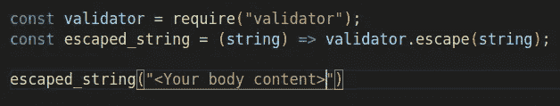
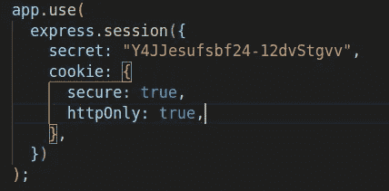
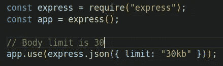
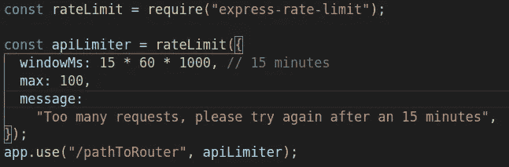

# 如何防止您的节点 API 落入常见的安全漏洞

> 原文：<https://javascript.plainenglish.io/how-to-prevent-your-node-api-from-falling-into-common-security-holes-8bd7272e5504?source=collection_archive---------7----------------------->

软件工程师的日常生活充满了问题。有时，我们会遇到安全问题。但是在为大公司做一个大项目时，这个消息可能是非常有害的。

如果您从未听说过诸如 **XSS、DOS 攻击、SQL/NoSQL 注入攻击、**等术语，那么很抱歉，您真的没有创建安全的代码。

好吧，但是具体怎么做呢？从现在开始，我知道这些攻击者是非常有害的。这意味着我们需要尽可能地保证您的应用程序(或 API)的安全。

在本文中，我希望通过提供一些最佳实践来帮助您，您可以在日常工作环境中尝试并解决这些安全问题。
但首先，如果你不熟悉，让我们一个一个来分析一下！

# **跨站点脚本(XSS)**

基本上，XSS 攻击是一种攻击者注入。攻击者会寻找一些方法来插入恶意的浏览器端脚本。当开发人员不够仔细地在服务器端验证输入时，这意味着开发人员只是费心在前端进行验证。不幸的是，这是很常见的。:(

当攻击者成功使用 XSS 时，他们就可以访问 cookies、会话令牌和敏感数据。

# **拒绝服务(DOS)**

这种行为对于应用程序的声誉来说是非常糟糕的，因为这意味着没有人能够访问该应用程序。攻击者通过不断发送请求、创建流量和发送大量各种信息来实现这一点。如果攻击者成功进行了 DOS 攻击，将会使您的服务变慢或导致停机。

# **蛮力攻击**

用于获取密码或个人识别码(pin)等敏感用户数据的方法。通常，攻击者使用机器人对所需数据的值进行大量猜测/尝试，即使用随机密码进行登录尝试。

# **NoSQL/SQL 注入**

我想你以前已经听说过这个术语了。注入使得攻击者能够执行恶意的 SQL/NoSQL 语句。攻击者可以绕过认证、授权，检索整个数据库的内容，添加、修改、删除数据库中的数据。

好吧，但是现在，我们需要解决主要问题。

# **解决这些问题的最佳方法是什么？**

因此，在您了解了每个安全发现之后，我将逐一向您展示如何防止这些攻击。

# **如何防范 XSS 袭击？**

首先，我们需要记住，任何参数都需要经过[验证和](https://cheatsheetseries.owasp.org/cheatsheets/Input_Validation_Cheat_Sheet.html)净化。这是一件非常容易实现的事情，尽管如此，许多开发人员还是忘记了去做。除此之外，验证所有输入。这是解决这一问题的最有效的技术。该标准将防止脚本攻击并验证服务器端输入。

# **HttpOnly:阻止针对 XSS 的 cookies】**

另一种防止 XSS 的方法是防止浏览器 JavaScript 脚本访问 cookie。窃取 cookies 是最常见的 XSS 攻击之一。这是通过在下面的代码中将 cookie 值`httpOnly`设置为`true`来实现的。

# **DOS:防止拒绝服务**

首先，为了防止拒绝服务，我们需要定义用户可以向您的 API/服务提交的限制。

我们可以使用 Express 中的 body-parse 来设置这个限制。

另一种选择是为用户设置速率限制。所以，基本上，你可以为每个用户设置最大请求量；在用户使用完他们的所有请求后，您可以将他们锁定一段时间。

# **如何防止暴力攻击**

防止这种情况最有效的方法是设置登录尝试的限制，如上所示，使用`express-rate-limit`。

为了降低攻击者猜测敏感数据(密码、pin)的难度，您应该实现 **bcrypt 依赖。Bcrypt 将加密敏感数据，如密码，这将使他们更难猜测。**

我们还可以实现 MFA(多因素认证)。这使得认证机制更加安全。

# **依赖项和包**

我们知道 NPM 提供了一种简单的方法来将一些软件包集成到您的应用程序中。但是我们需要采取预防措施，不要因为过时的包而暴露在安全风险中。

除此之外，我们必须监控以确保所有软件包都是最新的。

用`npm audit`命令很容易做到，你可以自动修复运行`npm audit fix`时可修复的问题。

对了，另一个对你有很大帮助的重要包是[头盔](https://www.npmjs.com/package/helmet)。头盔通过设置各种 HTTP 头来帮助您保护您的 Express 应用程序。*不是银弹*，但是能帮上忙！

# **结论**

正如我之前已经解释过的，当主题是确保服务的稳定性、可靠性、持久性和安全性时，开发人员必须努力工作。

上述类型的安全缺陷更常见，因此我向您展示了一些增强我们的节点应用程序的方法，以安全地运行它们，并将安全风险降至最低。

我希望我已经帮助你编写了安全代码！💻 👏

*更多内容看*[***plain English . io***](http://plainenglish.io/)