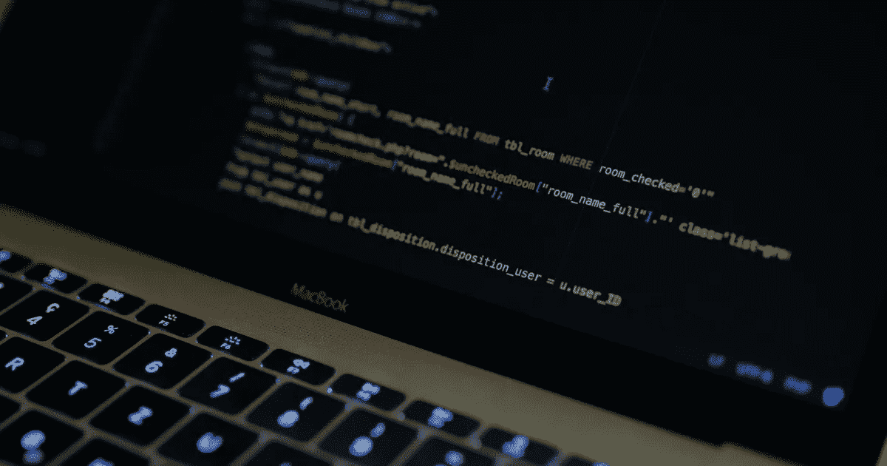

# 从 1 到 100 打印，不使用任何数字或循环

> 原文：<https://javascript.plainenglish.io/how-to-print-from-1-100-without-using-any-numbers-or-loops-a92cca1a5d22?source=collection_archive---------8----------------------->

## 使用一元运算符和递归

因此，LinkedIn 上出现了一个疯狂的趋势，程序员试图打印 1-100，但主要问题是他们不能在整个代码中使用任何数字，使用循环也不是解决方案的一部分。

以下是我对这个问题的看法。为了解决在整个代码中不使用数字的问题，我求助于一元运算符来拯救我的日子。使用 JavaScript **一元运算符(+)** ，可以将任何变量转换成数字。如果数字不能转换成数字，它将简单地返回 NaN。所以，这解决了问题的第一部分，我们可以使用布尔和一元运算符生成任何数字。

谈到不使用循环的第二个问题，很明显任何循环问题都可以用递归等价地解决。所以，现在让我们来看看代码，它相当简单，但足够有效地解决我们的问题。

代码很容易理解，如果你有任何建议或其他版本的代码可以解决这个问题，我很乐意在评论中看到它们。