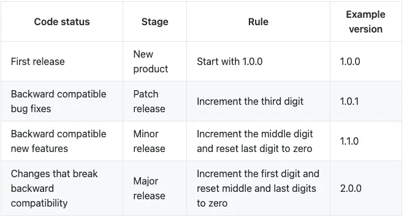

# 如何在 5 分钟内在 NPM 上发布你的自定义反应钩

> 原文：<https://javascript.plainenglish.io/how-to-publish-your-custom-react-hook-on-npm-in-5-minutes-f3baed1f916d?source=collection_archive---------5----------------------->

## 使用 rollup.js


反应钩很棒。他们让我们可以选择为我们需要的任何东西定制挂钩。有时候，你建造了非常有用的钩子——你想与世界分享它们。

当你已经在查找如何发布 NPM 套餐时，你注意到:
这可能有点困难。根据您想要发布的内容，需要进行一些配置。为了让事情变得简单，这里有一个在 NPM 上发布自定义 React hook 的指南。

# 编写自定义挂钩本身

因为，最后，你要自己写一个钩子，所以我们在这里给它一个简单快速的例子。每当组件更新时(包括挂载，如您所理解的 useEffect ),控制台上会记录以下“钩子”。

我知道这绝对不是一个定制钩子的用例，但是它现在可以作为一个例子。使用它很简单:

# 正在初始化我们的包

让我们从不太好的部分开始。要在 NPM 上发布包，您需要一个帐户。它不花费任何东西。在这里自己报名[。](https://www.npmjs.com/)

当您创建帐户时(确保通过您收到的电子邮件确认您的电子邮件地址！)或者已经有了，在终端登录自己的账号:`npm login`。

创建我们的包像往常一样工作:创建一个新目录，运行
`npm init -y`。确保在 package.json 的`name`字段中选择一个好的名称，然后在 package.json 中创建一个`main`字段，指向绑定的文件。现在，我们使用“dist”目录中的`index.js`——所以确保创建两个目录。package.json 条目如下所示:

```
"main": "dist/index.js",
```

## 了解版本控制

如您所见，package.json 将您的包版本默认设置为 1.0.0。

每当您发布软件包的更新版本时，都需要增加版本。选择版本不是随机的——它背后有一个计划，你应该遵循:



Source: [docs.npmjs.com](https://docs.npmjs.com/about-semantic-versioning)

因此，在再次发布 NPM 软件包之前，请确保更改版本。对于第一次发布，版本`1.0.0`是好的。

# 为 NPM 打造包装

为了将 React Hooks 代码转换成适合 NPM 的格式，我们使用了著名的 rollup.js。文件结构现在应该如下所示:

```
.
├── dist
│ └── index.js
├── package.json
└── src
 └── index.js
```

要使用 rollup，可以全局安装:`npm install -g rollup`。然后，我们可以通过运行 package.json 脚本来使用它构建我们的包。因此，在 package.json 的脚本部分，添加:

```
"build": "rollup src/index.js --file dist/index.js --format cjs"
```

格式值“cjs”代表 commonJS。这意味着我们使用现代导入/导出语法的 React 钩子代码被转换了。dist 目录中的 index.js，最终文件，将使用从 Node 中得知的`require`和`module.exports`语法。为了自动进行这种更改，我们使用 Rollup。

我们写的想要发布的 React 钩子可以复制到 src 目录里面的 index.js 中。然后，您应该能够运行`npm run build`，在 dist/index.js 中生成格式化的 React Hook 它应该如下所示:

# 让我们发布这个包

最后一次检查是否一切就绪，可以发布了:

*   你在终端登录 NPM 了吗？
*   dist-directory 中是否存在 index.js？
*   你是否在 package.json 中将`"dist/index.js"`作为值提供给了`"main"`？是否在 package.json 的`"name"`字段中提供了名称？
*   你通过他们发给你的邮件确认你的 NPM 账户了吗？

如果这三件事你都能回答是，那就可以发布包:`npm publish --access public`。好了，你的包裹出版了！

## 测试包

在您选择的 React 项目中，您可以安装您的 Hook 包。只需运行`npm install <your-package-name>`。包名是通过 package.json 的`"name"`字段定义的。

```
import useConsole from "<your-package-name>"function App() {
  useConsole()
  ...
}
```

# 更新、提示和技巧

为了发布包的新版本，您需要做三件事:

1.  用`npm run build`重新运行构建过程
2.  更改 package.json 中的版本
3.  运行`npm publish`

为了节省时间并获得更高的安全性，您可以组合使用其中的两个命令。通过在 package.json 中创建一个定制脚本，我们可以依次运行构建和发布包。通过这种方式，您可以确保在没有运行构建之前不会发布:

```
"deploy": "npm run build && npm publish"
```

不使用`npm publish`，现在，可以使用`npm run deploy`。

## 链接你的 GitHub 和主页

你肯定使用 Git 来管理你的包的代码。在 GitHub 上发布代码时，你可以从你的 NPM 站点链接到 GitHub 站点。NPM 的每个好包装都使用这个:


Source: [npmjs.com](https://www.npmjs.com/package/react)

要链接 GitHub repo，请在 package.json 中引用它，如下所示:

```
"repository": {
  "type": "git",
  "url": "https://github.com/<username>/<repo-name>"
},
```

正如你的 GitHub repo，你可以添加一个主页:

```
"homepage": "https://github.com/<username>/<repo-name>#readme"
```

最常见的方法是将你的 GitHub README 作为主页。

感谢您的阅读！

## [在 Twitter 上找到我以了解最新消息:)](https://twitter.com/louispetrik)

关于 React 挂钩的更多信息:

[](/next-js-keep-state-7eb68984c54e) [## 如何在 Next.js 中跨页面保持组件状态

### 使用会话存储& useLayoutEffect

javascript.plainenglish.io](/next-js-keep-state-7eb68984c54e) [](https://medium.com/codex/usestate-useref-react-9f2398606d51) [## 使用 useRef 作为使用状态替换—下面是时间和原因

### useState 挂钩可能是任何与在 React.js 中保存数据相关的挂钩

medium.com](https://medium.com/codex/usestate-useref-react-9f2398606d51) 

*更多内容看*[***plain English . io***](http://plainenglish.io/)