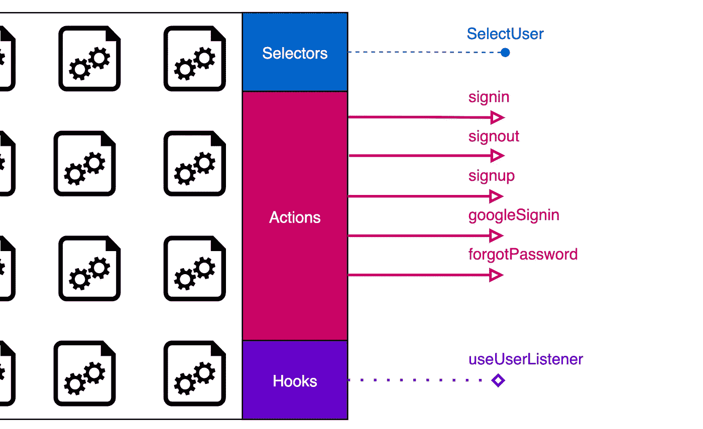

# 如何用 Redux 量化一个 React App 的复杂度？

> 原文：<https://javascript.plainenglish.io/how-to-quantify-the-complexity-of-a-react-application-with-redux-6f1a501e9454?source=collection_archive---------8----------------------->


Photo by [Caspar Camille Rubin](https://unsplash.com/@casparrubin?utm_source=medium&utm_medium=referral) on [Unsplash](https://unsplash.com?utm_source=medium&utm_medium=referral)

一个**大的**软件产品不一定要**复杂。**它可以是一个由简单独立的单元组成的庞大组织，这些单元以预定的方式进行交流。

## React Redux 项目由什么组成？

*   UI 组件
*   冗余切片(充当域的核心)
*   效用函数

我们可以通过 UI 组件的数量、redux 片的数量等来量化应用程序的复杂性。但是数据流呢？

我们可以用 5 个 UI 组件和 2 个片段构建一个混乱的应用程序，它们以一种混乱的方式进行通信，最终使应用程序变得脆弱。

> 数据流决定复杂度。

# 交换单位

想象我们产品的任何部分是一个有三种端口的盒子。

*   **选择器** →提供**数据**。
*   **动作→** 提供**动作**来调用用户交互。
*   **挂钩** →提供挂钩，与组件的**生命周期**一起运行。


Photo by [Markus Winkler](https://unsplash.com/@markuswinkler?utm_source=medium&utm_medium=referral) on [Unsplash](https://unsplash.com?utm_source=medium&utm_medium=referral)

我们可以将我们的产品扩展成任何尺寸，但独立单位只接受或放弃上述三种尺寸中的一种。

它们是我们应用程序中的货币。

## 在 UI 下

使用这个架构，我们可以构建一个完整的应用程序，所有的数据都流向没有 UI 的所有路由，然后**轻松地将 UI 插入到路由中**。

UI 组件接受什么？以上三种。

# 领域驱动设计

任何产品都是业务领域的集合。我们在本文中构建的产品是 Epic Games Clone。我们拥有的域名有

*   **用户:**来自 *firebase 认证的认证信息。*
*   **游戏:**游戏收藏 *firestore* 。
*   **browse game:***Algolia*全文搜索。
*   **用户游戏:**用户游戏收藏 *firestore。*

它们都处理不同的数据源。我们将使用`createSlice`作为每个域的核心。我们将打包每个域中的所有实现，并且只公开项目其余部分所需的内容。

## **一个域的结构。**

让我们看看用户域是如何构造的。



UserSlice showing the consumable units exported

这就是项目的**其余部分看待用户域的方式。他们不关心这项服务是如何实现的，服务内部发生了什么。他们关心的消耗品出口包括**选择器**、**动作**和**挂钩**。**

查看用户域的 index.ts 文件。

上述体系结构提供了以下优点。

*   **灵活性:**如果我们将身份验证提供者从 Firebase Auth 更改为 AWS Cognito，我们不需要更改操作。如果做得好，UI 甚至不知道它下面发生了移动。
*   **可扩展性:**上述域如何扩展？我们将引入新的动作、选择器和挂钩。我们将在索引中展示它们。

## 从消费者的角度来看

我们将确保这部分的消费者有一个顺畅的体验。

导入并使用数据即可。

```
import {selectUser} from 'src/store/user'const user = useAppSelector(selectUser)
```

*   **易用性:**导入即可使用。
*   **抽象的痛点:**如果我们从 UI 中找到痛点，我们将在我们的领域中修复它们。
*   **干净的道具:**通过使用选择器，我们可以确保像 UI 这样的东西得到一个特定的数据作为`[]`而不是`null`等等。

## 如何量化复杂性？

随着项目的成熟，我们可以很容易地跟踪以下信息列表。

该应用程序具有，

*   `***15*** Domains`
*   `***73*** Selectors (4.8/domain)`
*   `***59*** Actions (3.9/domain)`
*   `***13*** Hooks (0.8/domain)`

多酷啊。

知道了这些，无论应用程序变得多么大，它都会给整个应用程序**一个清晰的**思维地图**。**

这也是对项目的详细介绍。当一个新生加入这个项目时。我们可以让他/她浏览控制流单元列表，以了解应用程序做的所有可能的事情。

数量的增加也与复杂性不成比例，因为它们都以一种简化的方式进行交流。

我们可以更进一步，了解应用程序内部的**消费行为**到一个非常细微的层次。我们可以运行一个代码分析工具，用下面的代码来指导我们。

*   `**Selector**:selectUser`被`12 components and 2 Domains`消耗。
*   `**Action**:login`被消耗`7 components`。

你可能会想。*哪 7 种成分？并可能最终发现用户登录流程中的缺陷。*

*   `**Domain**:UserInfo`正在消费来自`**Domain**:User`的`13 units(selectors|actions|hooks)`。那就是 `(76%)`。考虑合并？

遵循选择器-动作-钩子体系结构并分析这些控制流的性质将会控制我们的应用程序的复杂性。

## 从属巡洋舰

我能找到的最接近可视化项目中控制流的工具是 [dependency-cruiser](https://github.com/sverweij/dependency-cruiser) 。

下面是 [epic-clone](https://github.com/karthickthankyou/epicgames-clone-develop/tree/playground) 的详细依赖图(目前在 playground 分支)

以完整模式打开以查看详细信息。

注意事项:

*   图表显示了`src/components`和`src/store`之间的关系。
*   黄色框是相应索引文件的快捷方式。

dependency-cruiser 也允许我们创建孤立的图表。下面是`BrowseGames`页面和`store`页面的关系。

*   注意它是如何只处理`browserGame`片而不处理其他任何东西的。(它从`store`中获取`useAppSelector`。)

## 调试的未来？

上图显示

*   模块(用户界面/商店/资产等)
*   连接

上图中的连接不仅仅是模块导出。它们是应用程序中的控制流网络。

想象下面的 ***DX*** 。

在开发过程中，您总是会打开这个实时图表。在应用程序执行的任何时候，我们都可以看到

*   什么路线/页面是活动的？
*   正在渲染和重新渲染哪些组件？
*   一个`component -> component`连接承载了什么状态和道具？
*   正在采取什么行动？

我们还可以包括重要的分析，例如，

*   每个动作和渲染需要多长时间？
*   每个模块(包括第三方模块)的大小和已用与未用代码的比率。

如果上述信息以一种难以处理的方式与其他重要的见解一起呈现给开发人员，将会有巨大的价值。

谢谢你。下次见。

这是我正在写的一个更大系列的一部分。所以请和我保持联系，加入我的旅程。

*更多内容请看*[***plain English . io***](http://plainenglish.io/)