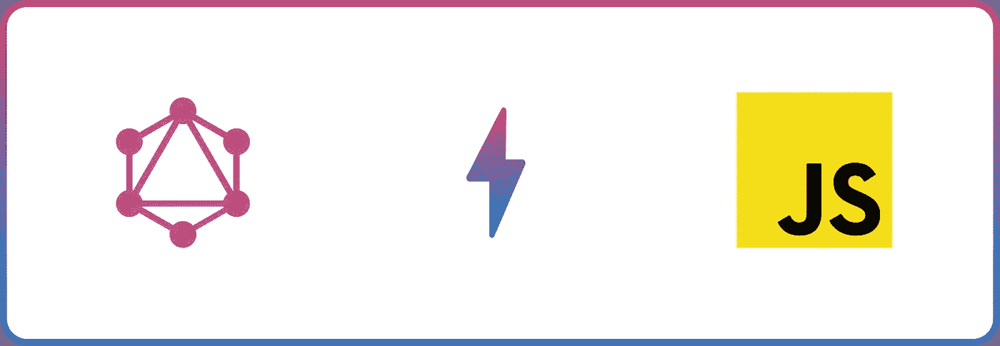

# 如何用普通 JavaScript 查询 GraphQL 端点

> 原文：<https://javascript.plainenglish.io/how-to-query-graphql-endpoint-with-vanilla-javascript-e2ebdb266b98?source=collection_archive---------5----------------------->

Image

[GraphQL](https://graphql.org/) 是一种用于读取和改变 API 中数据的查询语言。它为后端开发人员提供了一个描述数据模式的系统。它为 API 的消费者提供了探索他们需要的确切数据的灵活性。

使用 GraphQL 构建解决了提取过量/不足的问题，并限制了传统 REST APIs 带来的数据传输成本。JavaScript、C#、Go、PHP、Java 等编程语言提供了库和工具来帮助开发人员开始使用 Graphql。

我们将使用 React 开发我们的前端应用程序。(*注意:您可以在其他前端库/框架上使用相同的方法。*)。对于 GraphQL 端点，我们将使用 [**GitHub GraphQL API**](https://api.github.com/graphql) 来获取用户的详细信息和存储库。

在本教程中，我们将学习如何只用普通的 JavaScript 查询 GraphQL 端点。

# 沙箱

我们在一个 [Codesandbox](https://codesandbox.io/s/reactgraphql-tcnxe?file=/src/App.js:2094-2705) 中完成了这个项目，你可以派生它来运行代码。

# 先决条件

*   JavaScript 和 React.js 的基础知识。
*   GraphQL 不是必需的，但是拥有它很好。
*   GitHub 账户。我们需要一个帐户来为我们的应用程序生成个人访问令牌，并使用 GitHub GraphQL explorer。

# **生成 GitHub 个人访问令牌。**

首先，我们需要生成一个个人访问令牌。当使用 GitHub API 或命令行时，个人访问令牌是使用密码对 Github 进行身份验证的替代方法。

要获取我们的个人访问令牌，[登录您的 GitHub 帐户](https://github.com/login)，导航至**设置**页面

click on settings

在左侧工具条中，点击**开发者设置**

click developer settings

在左侧工具条中，点击**个人访问令牌**

click personal access token

点击**生成新令牌**

click generate new token

给你的令牌命名，勾选**回购**和**用户**复选框。然后点击**生成令牌**按钮。

name and check

generate token

我们需要将我们的访问令牌复制并粘贴到一个安全的地方。出于安全原因，如果我们离开页面，GitHub 不会再次显示令牌。

click on the circle icon to copy token.

# 用普通 JavaScript 查询 GraphQL 端点

现在我们有了个人访问令牌。我们可以构建我们的查询并修改`App.js`来查询 GitHub API 并显示结果。

**第一步**
首先，在浏览器上进入[https://docs.github.com/en/graphql/overview/explorer](https://docs.github.com/en/graphql/overview/explorer)，点击**用 GitHub** 按钮登录。

Graphiql interface

上一页的图形界面叫做 [GraphiQL](https://github.com/graphql/graphiql) 。GraphQL 是一个基于浏览器的集成开发环境，可以帮助我们轻松构建 graph QL 查询。

接下来，用下面的代码片段替换 GraphiQL 中的查询。这个代码片段接受一个 GitHub 用户名作为参数，获取最近 20 个存储库、主要语言和用户的基本信息。

sample query.

单击播放图标查看我们的查询结果。

play

GraphiQL 还支持使用 explorer 选项卡构建查询。点击**执行**按钮开始。

GraphiQL with explorer

**第 2 步** 整理好我们的查询结构后，我们可以更新`App.js`，如下所示:

Updated App.js

上述代码执行这些任务:

*   创建状态来管理应用程序，并将其初始化为默认值。
*   创建了一个助手函数`getUserQuery`,它将用户的输入作为参数，并将其与我们之前测试的示例查询一起返回。
*   修改了`handleSubmit`函数，首先创建一个对象来定义方法类型，包括带有我们之前创建的**个人访问令牌**的 header 对象，然后调用`getUserQuery`函数并将状态(值)作为参数传递。
    最后，我们使用 JavaScript `fetch API`对[**GitHub graph QL API**](https://api.github.com/graphql)进行 API 调用，传递`options`对象并相应地更新状态。
*   设置一个错误界限，并显示一条适当的消息(如果有的话)。然后我们使用`result`对象来显示用户详细信息和存储库列表。

这样，我们现在可以通过输入 GitHub 用户名来测试应用程序。

result of a query

# 结论

这篇文章讨论了什么是 GraphQL，它的重要性以及如何使用普通 JavaScript 查询 GraphQL 端点

您可能会发现这些资源很有用:

*   [图表 QL](https://graphql.org)
*   [GitHub GraphQL API](https://api.github.com/graphql)
*   [GitHub GraphQL 浏览器](https://docs.github.com/en/graphql/overview/explorer)
*   [图形 1](https://github.com/graphql/graphiql)

*更多内容尽在*[plain English . io](http://plainenglish.io/)