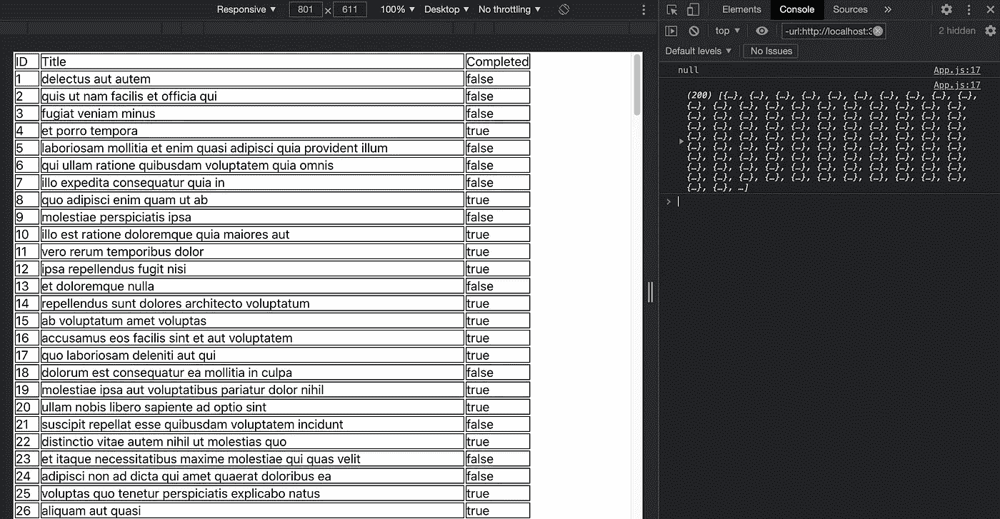

# 如何快速创建 React 表格—无需库

> 原文：<https://javascript.plainenglish.io/how-to-quickly-create-a-react-table-without-a-library-5deb80180788?source=collection_archive---------5----------------------->

*设置一个 React 表，不用花时间阅读复杂的文档和哭泣。*


Photo by [Uillian Vargas](https://unsplash.com/@vargasuillian?utm_source=medium&utm_medium=referral) on [Unsplash](https://unsplash.com?utm_source=medium&utm_medium=referral)

*没有绒毛。不要哭。三、二、一——我们走吧！*


Meme belongs to PJ Codes

现在，假设您有一个使用`create-react-app`的 react 项目设置，让我们直接进入`app.js`文件。

我们将使用 JSON 占位符 API，特别是端点:`https://jsonplaceholder.typicode.com/todos`(非常简单)。

在第 1 行导入我们的 table 组件(我们将在下面进一步查看)后，我们使用一个名为`data`的状态变量及其设置方法`setData`来设置我们的初始状态——我们将初始状态设置为`null`,因为它是一个 *falsy* 值，我们将进一步了解*为什么*我们将它设置为`null`。

从第 8–12 行，我们设置了一个对我们的 **todos** 端点的 fetch 调用，我们将从其中检索一个列表—更具体地说是一个对象数组，每个对象的格式如下:

```
[
   {
      completed: false,
      id: 1,
      title: 'lorem ipsum',
      userId: 1
   },
   {
      ...
   },
]
```

特别是在第 12 行，我们用 react 钩子建立了一个空数组。这个空数组表示一个叫做**的依赖数组**。这意味着只有在依赖数组中存在元素(1 个或更多)时，才会重新计算 **useEffect** 方法中的逻辑。这将触发组件重新渲染。然而，如果我们的依赖数组是空的，我们告诉 react " *嘿 react，不要触发重新渲染，因为我已经让这个数组为空了…只在组件最初挂载时计算我的 use-effect 中的逻辑。*"这类似于一个类组件的`componentDidMount`。

在第 11 行，我们使用`setData` setter 方法将状态变量`data`的状态设置为从 fetch 请求中获取的 JSON。这个 set-state 方法将触发一次重新渲染。

好了，既然我们已经弄清楚了这一部分，让我们跳到第 14–16 行，这里我只是在每次数据值改变时记录状态变量。如果`data`的值发生变化，我们会在这里看到变化。

好的——现在让我们关注第 21-24 行。注意简写:

```
data && <Table
      tableData = {data}
      headerData = {['ID', 'Title', 'Completed']}
   />
```

这意味着我们检查数据的*真值*(记得我们最初将状态变量`data`设置为`null`)。一旦`data`和我们的`<Table />`组件都被评估为`true`，我们就传入我们想要的道具，然后*瞧！我们正在向孩子传递数据。*

现在，在我们继续之前——花一分钟来研究一下传入的道具。我们希望我们的表对传入的道具完全不可知。我的意思是，我们希望保持我们的**表**组件的全局和可重用性，不仅仅是对于 todos，而是对于传入的任何类型的数据。我们应该能够传入一个包含用户数据或除 todos 之外的其他内容的对象数组，这样我们就不会将我们的表限制为只显示 todos，这就是为什么我们传入一个名为`headerData`的属性，包含要在我们的表头中显示的动态数据。

# 最后，让我们看看我们的表组件:

在我们的 table 组件的第 5 行，我们分解了我们的 2 个 props — `tableData`和`headerData`，这样我们就不必将它们称为`props.tableData`等等。这纯粹是速记，不符合逻辑，但是这是很好的实践。

如果你想学习一些非常棒的 JavaScript 速记，看看这篇文章:

[](/20-javascript-short-hands-you-need-to-know-in-2021-c0ed25a40837) [## 2021 年你需要知道的 20 个 JavaScript 小技巧

### 一个成功项目的一个重要因素是生产力——这正是这些 JavaScript 缩写…

javascript.plainenglish.io](/20-javascript-short-hands-you-need-to-know-in-2021-c0ed25a40837) 

在第 7 行，我们编写了一个名为`tableHeader`的函数，在这个函数中，我们映射了从 app 组件传入的头数组:

```
headerData = {['ID', 'Title', 'Completed']}
```

映射之后，我们为数组中的每个元素生成一个表数据元素，我们可以在第 33 行方便地调用它。够简单吧？

向下移动到第 15 行，我们声明一个名为`returnTableData`的函数，它接收我们从 app 组件传入的表数据(来自我们的 fetch 请求的数据):

```
tableData = {data}
```

我们映射这些数据，分解其参数，因为每个 todo 都是一个对象。这样，我们可以将每个嵌套键称为`{id}`而不是`todos.id`。

从第 18–23 行，我们简单地为每个 todo 返回一行，包含每个值的表数据元素。

# 我们的表将如下所示:



在造型方面还有很多路要走，但我们有一个基本的表格。

如果你想更进一步，我推荐你使用像 TanStack 的 React-Table 这样的库。你可以在这里了解更多信息:

[](/how-to-set-up-react-table-using-dynamic-data-1d2b6f555a9a) [## 如何使用动态数据建立反应表

### 欢迎来到灵活、可组合和轻量级表格的无头世界——介绍 React Table，作者是…

javascript.plainenglish.io](/how-to-set-up-react-table-using-dynamic-data-1d2b6f555a9a) 

如果你正在为网络开发面试做准备，也一定要看看这篇有用的文章:

[](/web-development-interview-questions-cheatsheet-2021-65eed8bbc1b2) [## 网络开发面试问题备忘单，2021

### 133 个你肯定会被问到的网络开发面试问题。

javascript.plainenglish.io](/web-development-interview-questions-cheatsheet-2021-65eed8bbc1b2) 

希望这有所帮助！:)

到 Pjcodes.com 的[来找我](http://www.pjcodes.com/)

感谢阅读。

*更多内容尽在*[***plain English . io***](http://plainenglish.io/)