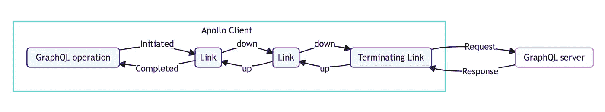

# 如何在 Apollo 客户端和 Mongo Atlas 上重新授权用户

> 原文：<https://javascript.plainenglish.io/how-to-re-authorize-your-user-with-refresh-token-on-apollo-client-and-mongo-atlas-dcdf0356d228?source=collection_archive---------8----------------------->


Photo by [Charles Deluvio](https://unsplash.com/@charlesdeluvio?utm_source=unsplash&utm_medium=referral&utm_content=creditCopyText) on [Unsplash](https://unsplash.com/s/photos/network-handshake?utm_source=unsplash&utm_medium=referral&utm_content=creditCopyText)

网上最常见的认证方法是 JWT。我们使用用户名和通行证登录，并得到一个**访问令牌**和一个**刷新令牌**作为响应。我们将它们存储在本地，然后对服务器的任何请求使用访问令牌进行身份验证，而不是用户的密码。最终，访问令牌将到期。刷新令牌允许我们获得新访问令牌，而不必再次提供我们的用户名和密码。

作为开发者*我们不知道这种过期何时会发生*，因为这有很多原因，一般来说，我们的客户端应用不知道服务器端的技术是一个很好的实践。因此，在我们的任何请求中，我们都需要能够处理访问令牌过期的情况。

# 请求的重新认证流程

首先，请求被拒绝，并显示错误消息。然后，我们使用刷新令牌获取新的访问令牌，最后使用新的访问令牌重试请求。Apollo 将为我们处理对服务器的实际请求。然而，为了实现重新认证流程，**我们需要扩展请求处理过程**。

# 使用 Apollo Client 2.0“链接”扩展网络接口

扩展 Apollo 客户端网络接口的方法是通过他们所谓的链接。[阿波罗链接概述(官方文档)](https://www.apollographql.com/docs/react/api/link/introduction/)。



链接允许我们做的是创建一组函数，**可以在它们执行**之前交互和操纵我们的请求。

一个 Apollo 客户端可以由许多链接组成。然而，这组链接必须总是以一个 [**终止链接**](https://www.apollographql.com/docs/link/overview.html#terminating) 结束。与前面的链接不同，终止链接必须根据参数执行一些操作，并返回操作的结果。通常，这个操作是一个网络请求。

Apollo 提供的默认终止链接是`apollo-http-link`。这个终接链路使用`fetch`执行网络请求并发回结果。您可以使用`apollo-http-link`包中提供的`createHttpLink()`功能创建链接。在上面的例子中，我们为 graphql 服务器传递了 URI，这样它就知道将请求发送到哪里，以及身份验证所需的头。

# 实施重新授权流程

为了实现上面列出的重新授权流程，我们可以覆盖由终止链接执行的`fetch`。我们创建了一个`customFetch`函数，它可以执行请求，如果失败，就用一个新令牌重试，并将其作为一个选项传递给`apollo-http-link`。

```
...const httpLink = createHttpLink({
    uri: "/graphql",
    **fetch: customFetch,
**    headers: {...}})...
```

下面是一个将被添加到 Apollo 客户端的`customFetch`函数的实现:

现在，当一个请求被执行时，我们在返回结果之前检查一个未授权的错误。如果用户有一个过期的访问令牌，链接将使用刷新令牌获得一个新的令牌，并重试请求。

**如果没有错误**我们返回链中的初始响应并继续前进。注意我们如何在链中传递**初始响应(** `using .clone()` **)和** `response.json()` **。**

```
return ({
    initialResponse: response.clone(),
    json: response.json()
});
```

上述技巧的原因是 response.json()的函数调用正在消耗响应，之后我们需要重新打包承诺并将其作为最终结果返回。因此，为了避免重新打包(这可能会导致一些意想不到的结果),我们可以简单地克隆最初的请求，并在需要时准备好。记住 **fetch** 期待一个返回 **Promise < Response >的函数。**

就是这样。希望这个实现能让你有一个流畅的用户体验，而不会让用户意外注销。

*更多内容请看*[***plain English . io***](http://plainenglish.io)