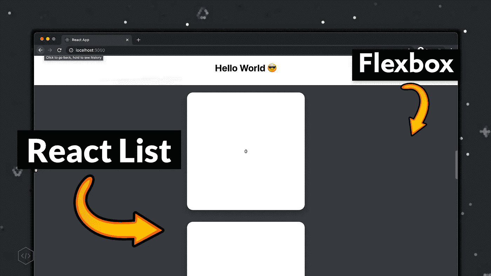
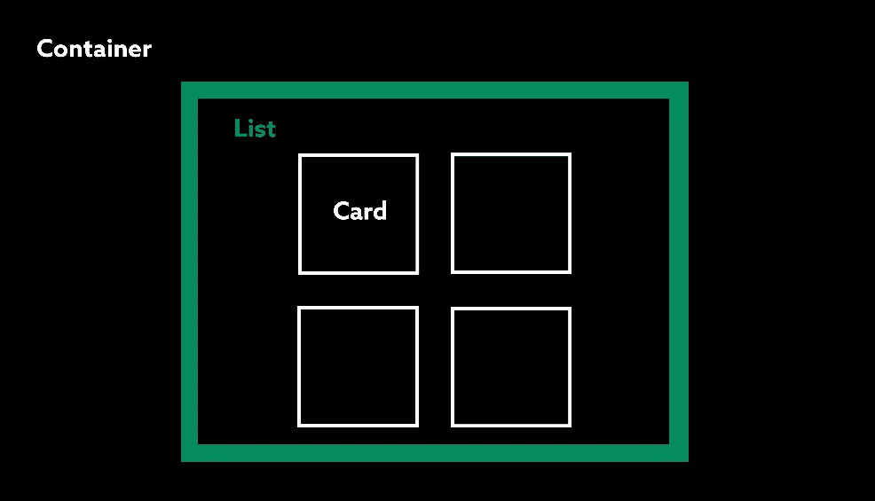
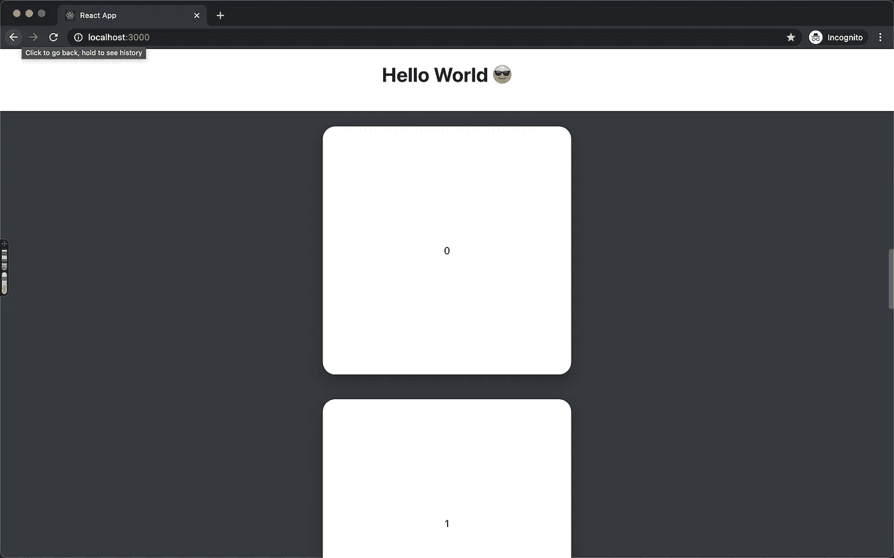

# 使用 React 的 FlexBox 垂直滚动列表/网格

> 原文：<https://javascript.plainenglish.io/how-to-react-vertical-scrolling-list-grid-with-flexbox-714a61a07c9?source=collection_archive---------4----------------------->

## 我使用 flexbox 和 styled-components 在 React 中创建了一个垂直滚动的卡片列表(初学者入门，带示例)。



我是新来的反应，CSS 和 HTML，并发现很难建立这个简单的垂直列表显示卡。我的背景是 iOS 开发，主库(UIKit)有解决这些特定 UI 相关问题的内置组件，即 ScrollView。

出于沮丧，我在上发帖寻求帮助，因为我在谷歌上找不到解决方案。在谷歌上花了一些时间后，我开始在 iOS 中绘制 flexbox 和布局系统之间的连接，并解决了问题！我在下面的教程中总结了我的方法。

I posted about this on r/reactjs

# 入门指南

一些先决条件是安装了 [Node.js](https://nodejs.org/en/) 和一个像 [VSCode](https://code.visualstudio.com/download) 这样的代码编辑器。

```
npx create-react-app list-app // 1... installing cd list-app // 2npm run start // 3
// or 
yarn startcontrol-c // 4 code . // 5
```

1.  这将创建一个名为 list-app 的新 React 应用程序。
2.  安装好所有东西后，导航到列表应用程序目录。
3.  要运行您新创建的 web 应用程序，运行 npm 或 yarn，Chrome 将弹出预览网站！
4.  关闭正在运行我们的应用程序的 web 进程。
5.  在 VSCode 中打开当前项目。

我们将要接触的唯一文件是`App.js`。这是在浏览器中启动应用程序时显示的第一个组件。这里我们将创建一个垂直滚动的卡片列表，但是在此之前，让我们安装一个名为 styled-components 的依赖项。

```
// CLI
npm install styled-components
// or 
yarn add styled-components
```

[Styled-Components](https://styled-components.com/) 让我们以小块的形式编写 HTML 和 CSS 块，然后我们像乐高积木一样在渲染函数中组合它们。 [Render](https://reactjs.org/docs/rendering-elements.html) 是在网页上渲染你的 HTML 和 CSS 的函数。

在 App.js 中，让我们首先导入新的样式化组件包，并创建一个封装列表的容器。

在 VSCode 中，您可以安装一个扩展，帮助您提高开发人员的工作效率。这里有两个我用来帮助开发样式化组件的例子。

*   [vs code-styled-components](https://github.com/styled-components/vscode-styled-components)(语法高亮)
*   [样式-组件-片段](https://github.com/danielsousast/styled-components-snippets) (sc 片段)

```
cmd + p, ext install vscode-styled-components // in vscode
```

如上所述，样式化组件将 HTML 元素和 CSS 包装成一个小的可重用块。我们将为容器、列表和卡片创建一个。

想法是让容器成为垂直居中列表的根。列表将内容水平居中并包含卡片。



The container holds everything, and we add a list inside of it.

好了，让我们添加容器、列表和卡片样式的组件，并检查代码。在大多数情况下，我们使用基本的 CSS 和 flexbox 进行布局。如果你对 flexbox 生疏，我在玩了 [flexbox froggy](http://flexboxfroggy.com/) 之后，用一些笔记总结了我的理解。

```
**display**: flex = turn on flexbox**justify-content** = horizontal alignment* flex-start
* flex-end
* center
* space-between
* space-around**align items** = vertical alignment
* flex-start
* flex-end
* center
* baseline
* stretch
*(Align-self) useful for individual elements.***flex-direction** = axis
* row = horizontal
* column = vertical
* -reverse**flex-wrap** = should content stay in row or wrap to next
* wrap
* nowrap******flex-flow*** *is short hand for flex-direction and flex-wrap***align-content** = space between rows
* same as justify content values
```

通过运行`**yarn start**` **或** `***npm run start***`来启动开发服务器，如果您先前关闭了会话，则查看更改。

1.  垂直居中容器内容。
2.  内容将在一个列中，如果空间不足，将换行。
3.  水平居中列表内容。
4.  内容将在一行，如果我们用尽空间包装。
5.  将卡片中的内容居中，并使其布局在一列中。
6.  用我们新的样式组件和一个简单的数组来映射和创建一些卡片，更新我们的应用程序功能。

We have a vertical scrolling grid and list when the browser size is smaller ([gif](https://gifs.com/gif/react-gif-L7X6wX).)

如果你想要一个单一的列表，你可以更新容器和包装器来交换伸缩方向。这样做之后，你会得到下面的结果！

```
...
flex-flow: row wrap; // in Container
...
flex-flow: column wrap; // in List
```

A single vertical list now ([gif](https://gifs.com/gif/react-gif-2-71v8By))!

# **奖金**

让我们给 web 应用程序添加一个标题。我们将创建一个新组件，并将其添加到列表之前的容器中。这就是为什么我选择将所有东西都嵌套在一个容器中，因为随着应用程序的增长，我们可以很容易地向它添加更多的组件。

1.  为标题添加新的样式组件。
2.  使用 flexbox 将里面的内容居中。
3.  更新容器以使用新的标题。



Vertical list 🎉

# 结论

我希望你喜欢这个教程。我正在学习一些个人项目的 web 开发，想分享一下我的经验以及我是如何解决这个问题的。

*查看我的*[*pat reon*](https://www.patreon.com/6ary)*或*[*YouTube*](https://www.youtube.com/channel/UCQWmp143iznhc_lZoM0rbXQ)*获取我围绕 JS/Swift 和 swe 'ing 所做的教程和帖子😎*

[](https://www.youtube.com/channel/UCQWmp143iznhc_lZoM0rbXQ) [## 加里·托克曼

### 你好，我是 Gary，一名开发人员。我喜欢学习新东西，开发很酷的应用程序，解决新问题。您可以查看…

www.youtube.com](https://www.youtube.com/channel/UCQWmp143iznhc_lZoM0rbXQ)