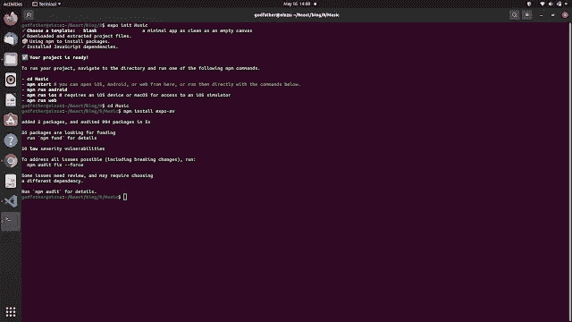

# 如何使用 React Native Expo 录制音频

> 原文：<https://javascript.plainenglish.io/how-to-record-audio-using-react-native-expo-74723d2358e3?source=collection_archive---------2----------------------->

## 使用 React Native Expo 为 Android 和 iOS 设备录制音乐的 JavaScript 代码。

您好，React 原生开发者！

当你在做一个项目，你想让用户用手机录制他们的音频，那么你必须知道如何在开发过程中把这个特性添加到你的移动应用程序中。我们被这种你可以录制音频的应用所包围。最常见的例子是脸书、Instagram 和各种录音应用。因此，在这里，我们将看到如何使用 React Native Expo 录制音频。坐下，喝杯咖啡，我们开始吧。


Photo by [Emile Perron](https://unsplash.com/@emilep?utm_source=medium&utm_medium=referral) on [Unsplash](https://unsplash.com?utm_source=medium&utm_medium=referral)

如果您正在寻找视频教程，那么它就在这里:

# 设置和安装

1.创建一个目录并导航到它。

2.打开该目录下的终端或命令提示符，执行命令:`**expo init Music**`

3.选择空白模板并继续下载。

4.导航到目录“音乐”

5.使用命令:`**npm install expo-av**`
安装一个包在完成上述所有步骤后，您会看到类似这样的内容



我们已经完成了这里的设置和安装。现在在文本编辑器中打开这个项目。对了，我更喜欢 VS 代码。

# 记录系统代码

**App.js**

```
import * as React from 'react';
import { Text, View, StyleSheet, Button } from 'react-native';
import { Audio } from 'expo-av';const [recording, setRecording] = React.useState();async function startRecording() {
    try {
      console.log('Requesting permissions..');
      await Audio.requestPermissionsAsync();
      await Audio.setAudioModeAsync({
        allowsRecordingIOS: true,
        playsInSilentModeIOS: true,
      }); 
      console.log('Starting recording..');
      const recording = new Audio.Recording();
      await recording.prepareToRecordAsync(Audio.RECORDING_OPTIONS_PRESET_HIGH_QUALITY);
      await recording.startAsync(); 
      setRecording(recording);
      console.log('Recording started');
    } catch (err) {
      console.error('Failed to start recording', err);
    }
  }
```

我们正在使用 react hooks 概念。这里我们创建了一个异步函数 startRecording()，在这个函数中，我们首先从 android 或 ios 设备请求许可。在用户允许权限之后，进一步的过程将会工作。我们使用控制台日志，以便您可以在终端中看到运行状态。我们将录音质量设置为高。以上代码是针对如何开始录音的。现在，让我们看看如何在 react native expo 中停止录制。

```
async function stopRecording() {
    console.log('Stopping recording..');
    setRecording(undefined);
    await recording.stopAndUnloadAsync();
    const uri = recording.getURI(); 
    console.log('Recording stopped and stored at', uri);
  }
```

这里我们首先在控制台记录停止记录和停止记录。停止录制后，您必须知道录制的位置。这就是为什么我们在记录停止后记录位置的原因。现在只做一个简单的 UI 进行测试。

```
return (
    <View style={styles.container}>
      <Button
        title={recording ? 'Stop Recording' : 'Start Recording'}
        onPress={recording ? stopRecording : startRecording}
      />
    </View>
  );
```

做一点造型

```
const styles = StyleSheet.create({
  container: {
    flex: 1,
    justifyContent: 'center',
    backgroundColor: '#ecf0f1',
    padding: 10,
  },
});
```

我们已经完成了这里的编码部分。现在打开终端或命令提示符，使用命令运行服务器:npm start
打开 expo app，扫描二维码。按下开始录制按钮后，会弹出一个请求许可的屏幕。允许所请求的许可。相应地开始和停止录制。现在看到你的命令提示符或终端，你会看到录音的位置。


如有疑问，请点击此处查看 [Github 代码](https://github.com/imrohit007/Recording-Audio-in-React-Native-Expo)。

谢谢你。

*更多内容看* [***说白了. io***](http://plainenglish.io/) ***。*** *报名参加我们的* [***免费每周简讯点击这里***](http://newsletter.plainenglish.io/) ***。***