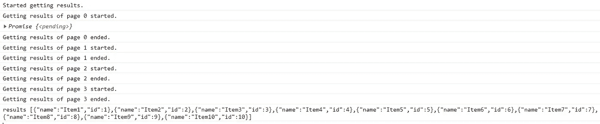

# 如何递归调用 API 以获取 JavaScript 中的所有结果

> 原文：<https://javascript.plainenglish.io/how-to-recursively-call-apis-to-get-all-results-in-javascript-58be97b035b1?source=collection_archive---------2----------------------->

## 提示和技巧

## 如何递归地获取每页的结果，并最终将它们返回到一个结果集中。

Photo by [Joan Gamell](https://unsplash.com/@gamell?utm_source=unsplash&utm_medium=referral&utm_content=creditCopyText) on [Unsplash](https://unsplash.com/?utm_source=unsplash&utm_medium=referral&utm_content=creditCopyText)

# 挑战

在从事 JavaScript 项目的大部分时间里，我会编写一些代码来调用**REST API**。这很正常。

然而，有时 REST API 可能会对每个请求返回的项数有所限制。换句话说，当调用 API 来获取一些项目时，这些项目将被分成索引页面/组，并且您必须提供页面/组索引。这将仅返回此页面/组中的项目。要获得其余的，您需要重复相同的 API 调用，但是现在使用不同的索引，等等…

 [## 订阅艾哈迈德的时事通讯？

### 订阅艾哈迈德的时事通讯📰直接获得最佳实践、教程、提示、技巧和许多其他很酷的东西…

medium.com](https://medium.com/subscribe/@eng_ahmed.tarek) 

Photo by [Emily Morter](https://unsplash.com/@emilymorter?utm_source=unsplash&utm_medium=referral&utm_content=creditCopyText) on [Unsplash](https://unsplash.com/?utm_source=unsplash&utm_medium=referral&utm_content=creditCopyText)

# 怎么做？

这就是我将在本文中向您展示的内容。我们将使用一个简单的 API 示例，它将项目返回到页面中，并了解如何使用该 API 并获取所有项目。

我们将用一个返回承诺和超时调用的函数来模拟 API 调用。这些条目将从我们定义的静态条目数组中获取。

此外，需要注意的是，将静态数组的项拆分成页面的逻辑是基于文章 [**“分页/分区”中提供的分析、等式和代码——学习主要等式以使其变得简单**](https://levelup.gitconnected.com/paging-partitioning-main-equations-to-make-it-easy-44fe89d5290b?sk=f65265d7b4c203ac219e7dec1208c0f2) 。

在本文中，为了简洁起见，我将只包含代码。

Photo by [Nubelson Fernandes](https://unsplash.com/@nublson?utm_source=unsplash&utm_medium=referral&utm_content=creditCopyText) on [Unsplash](https://unsplash.com/?utm_source=unsplash&utm_medium=referral&utm_content=creditCopyText)

# 让我们写一些代码

## 数组页面功能

*详见* [*本文*](https://levelup.gitconnected.com/paging-partitioning-main-equations-to-make-it-easy-44fe89d5290b?sk=f65265d7b4c203ac219e7dec1208c0f2) *。*

## 静态项目数组和默认页面大小

## 执行 API 调用函数

我们在这里可以注意到:

1.  这是模拟 API 调用的函数。
2.  首先，它使用静态`pageSize`变量将静态`items`数组分成页面。根据传入的`pageZeroIndex`参数，它设置`itemsToReturn`内部数组。
3.  然后它将这个包装成一个最终的对象，这个对象有一个`paging.pageZeroIndex`和`page.totalPagesCount`成员。API 调用者应该使用这些来知道是否有其他页面。
4.  最后，这个最后的对象在一秒钟后的承诺中被解决。

## 用老式的承诺来获得结果

我们在这里可以注意到:

1.  我们以递归的方式调用 API，但是只在项目的末尾进行解析。
2.  我们使用`page.totalPagesCount`来决定是否可以有另一页。

## 测试调用老式代码

结果将如下所示:

## 使用异步/等待获取结果

我们可以注意到，这里我们做的和老式代码一样，但是这里更简单。

## 测试调用异步/等待代码

结果将如下所示:

# 希望这些内容对你有用。如果您想支持:

如果你还不是**中**的会员，你可以使用 [**我的推荐链接**](https://medium.com/@eng_ahmed.tarek/membership) ，这样我可以从**中**得到你的一部分费用，你不需要额外付费。订阅 [**我的简讯**](https://medium.com/subscribe/@eng_ahmed.tarek) 将最佳实践、教程、提示、技巧和许多其他有趣的东西直接发送到您的收件箱。

# 其他资源

这些是你可能会发现有用的其他资源。

 [## 如何设置 JavaScript 承诺超时

### 只是不要永远等待承诺的实现，你需要设定自己的条件。

javascript.plainenglish.io](/how-to-set-javascript-promise-timeout-7d51c87bc38e)  [## 如何在普通 JavaScript 中使用 Observables

### 没有使用框架，只是纯香草 JavaScript。

javascript.plainenglish.io](/how-to-use-observables-with-vanilla-javascript-aca40a7590ff) 

就这样，希望你觉得读这个故事和我写它一样有趣。

*更多内容看* [***说白了. io***](http://plainenglish.io/)