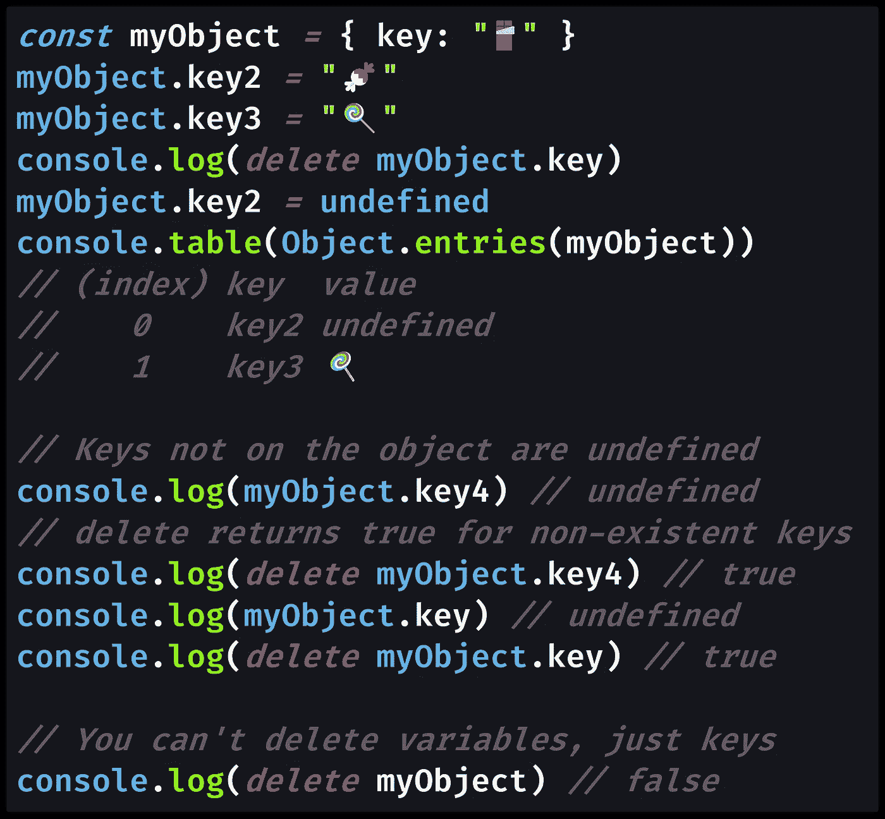
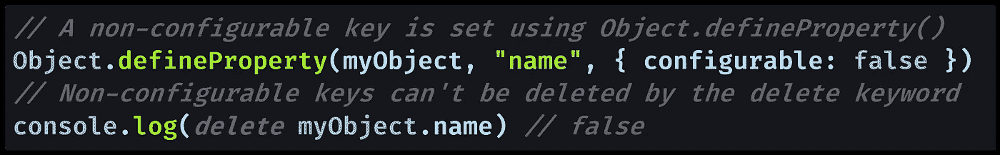

# 如何在 JavaScript 中从对象中移除一个键

> 原文：<https://javascript.plainenglish.io/how-to-remove-a-key-from-an-object-in-javascript-9e5cf823fd37?source=collection_archive---------0----------------------->

## 要从 JavaScript 对象中移除对象键，不能使用赋值运算符(`=`)。相反，您需要学习用于删除对象键的关键字`delete`的规则。

Photo by [u j e s h](https://unsplash.com/@ujesh?utm_source=medium&utm_medium=referral) on [Unsplash](https://unsplash.com?utm_source=medium&utm_medium=referral)

# 使用`delete`移除对象关键点

特殊的 JavaScript 关键字`[delete](https://developer.mozilla.org/en-US/docs/Web/JavaScript/Reference/Operators/delete)`用于移除对象键(也称为[对象属性](https://developer.mozilla.org/en-US/docs/Web/JavaScript/Guide/Working_with_Objects#Objects_and_properties))。

> “JavaScript `**delete**` **操作符**从对象中删除属性；如果不再持有对同一属性的引用，它最终会自动释放。— [MDN 文档](https://developer.mozilla.org/en-US/docs/Web/JavaScript/Reference/Operators/delete)

虽然您可能认为将对象关键点设置为等于`[undefined](https://medium.com/coding-at-dawn/how-to-check-for-undefined-in-javascript-bcedd62c8ad)`会删除它，但是由于`undefined`是尚未设置的对象关键点所具有的值，所以该关键点仍然存在。

要真正从对象中移除键，您需要使用`delete`关键字，正如我们在这个 JavaScript 代码示例中看到的:

[View raw code](https://gist.github.com/DoctorDerek/1216d8029d456537d6cb154d8b205ce5) as a GitHub Gist

在示例中，在删除了`key`并将`key2`设置为`undefined`之后，我使用了`[Object.entries()](https://developer.mozilla.org/en-US/docs/Web/JavaScript/Reference/Global_Objects/Object/entries)`来访问对象键和值。

我们可以看到，因为我没有使用`delete`关键字，`key2`仍然存在于 JavaScript 对象上。

代码示例还显示了来自`delete`的返回值。

# 您不能移除的 JavaScript 对象键

如果 JavaScript 成功地从对象中移除了键，那么`delete`表达式将返回`true`。

> “`**delete**`操作符从对象中删除给定的属性。删除成功，返回`true`，否则返回`false`— [MDN 文档](https://developer.mozilla.org/en-US/docs/Web/JavaScript/Reference/Operators/delete)

当你在一个不存在的对象键上调用`delete`时，你可能期望`false`——但是你实际上得到的是`true`。

> "如果您试图删除的属性不存在，`delete`将不起任何作用，并将返回`true`。"— [MDN 文档](https://developer.mozilla.org/en-US/docs/Web/JavaScript/Reference/Operators/delete)

在 JavaScript 中，`delete`关键字仅用于从对象中移除一个键。你不能删除普通的变量或函数，也就是那些使用 [let、const 或 var](https://medium.com/javascript-in-plain-english/how-to-use-let-var-and-const-in-javascript-cdf42b48d70) 声明的变量或函数。

最后，您只能删除对象上的普通属性，而不能删除内置对象的属性。

> "不能删除不可配置的属性。这包括内置对象的属性，如`[Math](https://developer.mozilla.org/en-US/docs/Web/JavaScript/Reference/Global_Objects/Math)`、`[Array](https://developer.mozilla.org/en-US/docs/Web/JavaScript/Reference/Global_Objects/Array)`、`[Object](https://developer.mozilla.org/en-US/docs/Web/JavaScript/Reference/Global_Objects/Object)`。— [MDN 文档](https://developer.mozilla.org/en-US/docs/Web/JavaScript/Reference/Operators/delete)

不可配置的键是使用`[Object.defineProperty()](https://developer.mozilla.org/en-US/docs/Web/JavaScript/Reference/Global_Objects/Object/defineProperty)`设置的键，选项`configurable`设置为`false`。

[View raw code](https://gist.github.com/DoctorDerek/1216d8029d456537d6cb154d8b205ce5) as a GitHub Gist

不可配置的键不能被关键字`delete`删除，像`[Array](https://medium.com/javascript-in-plain-english/how-to-check-for-an-array-in-javascript-6ad20f7a0e21)`这样的全局对象的对象键也不能被删除。

这就是在 JavaScript 中删除对象键的方法。

**编码快乐！⭐☜(ﾟヮﾟ☜)⭐**

[Derek Austin](https://www.linkedin.com/in/derek-austin/)博士是《职业编程:如何在 6 个月内成为一名成功的 6 位数程序员 》一书的作者，该书现已在亚马逊上架。