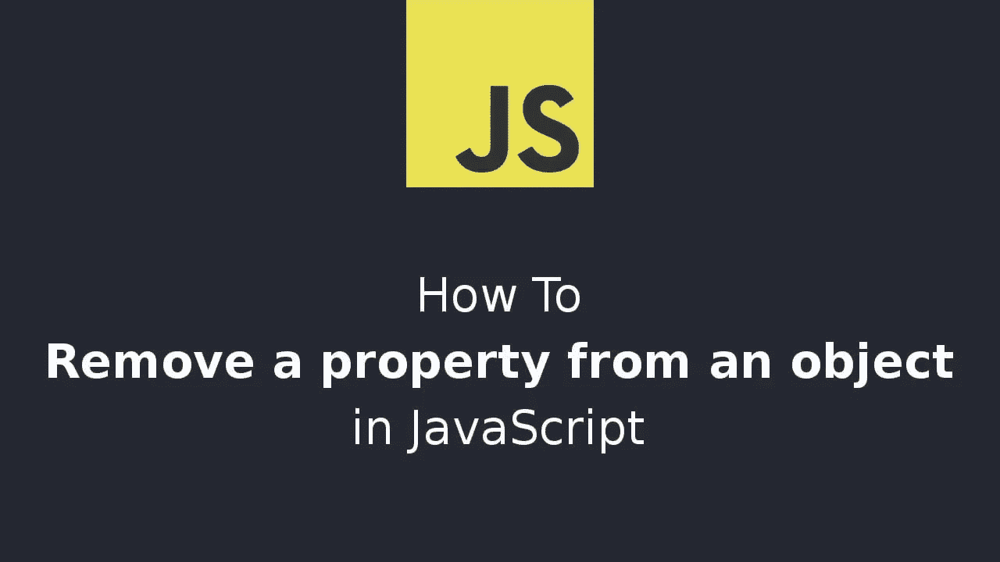

# 如何从 JavaScript 对象中移除属性

> 原文：<https://javascript.plainenglish.io/how-to-remove-a-property-from-a-javascript-object-1c70cd6c08c1?source=collection_archive---------7----------------------->



有两种方法可以从 JavaScript 对象中删除属性:一种是使用 delete 操作符的可变方法。第二个是通过使用[对象重组](https://www.wisdomgeek.com/development/web-development/rest-and-spread-operator-three-dots-that-changed-javascript/)的不可变方式。让我们逐一看一下:

# 1.删除操作符

`delete`是一个 JavaScript 指令，允许我们从 JavaScript 对象中移除一个属性。有几种方法可以使用它:

*   删除 object.property
*   删除对象[' property ']；

运算符从对象中删除相应的属性。

```
let blog = {name: 'Wisdom Geek', author: 'Saransh Kataria'};
const propToBeDeleted = 'author';
delete blog[propToBeDeleted];
console.log(blog); // {name: 'Wisdom Geek'}
```

删除操作会修改原始对象。因此，这是一个可变的操作。

# 2.对象析构

使用对象重构和 rest 语法，我们可以用要移除的属性来析构对象，并创建它的新副本。在析构之后，对象的一个新副本将被创建并赋给一个新变量，而没有我们选择移除的属性。

```
const { property, ...remainingObject } = object;
```

例如:

```
let blog = {name: 'Wisdom Geek', author: 'Saransh Kataria'};
const { author, ...blogRest } = blog;
console.log(blogRest) // {name: 'Wisdom Geek'};
console.log(blog); // {name: 'Wisdom Geek', author: 'Saransh Kataria'}
```

如果我们想动态地这样做，我们可以这样做:

```
const name = 'propertToBeRemoved';
const { [name]: removedProperty, ...remainingObject } = object;
```

也可以使用相同的语法删除多个属性。

这是从 JavaScript 对象中移除属性的两种方法。如果你有任何问题，欢迎在下面留言！

*原载于 2021 年 8 月 29 日 https://www.wisdomgeek.com**的* [*。*](https://www.wisdomgeek.com/development/web-development/javascript/how-to-remove-a-property-from-a-javascript-object/)

*更多内容看* [***说白了。报名参加我们的***](https://plainenglish.io/) **[***免费周报***](http://newsletter.plainenglish.io/) *。关注我们关于*[***Twitter***](https://twitter.com/inPlainEngHQ)*和*[***LinkedIn***](https://www.linkedin.com/company/inplainenglish/)*。加入我们的* [***社区***](https://discord.gg/GtDtUAvyhW) *。***