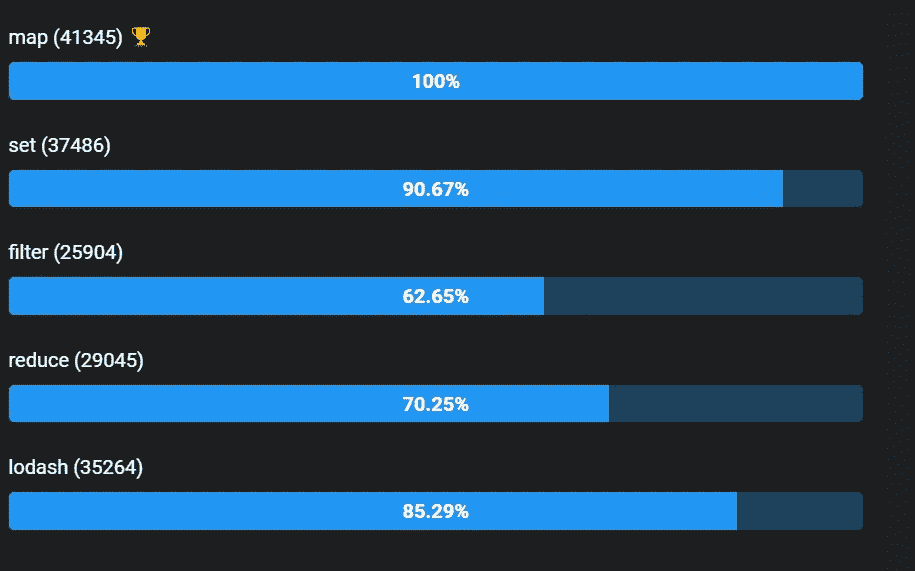

# 如何在 JavaScript 中删除数组或对象数组中的重复项

> 原文：<https://javascript.plainenglish.io/how-to-remove-duplicates-from-an-array-or-array-of-objects-in-javascript-b35af7520c94?source=collection_archive---------2----------------------->

## JavaScript 面试问题 2021


Photo by [Matthew Henry](https://unsplash.com/@matthewhenry?utm_source=medium&utm_medium=referral) on [Unsplash](https://unsplash.com?utm_source=medium&utm_medium=referral)

你可能做了很长时间的 JavaScript 开发，但有时你可能没有更新最新的特性，这些特性可以在不做或编写额外代码的情况下解决你的问题。

在这里，我将带来一篇新文章，介绍一些从数组和对象数组中删除重复项的方法。这些技巧可以成为你 2021 年 JavaScript 编码面试中的一块小石头。

> 我知道小石头没什么区别，但如果我们有成千上万的石头，就有区别了，为此我明天会带新石头来。敬请期待😉

我们可能总会遇到这样或那样的方法来从数组或对象数组中删除重复项。下面是五种不同的方法，我们可以删除其中的重复。

*让我们创建将在本文中使用的测试数据。*

**测试数据:**

```
var users = [{ id: 1, name: "ted" },{ id: 1, name: "ted" },{ id: 1, name: "bob" },{ id: 3, name: "sara" },{ id: 4, name: "test" },{ id: 4, name: "test" },{ id: 5, name: "abc" },{ id: 6, name: "abc" },{ id: 7, name: "test2" },{ id: 8, name: "test1" },{ id: 8, name: "test1" }];var array = [2, 1, 2, 5, 6, 7, 8, 9, 9, 10];
```

**我创建了三个不同的场景来讲述这个话题**

1.  唯一数组
2.  按属性排列的唯一对象数组
3.  唯一的对象数组

# 1.洛达什

在找到解决方案之前，让我们先了解 lodash 提供的一些制作独特数组的方法。

`**_.uniq(array)**` **将创建唯一的数组**

`**_.uniqBy(array, [iteratee=_.identity])**` **可以通过属性获取唯一值**

`**_.uniqWith(array, [comparator])**` **可以通过比较器获得唯一性**

***我们来看看解决方案。***

```
var uniqueUsersByID = _.uniqBy(users, "id"); 
//removed if had duplicate idvar uniqueUsers = _.uniqWith(users, _.isEqual); 
//removed complete duplicatesconst uniquewithMultipleProperties = _.uniqWith(
    users,
    (a, b) => a.id === b.id || a.name === b.name
);var result = _.uniqBy(users, v => [v.id, v.name].join());var av = _(users)
    .uniqBy(v => [v.id, v.name].join())
    .value();var arrayuniq = _.uniq(array);console.log("loadash array unique", arrayuniq);
//*[2, 1, 5, 6, 7, 8, 9, 10]*console.log("loadash unique with id", JSON.stringify(uniqueUsersByID));
//[{"id":1,"name":"ted"},{"id":3,"name":"sara"},{"id":4,"name":"test"},{"id":5,"name":"abc"}]console.log("loadash unique", JSON.stringify(uniqueUsers));
//[{"id":1,"name":"ted"},{"id":1,"name":"bob"},{"id":3,"name":"sara"},{"id":4,"name":"test"},{"id":5,"name":"abc"}]
```

# 2.过滤器

`**filter**` **可以为新数组提供过滤后的值**

`**findIndex**` **返回满足条件的指标**

***我们来看看解决方案。***

```
var filteruniquebyID = users.filter(
    (v, i, a) => a.findIndex(t => t.id === v.id) === i
);var filteruniquebyIDName = users.filter(
    (v, i, a) => a.findIndex(t => t.id === v.id || t.name === v.name) === i
);var filteruniquebyIDName1 = users.filter(
    (v, i, a) => a.findIndex(t => JSON.stringify(t) === JSON.stringify(v)) === i
);var list = array.filter((x, i, a) => a.indexOf(x) == i);console.log("array unique", list);
//*[2, 1, 5, 6, 7, 8, 9, 10]*console.log("filter unique with id", JSON.stringify(filteruniquebyID));
//[{"id":1,"name":"ted"},{"id":3,"name":"sara"},{"id":4,"name":"test"},{"id":5,"name":"abc"}]console.log("filter unique", JSON.stringify(filteruniquebyIDName1));
//[{"id":1,"name":"ted"},{"id":1,"name":"bob"},{"id":3,"name":"sara"},{"id":4,"name":"test"},{"id":5,"name":"abc"}]
```

# 3.地图

`**map**` **通过迭代创建新数组**

`**reduce**` **缩小阵列，提供单输出**

***我们来看看解决方案。***

```
function getUniqueListBy(arr, key) {
    return [...new Map(arr.map(item => [item[key], item])).values()];
}const arr1 = getUniqueListBy(users, "id");
var reduced = [...array.reduce((p, c) => p.set(c, true), new Map()).keys()];const arr2 = getUniqueListBy(users, "name");
let q = [...new Map(users.map(obj => [JSON.stringify(obj), obj])).values()];console.log("array unique", reduced);
//*[2, 1, 5, 6, 7, 8, 9, 10]*console.log("Map unique with id ", JSON.stringify(arr1));
//[{"id":1,"name":"bob"},{"id":3,"name":"sara"},{"id":4,"name":"test"},{"id":5,"name":"abc"}]console.log("map unique", q);
//[{"id":1,"name":"ted"},{"id":1,"name":"bob"},{"id":3,"name":"sara"},{"id":4,"name":"test"},{"id":5,"name":"abc"}]
```

# 4.一组

`**Array.from**` **从对象**创建数组的浅拷贝

***我们来看看解决方案。***

```
var setuniq = [...new Set(array)];var set1 = Array.from(
    users.reduce((m, t) => m.set(t.id, t), new Map()).values()
);const uniq = new Set(users.map(e => JSON.stringify(e)));const set2 = Array.from(uniq).map(e => JSON.parse(e));console.log("set array unique", setuniq);
//*[2, 1, 5, 6, 7, 8, 9, 10]*console.log("set unique with id",JSON.stringify( set1));
//[{"id":1,"name":"bob"},{"id":3,"name":"sara"},{"id":4,"name":"test"},{"id":5,"name":"abc"}]console.log("set unique", JSON.stringify(set2));
//[{"id":1,"name":"ted"},{"id":1,"name":"bob"},{"id":3,"name":"sara"},{"id":4,"name":"test"},{"id":5,"name":"abc"}]
```

# 5.减少

***我们来看看解决方案。***

```
var reduce = users.reduce((unique, o) => {
    if (!unique.some(obj => obj.id === o.id && obj.name === o.name)) {
        unique.push(o);
    }
    return unique;
}, []);const uniqify = (array, key) =>
    array.reduce(
        (prev, curr) =>
        prev.find(a => a[key] === curr[key]) ? prev : prev.push(curr) && prev,
        []
    );
const reduce2 = uniqify(users, "id");var filtered = users.reduce((filtered, item) => {
    if (
        !filtered.some(
            filteredItem => JSON.stringify(filteredItem) == JSON.stringify(item)
        )
    )
        filtered.push(item);
    return filtered;
}, []);console.log("reduce array unique", reduce2);
//[{"id":1,"name":"ted"},{"id":3,"name":"sara"},{"id":4,"name":"test"},{"id":5,"name":"abc"}]console.log("reduce unique with id", JSON.stringify(reduce));
//[{"id":1,"name":"ted"},{"id":1,"name":"bob"},{"id":3,"name":"sara"},{"id":4,"name":"test"},{"id":5,"name":"abc"}]console.log("reduce unique", JSON.stringify(filtered));
//[{"id":1,"name":"ted"},{"id":1,"name":"bob"},{"id":3,"name":"sara"},{"id":4,"name":"test"},{"id":5,"name":"abc"}]
```

下面是 stackblitz 的例子。

[https://stack blitz . com/edit/remove-duplicates-arrayofobjects？file=index.ts](https://stackblitz.com/edit/remove-duplicates-arrayofobjects?file=index.ts)

## 性能检查

***注:此矩阵可根据*** 的数据变化

你可以在这里玩:[https://jsben.ch/5jxfO](https://jsben.ch/5jxfO)



# 你可以在这里查看我以前的文章:

*更多内容请看*[***plain English . io***](http://plainenglish.io/)