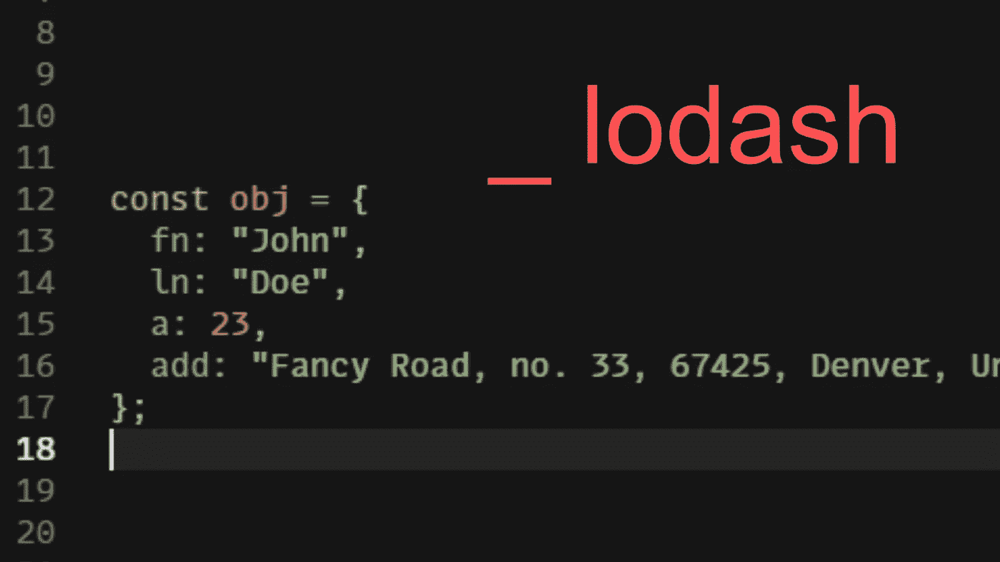

# 如何使用 Lodash 重命名 React/JavaScript 中的对象键

> 原文：<https://javascript.plainenglish.io/how-to-rename-object-keys-in-react-javascript-using-lodash-b73fb92ea24d?source=collection_archive---------2----------------------->

## 了解如何快速重命名 JavaScript 对象中的键



假设我们有以下对象:

```
const fancyObject = {
   fn: “John”,
   ln: “Doe”,
   a: 23,
   add: “Fancy Road, no. 33, 67425, Denver, United States”
};
```

楼上的声音意识到他希望按键比现在更模糊，并在对象中的每个按键前面添加公司的首字母' **DH** '。

你马上去查栈溢出，*“如何重命名对象键 JavaScript”*，发现一大堆结果一个比一个复杂。然后你记得有人谈论过那个叫做 lodash 的奇特的实用程序库。

您决定使用 npm 安装软件包:

```
$ npm i --save lodash
```

或纱线:

```
$ yarn add lodash
```

将其导入到您的组件中:

```
import _ from "lodash";const fancyObject = {
    fn: "John",
    ln: "Doe",
    a: 23,
    add: "Fancy Road, no. 33, 67425, Denver, United States"
};
```

声明一个新的效用函数，姑且称之为 **objMapper** ，它将接受一个对象作为参数:

```
import _ from "lodash";const fancyObject = {
    fn: "John",
    ln: "Doe",
    a: 23,
    add: "Fancy Road, no. 33, 67425, Denver, United States"
};const objMapper = (obj) => {} 
```

声明一个 **newObj** 来保存我们修改过的对象的值:

```
import _ from "lodash";const fancyObject = {
    fn: "John",
    ln: "Doe",
    a: 23,
    add: "Fancy Road, no. 33, 67425, Denver, United States"
};const objMapper = (obj) => {
    let newObj
}
```

使用罗达什**。mapKeys** 方法映射每个键/值对，修改键，并返回新对象中的新对，最后返回带有修改后的键的整个新对象:

```
import _ from "lodash";const fancyObject = {
    fn: "John",
    ln: "Doe",
    a: 23,
    add: "Fancy Road, no. 33, 67425, Denver, United States"
};const objMapper = (obj) => {
    let newObj = _.mapKeys(obj, (value,key)=> 'DH' + key)
    return newObj
}
```

这到底是怎么回事？

**。mapKeys** 方法接受两个参数。第一个参数( **obj** )是我们想要迭代的对象，并对其中的每个键/值对做一些事情。

```
_.mapKeys(**obj**, (value,key)=> 'DH' + key)
```

为此，我们使用一个回调函数，它接受两个参数**值**和**键**。

```
_.mapKeys(obj, **(value,key)=> 'DH' + key**)
```

现在，JavaScript 是我们所知道和喜爱的好孩子，在每次迭代中自动插入两个参数的值，这样我们就可以疯狂地使用它们。

现在，如果我们在控制台记录我们的实用函数的调用，我们将得到预期的结果:

```
{
    DHfn: "John",
    DHln: "Doe",
    DHa: 23,
    DHadd: "Fancy Road, no. 33, 67425, Denver, United States"
};
```

酷，但是如果与此同时楼上的声音终于意识到一切是多么多余，并希望以不同的方式改变每个键。

嗯，‘没问题！’你说，你现在有了 Lodash，再加上一些 switch 语句，你就势不可挡了:

```
const objMapper = (obj) => {let newObj = _.mapKeys(obj, (value, key) => {
   switch (key) {
      case "fn":
         return "firstName";
      case "ln":
         return "lastName";
      case "a":
         return "age";
      case "add":
         return "address";
      default:
         return;
     }
   });return newObj;};
```

现在您的结果将是:

```
{
    firstName: "John",
    lastName: "Doe",
    age: 23,
    address: "Fancy Road, no. 33, 67425, Denver, United States"
};
```

哇，现在不是那么容易，给自己拍一下背，你应该得到它。

当然，这些例子还可以继续下去，但是现在你已经知道了基础知识，你可以很容易地从这里开始构建。

真的希望这有所帮助，直到下次。

***继续编码！***

*更多内容请看*[***plain English . io***](http://plainenglish.io)