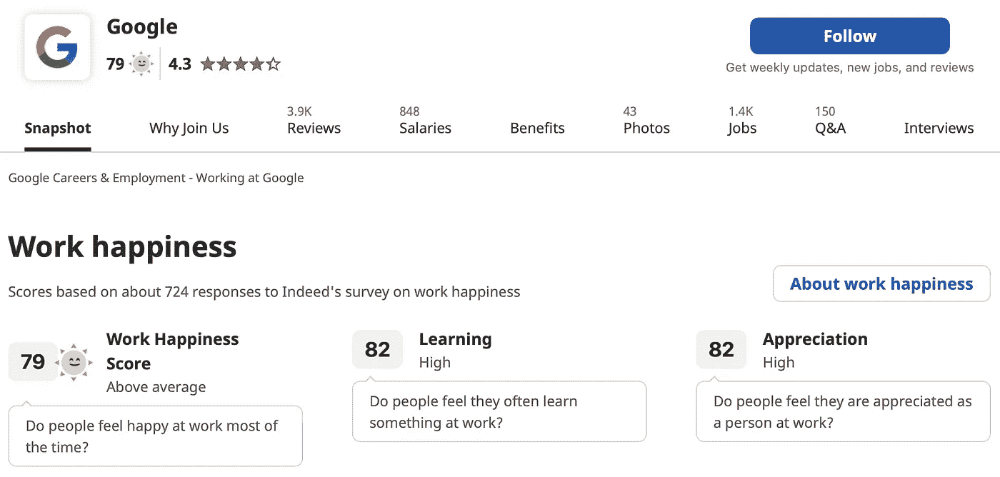

# 如何在科技公司找工作

> 原文：<https://javascript.plainenglish.io/how-to-research-that-job-at-a-tech-company-4cc28ad904d2?source=collection_archive---------24----------------------->

最近在为我的下一篇博客文章寻找灵感时，我看到了[里克·洛马斯](https://medium.com/u/9ee66467202a?source=post_page-----4cc28ad904d2--------------------------------)写的[这篇文章](https://medium.com/superhi/how-to-get-a-job-in-the-tech-industry-9b3ca6d5ee88)，想找一份科技行业的工作。我喜欢他的观点，炫耀你的技能，以及如何使用求职板找到你感兴趣的公司。然而，我觉得这篇文章的不足之处在于，它没有给出很多关于如何研究一家公司是否适合你的提示。因此，我决定写一篇关于这个话题的文章。

如果我在 2008 年寻找我的第一个软件工程职位，我得到的建议是彻底研究我面试的任何公司。在面试中被问到你对这家公司了解多少，并被期望给出一个好的答案，这是相当常见的。需要对一家公司有更多的了解意味着我对一家公司的大部分研究都是围绕着一家公司是做什么的。

当你可能要面试一两个角色时，这个建议是有意义的；然而现在，你可以在 10-20 家不同的公司面试，所以深入了解他们做的每一件事是不切实际的。大多数企业也承认这一点，并问“你对公司了解多少？”更多的提问被设计成一种让他们理解他们需要告诉你什么的方式。

这意味着任何研究的重点都应该转移到理解在企业工作是什么样子。有很多网站可以帮你做到这一点:

## 玻璃门

Screenshot of Glassdoor Google Page

**Glassdoor** 是一个提供各种公司信息的网站，包括员工评价、综合薪资/福利信息以及其他潜在员工的面试信息。

我喜欢 Glassdoor 的一点是，他们为自己的评论质量感到自豪，每篇评论都由版主检查。我喜欢他们鼓励评论者关注在企业工作的经历，并对领导层给出诚实的反馈。

## 职业女性

Screenshot of CareerBliss Google Page

CareerBliss 提供了与 Glassdoor 类似的体验，虽然一般来说它的评论较少，但它可以成为对一家公司的第二种意见的良好来源，因为他们有单独的用户群。

## 确实是

Screenshot of Indeed Google Page

大多数人都知道**实际上**主要是一个求职板，然而我发现它的评论通常提供了一个公司的不同视角。的确倾向于吸引整个公司更广泛的评论，因为 Glassdoor 有更多的技术评论。

我真的很想了解员工在整个企业中的体验，我不想在一个把工程师放在基座上，然后对其他人很差的地方工作。

# 概括起来

研究一家科技公司是否适合你是寻找下一个软件工程职位的关键。这将有助于你了解你想加入的企业，看看它们是否符合你的道德观和价值观。

作为这项研究的一部分，我鼓励你去寻找其他人的真实经历，无论是相似的角色还是业务中的其他角色。如果你发现了一些让你担心的事情，你可以选择退出面试或者在面试中提出来，这样你就可以了解这是否是一个历史问题。

 [## 相关帖子:如何在科技行业找到工作

### 在这个行业找工作和其他大多数行业都不一样。这里有一些步骤可以帮助你。

medium.com](https://medium.com/superhi/how-to-get-a-job-in-the-tech-industry-9b3ca6d5ee88)