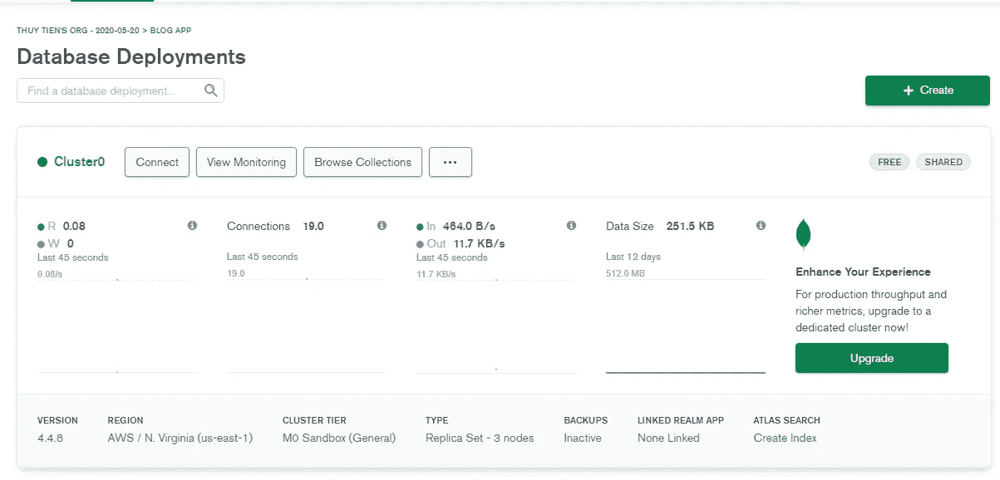

# 使用 MongoDB Compass 恢复 MongoDB 上暂停的集群

> 原文：<https://javascript.plainenglish.io/how-to-resume-a-paused-cluster-on-mongodb-a1adefeb27b8?source=collection_archive---------10----------------------->

MongoDB Compass -重新连接暂停集群的快速工具。

Image Designed Using Canva

如果您使用 MongoDB 已经有一段时间了，那么有一天您可能会在收件箱中收到一条类似如下的消息:

message from MongoDB to my inbox

然后不要惊慌，您可以重新连接您的集群。虽然您可以使用另一种方法来重新连接，但是我在本教程中使用 MongoDB Compass，因为我可以使用这个工具导入和导出 JSON 数据。根据他们网站上的[文档](https://docs.mongodb.com/compass/current/)，MongoDB Compass 是一个“*强大的 GUI，用于在可视化环境中查询、聚集和分析您的 MongoDB 数据。Compass 可以免费使用，可以在 macOS、Windows 和 Linux 上运行。*“你可以在这里下载 MongoDB 指南针(使用稳定版):

 [## MongoDB 指南针下载

### 2021 MongoDB，Inc.Mongo、MongoDB 和 MongoDB leaf 徽标是 MongoDB，Inc .的注册商标。2021…

www.mongodb.com](https://www.mongodb.com/try/download/compass) 

同时，在你的 MongoDB 账户上进入你的项目，点击下面的 **Resume** 按钮:

paused project on MongoDB

点击**连接**按钮，弹出连接集群窗口，然后点击**连接您的应用**，如下图，复制您的数据库字符串:

a pop-up window on MongoDB

当您的 MongoDBCompass 下载完成后，解压缩该文件夹，然后打开 MongoDB Compass 应用程序文件。然后该应用程序将如下打开，在*“粘贴您的连接字符串(SRV 或 Standard)”*下连接您的集群的数据库字符串

MongoDBCompass Application

确保数据库的名称与应用程序暂停前的名称相同。连接后，应该是这样的:

MongoDBCompassApplication

然后转到您的 MongoDB 帐户，现在您可以看到您的集群已经像这样连接了。恭喜你。

connected cluster is shown on MongoDB account

这是今天的教程，我希望你发现它是有用的，并在使用同样的技术时获得成功。感谢您的阅读，祝您有美好的一天！

*更多内容请看*[***plain English . io***](http://plainenglish.io/)