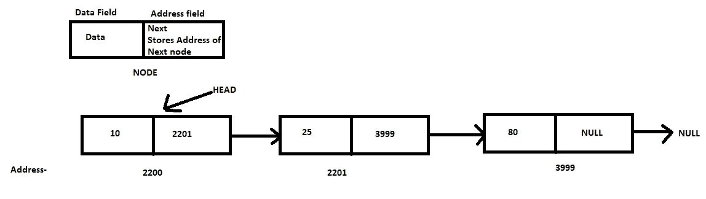
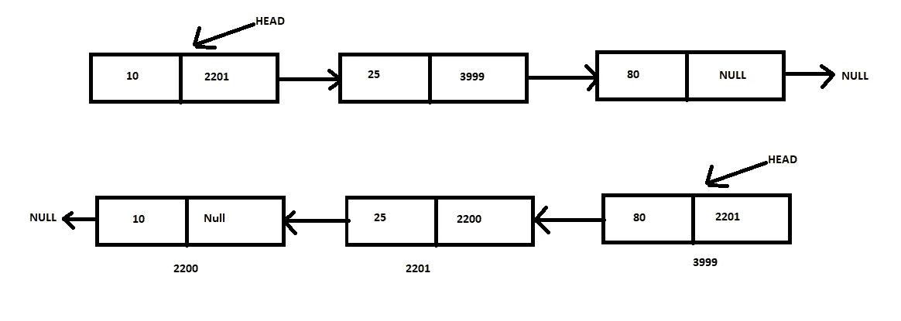

# 如何反转一个链表

> 原文：<https://javascript.plainenglish.io/how-to-reverse-a-linked-list-8437ccd26ef2?source=collection_archive---------21----------------------->

## 反转链表的迭代方法


Photo by [Jim Wilson](https://unsplash.com/@wilsonjim?utm_source=medium&utm_medium=referral) on [Unsplash](https://unsplash.com?utm_source=medium&utm_medium=referral)

链表是面试官在你申请软件开发人员职位时最常问的问题。

此外，了解反转链表对你总是有好处的。它可以帮助你解决一些复杂的现实生活问题。

所以基本上，链表是一种数据结构，它包含一个链接到另一个节点的节点。一个节点由两部分组成，即**数据字段**和**地址字段**。数据字段存储必要的数据，而地址字段存储下一个字段的**地址。**

使用链表的主要优点是它**不需要传染性内存**来存储数据。因此，链表很好地利用了内存。还有，它是一个**动态数据结构**，所以你实际上不需要事先指定需要的内存。



Visualization of linked list from the [author](http://aniketz.medium.com) — Created using paint

## 声明一个链表

```
Class node{
      public:
      int data;
      node*next; node(int val){
             data=val;
             next=NULL;
      }
};
```

我们已经创建了一个名为 node 的类，并声明了一个节点所需的两个变量。一个节点包含一个数据字段和一个地址字段。因此，我们声明了一个整型变量 data 来存储数据，并在下一个节点的存储地址旁边声明了一个指针。

此外，我们创建了一个构造函数，它获取数据字段的值并将其存储在数据变量中，并将下一个变量指向空值。

## 反转链接列表



Visualization of reversing a linked list from the [author](http://aniketz.medium.com) — Created using paint

```
node* reverse(node* &head)
{
   node*prevptr=NULL;
   node*currptr=head;
   node*nextptr; while(currptr!=NULL)
        {
         nextptr=currptr->next;
         currptr->next=prevptr;
         prevptr=currptr;
         currptr=nextptr;
         }
   return prevptr;
}
```

我们声明了三指针类型变量: **prevptr** ， **currptr** ， **nextptr** 。我们遍历一个链接的 while 循环，直到 currptr 不为空。我们只需反转所有节点的地址字段，并将 head 分配给最后一个节点，当 while 循环终止时，函数会返回该节点。

我希望这篇文章对阅读这篇文章的程序员有所帮助。祝你编程之旅好运。坚持编程，坚持练习。

[**花 5 美元成为中等会员，点击这里(当你使用这个链接时，我得到一小笔佣金，它帮助我成长)**](https://aniketz.medium.com/membership)

# 也读—

*   [**每个程序员都应该读的 3 本书**](/3-books-every-programmer-should-read-97ac12422cfb)
*   [**C++教程—完全初学者**](https://blog.devgenius.io/c-tutorial-for-complete-beginners-3d090ca8dd5f)
*   [**程序员最佳 YouTube 频道**](/3-youtube-channels-every-programmer-should-follow-66952f1f24e4)
*   [**Noob 为 Python 专家**](https://blog.devgenius.io/how-i-went-from-noob-to-expert-in-python-programming-8c4e141a0be1)

*更多内容尽在*[***plain English . io***](http://plainenglish.io/)