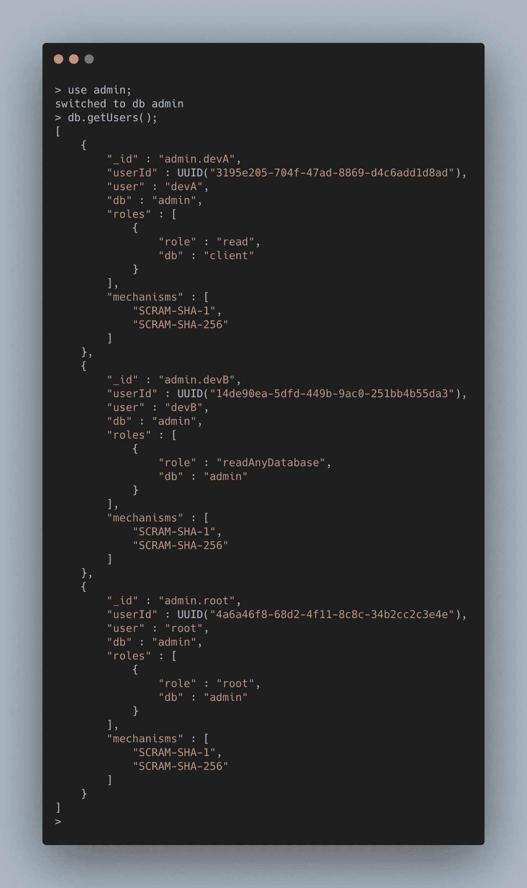

# 如何在 MongoDB 中撤销现有用户的角色

> 原文：<https://javascript.plainenglish.io/how-to-revoke-roles-from-existing-user-in-mongodb-f395954aaa9b?source=collection_archive---------12----------------------->

# 方案

假设您是一名 DevOps 工程师，您负责授予对数据库的访问权限，这也可以称为数据库管理员。

然而，这是新的一年，你的公司管理层决定重组团队。团队中有人试图改变自己的角色。例如，后端团队的“ **devA** ”想要尝试在他的职业生涯中做不同的事情，他决定转到前端团队。

管理人员通知您取消他的数据库权限，因为他以前提供了对数据库的访问权限。我写了一篇关于如何给现有的 MongoDB 用户添加角色的文章，如果你感兴趣，你可以在这里阅读帖子[。](https://medium.com/javascript-in-plain-english/how-to-add-roles-to-existing-user-in-mongodb-305551ccec86)

有两种不同的方法可以阻止现有用户访问数据库。您可以选择:

*   第一个选项—删除数据库用户。
*   第二个选项—删除为数据库用户指定的角色。

在本文中，我们将使用第二个选项。这是因为现有用户仍然是我们公司的一员，为了方便起见，如果将来需要，我们可以使用同一个数据库用户授予他任何角色。如果用户离开公司，我会使用第一个选项。

在下一节中，我们将展示如何在 MongoDB 中撤销用户角色的分步指南。

# 逐步指南

在我们进入如何从现有用户撤销角色的详细步骤之前。下面是这些步骤的简短版本。

1.  列出**管理**数据库中的所有用户(如果所有用户都是在管理数据库中创建的)。
2.  选择匹配值为“ **devA** ”的“用户”字段。
3.  使用`dropRolesFromUser()`函数删除赋予 devA 的角色，即**读取客户端数据库上的**角色

## 步骤 1-列出管理数据库中的所有用户

## 步骤 2 —找到“用户”字段值

查看名为 **user** 的字段名称，并找到值，因为我们将在下一步中需要它。参考下面的例子。

# 步骤 3 —使用 revokeRolesFromUser 函数从“devA”中撤销角色

通过下面的简单命令，您将能够撤销客户端数据库上的读取角色。

但是，如果您想要撤销多个角色，也可以通过一个命令来完成。例如，devA 有两个角色，一个是客户端数据库的 **read** 角色，另一个是 readWriteAnyDatabase 角色。您可以通过下面的代码撤销它们。

# 结论

简而言之，这篇文章讨论了:

*   如何在不从 MongoDB 中删除用户的情况下撤销现有用户的角色
*   如何撤销用户的一个或多个角色。

感谢您的阅读，下一篇文章再见。

# 参考

*   MongoDB`revokeRolesFromUser`手动
*   MongoDB 内置角色[手册](https://docs.mongodb.com/manual/reference/built-in-roles/)