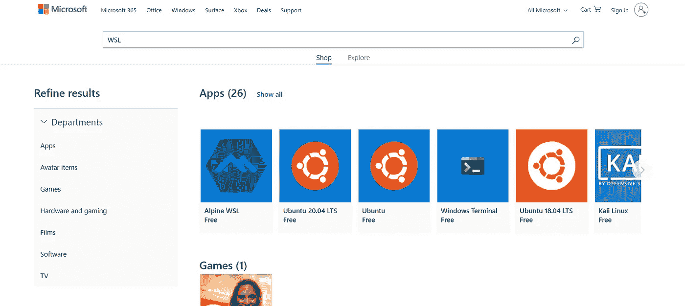

# 如何在 Windows 上运行 Linux Bash

> 原文：<https://javascript.plainenglish.io/how-to-run-linux-bash-in-windows-os-f861ff8aacc0?source=collection_archive---------23----------------------->

## 用于 Linux 的 Windows 子系统(WSL)


Image by [OpenClipart-Vectors](https://pixabay.com/users/openclipart-vectors-30363/?utm_source=link-attribution&utm_medium=referral&utm_campaign=image&utm_content=161382) from [Pixabay](https://pixabay.com/?utm_source=link-attribution&utm_medium=referral&utm_campaign=image&utm_content=161382)

我用 windows 来完成我的大部分日常任务，几乎所有我用来完成日常任务的软件都是基于 windows 的。我几乎 90%的时间都花在了 Windows 上，但差距仍然存在，只能由 Linux 来填补。作为一名开发人员，我的大部分任务都需要 Linux，其中之一就是部署。与 Windows 不同，Linux 是免费的，而且大多数 Linux 版本都是开源的。

随着对 Linux 的需求，我完全转向了 ubuntu。转变之后，我意识到有很多理由让我重新回到 windows。嗯，我在空闲时间使用的最喜欢的软件不见了，尤其是 Adobe illustrator(我非常喜欢这个软件，它可以让你探索你的创造力)。我回到 windows，选择了虚拟机。

把虚拟机想象成你真实机器内部的一台机器。这基本上是一个概念，其中大多数资源被拆分，并作为一个新的虚拟机提供，尽管这个新的机器完全是虚拟的，并作为一个真实的机器。这个新的虚拟机可以用来在您的主机中安装另一个操作系统。我希望现在你对虚拟机有了一个概念，但作为参考，你也可以通过[维基百科](https://en.wikipedia.org/wiki/Virtual_machine)阅读这个定义。

> 在计算中，虚拟机是计算机系统的虚拟化/仿真。虚拟机基于计算机体系结构，并提供物理计算机的功能。它们的实现可能涉及专门的硬件、软件或其组合。

双启动的时候虚拟机更好。因为每个工具也有一些缺陷。虚拟机也有一些缺点。正如我提到的，虚拟机运行在您的真实机器上。因此，我们的虚拟机需要的每一个硬件资源都必须向主机请求。这意味着我们的主机将间接访问硬件，因此其性能将受到影响。那么，最适合我们需求的替代方案是什么呢？这是 Linux 的 Windows 子系统(WSL)。

# 什么是 Linux 的 Windows 子系统(WSL)？

WSL 是 windows 操作系统中的一种资源，允许用户在 windows 中运行 Linux 命令行界面(CLI)。在 WSL 中，您可以完成几乎所有可以在 Linux 终端上执行的任务。

WSL 是基于虚拟机的。当我们下载一个首选的 Linux 发行版时，我们不是在创建一个 VM 实例。相反，WSL 提供了一个将 Linux 系统调用转换为 Windows 系统调用的层。因此，Linux 二进制文件可以不加修改地在 windows 中运行。我们还可以让 Linux 进程与 Windows 进程进行通信。WSL 还将 Windows 服务(如文件系统和网络)映射为 Linux 可以访问的设备。

# 为什么 WSL 比虚拟机好

WSL 不使用 VM 实例，而是在 Windows 内核上虚拟化一个 Linux 内核接口。这意味着运行 WSL 只需要少量的内存。当不使用时，WSL 驱动程序不会加载到内存中，这使得它比基于 VM 的解决方案更有效。

# 如何设置和安装 WSL

为了在 windows 中使用 WSL，你必须首先设置并安装它，我们需要一些配置，并在我们的机器上安装一些 Linux 内核，不要担心这并不像听起来那么乏味。

## 第一步。启用 WSL

WSL 是 Windows 的一项功能，默认情况下是关闭的，要启用它，您需要以管理员身份打开`powershell`并运行以下命令

```
dism.exe /online /enable-feature /featurename:Microsoft-Windows-Subsystem-Linux /all /norestart
```

## 第二步。启用虚拟机功能

启用 WSL 特性后，我们需要启用虚拟化功能来在 windows 上运行 WSL。为了在您的机器上启用 VM 特性，您需要在 Powershell 中运行下面给出的命令。

```
dism.exe /online /enable-feature /featurename:VirtualMachinePlatform /all /norestart
```

## 第三步。下载 Linux 内核包

现在，您需要下载 Linux 内核包。你可以点击[这里](https://wslstorestorage.blob.core.windows.net/wslblob/wsl_update_x64.msi)下载这个包。或者你也可以从[微软的 WSL 文档](https://docs.microsoft.com/en-us/windows/wsl/install-win10)下载这个包。

## 第四步。将 WSL2 设置为当前版本

打开 Powershell 并运行下面给出的命令，您可以跳过此命令。如果不想用 WSL2，也可以用 WSL1。就我而言，我更喜欢 WSL2。

```
wsl --set-default-version 2
```

## 第五步。安装您喜欢的 Linux 发行版

打开[微软商店](https://www.microsoft.com/en-us/search?q=WSL)并搜索你喜欢的 Linux 发行版。我建议使用 ubuntu，因为如果你需要任何帮助，你会找到很多社区支持。



安装后，你需要打开 ubuntu，第一次，你必须给出一个用户名和密码，这将只用于 ubuntu，以后将用于登录和在 ubuntu 中做其他`sudo`的东西。祝贺在您的机器上安装和设置 WSL。

# 结论

我并不反对双引导、虚拟机实例或任何类似的东西。对于一些 Linux 应用程序，我仍然使用虚拟机。我在这篇文章中想要表达的观点是，如果你需要 Linux 来满足你的开发者需求，那么 WSL 是最好的选择。如果你仍然喜欢一些其他的工具和技术，那完全没问题。选择是我们自己的。谢谢你阅读这篇文章，别忘了支持我，点击 clap 并与其他开发者分享。干杯！