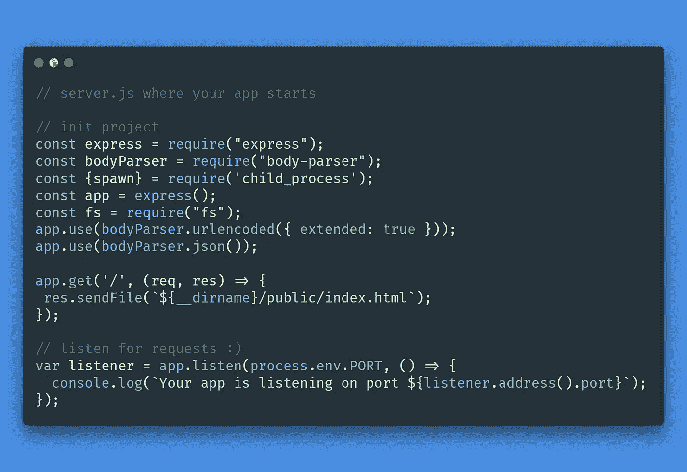
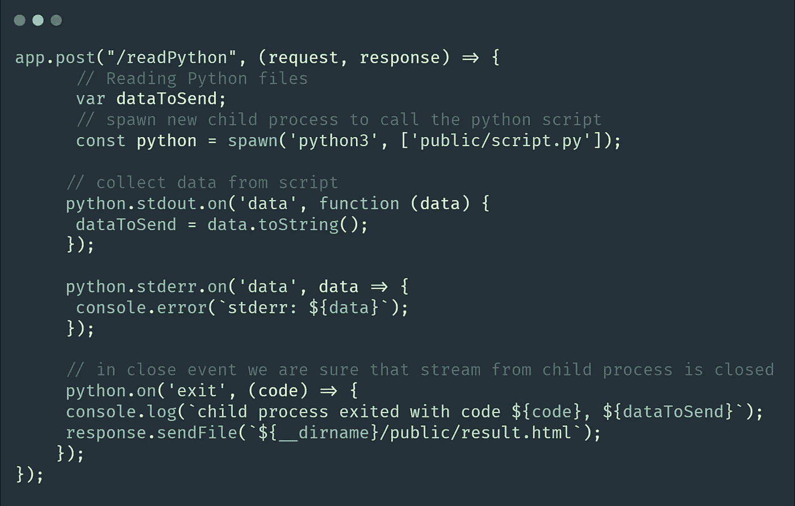
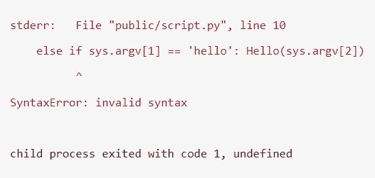
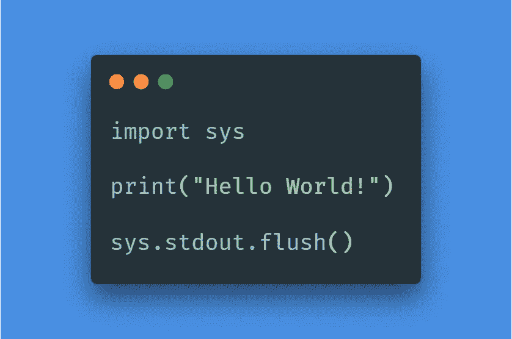
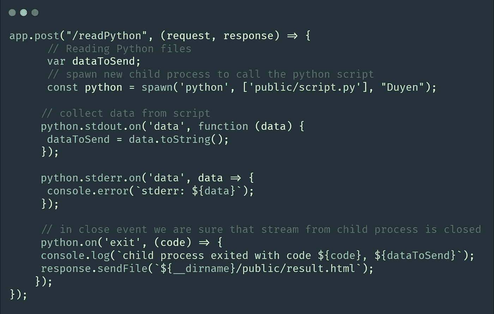
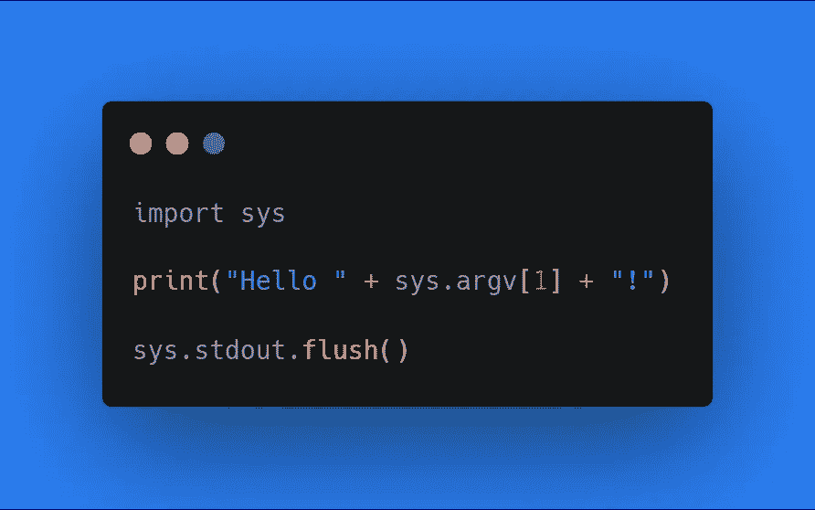
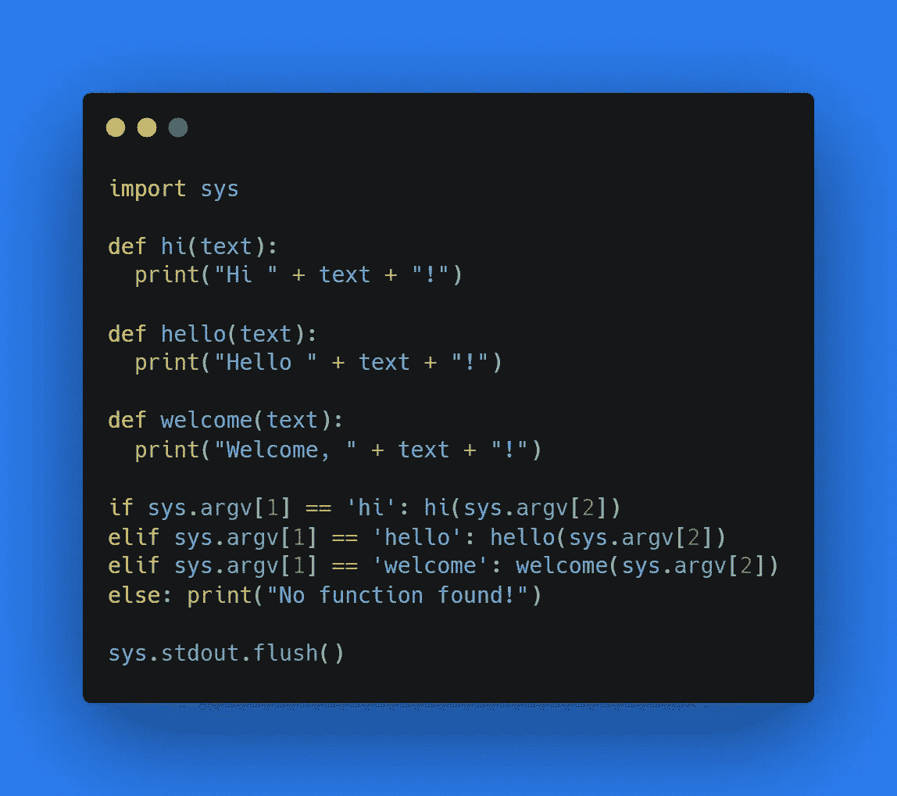

# 如何使用 Node.js 运行 Python 脚本

> 原文：<https://javascript.plainenglish.io/how-to-run-python-script-using-node-js-6b351169e916?source=collection_archive---------0----------------------->

## 文章末尾提供了完整的代码

Photo by [Markus Spiske](https://unsplash.com/@markusspiske?utm_source=medium&utm_medium=referral) on [Unsplash](https://unsplash.com?utm_source=medium&utm_medium=referral)

有一天，你想出了一个绝妙的主意，在你的项目中使用了很酷的 Python 库。但是您不知道如何将它与您现有的 Node.js 服务器集成。别担心！今天，我将向您展示如何轻松地从 Node.js 中读取 Python 脚本，并为您提供一步一步的实现指南，以便您可以将时间节省下来，用于以后更重要的任务。

为了简单起见，我将使用 [Glitch](http://glitch.com) 来演示如何让它工作，但是您可以随意将其应用到您喜欢的其他平台上！

首先，我们需要创建一个 **server.js** 文件作为我们应用程序的服务器。

Your server.js file

这里的想法很简单，你使用**子进程**和 **spawn()** 从 Node.js 调用你的 **Python 脚本**(不需要事先知道它们是什么)。然后 Node.js 将**存储 Python 脚本**的输出，之后你可以对变量做任何你想做的事情。因此，当表单在客户端提交时，我们需要添加一个新的 POST 方法来运行 Python 脚本:

Add a new POST method to read Python script

这里有一些你需要知道的**流程**:

1.  在变量`python`的声明中，`'python3'`是在 python 脚本中运行库所需的 python 版本**。`python`常，足矣。然而，如果错误发生:`cannot import [your libraries]`即使你已经安装了它们，那么你应该考虑使用`python3`和**使用`pip3`重新安装你的库**。**
2.  `stderr`将**把你的 Python 脚本**(如果存在)的错误返回到你的控制台，这样你就可以在进入下一部分之前修复它们。

An example of stderr error

3.当您的 **script.py 成功运行并且没有错误**时，您的 Python 脚本的输出将存储在变量`dataToSend`中，服务器将返回行`child process exited with code 0`。然后，**你可以使用 Node.js** 中的输出变量做任何你想做的事情。

现在，假设您有一个脚本文件**将 Hello World 打印到控制台。**

Your script.py code

注意 **sys 是允许 Python 从 Node.js 服务器读取参数**的模块，在接下来的例子中，我们将**将参数从服务器传递给 Python** 。如果没有发生错误，在使用 Node.js: `child process exited with code 0, Hello World!`运行 script.py 之后，您将从控制台收到这条消息。

然后，让我们看看如何从我们的服务器向 script.py 传递一个或多个参数。只需简单地**在 server.js 中的脚本路径**旁边添加一些新变量，Python 就会自动理解这些参数，并使用`sys.argv[*your_index*]`按顺序读取它们(这就是为什么我们需要提前`import sys`)。

Update your server.js

现在，假设我们想说“Hello”+这个人的名字作为 Node.js 服务器的参数。我们将编辑 Python 源代码，如下所示:

Your new script.py

下面是我们成功运行代码后会得到的结果:`child process exited with code 0, Hello Duyen!`。

恭喜，您已经学会了如何将 Node.js 中的参数传递给 Python 文件。您可以添加更多的参数并增加`sys.argv[]`的索引来获得新的值。

最后，我将向您展示**一个没有人告诉过您的小技巧**，以便您的 Node.js 文件只读取 Python 代码的必要部分，而不是整个文件。这个技巧就是……**从你的服务器调用函数作为参数！**

假设你想用三种不同的方式问候一个人，而不仅仅是说“你好”。为此，只需为每种问候方式创建一个函数，然后**将一个函数的名称作为第一个参数**传递给服务器。通过使用这种方法，**您不需要创建多个 Python 文件**和不同的 POST 方法来获取您的 web 应用程序所需的值。

Create functions in your script.py

如你所见，当我们现在从 server.js 调用 script.py 时，它只会运行你从 Node.js 作为第一个参数传递的函数，因此，这个方法**会帮助你更好地组织你的 Python 脚本**并且**只使用你需要的资源！**

然后，您需要做的最后一件事是**将 server.js** 中变量 **python 的声明**更改为:

`const python = spawn('python3', ['public/script.py', 'welcome', 'Duyen']);`

**就是这样！**

你做得很好。当程序成功运行时，您将会看到这个输出:`child process exited with code 0, Welcome, Duyen!`。

Here is the GUI for what we have done above! To access the full code, click the link below.

 [## 小故障

### 结合自动化部署、即时托管和协作编辑，Glitch 让您直接编码，以便您可以…

glitch.com](https://glitch.com/edit/#!/nodewithpython?previewSize=0&attributionHidden=true&sidebarCollapsed=false&path=public%2Findex.html&previewFirst=false) 

如果你在学习我的教程时有任何问题或者不能修复你的错误，你可以在下面留言直接跟我说。我会尽力帮忙的！

编码快乐，祝你有美好的一天！

*更多内容看*[***plain English . io***](http://plainenglish.io/)