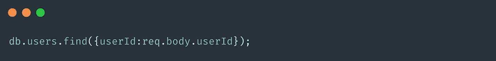
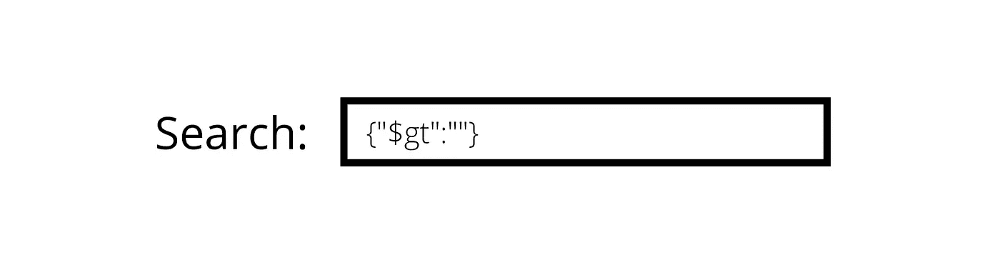
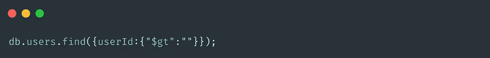
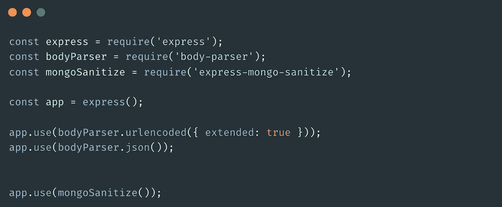
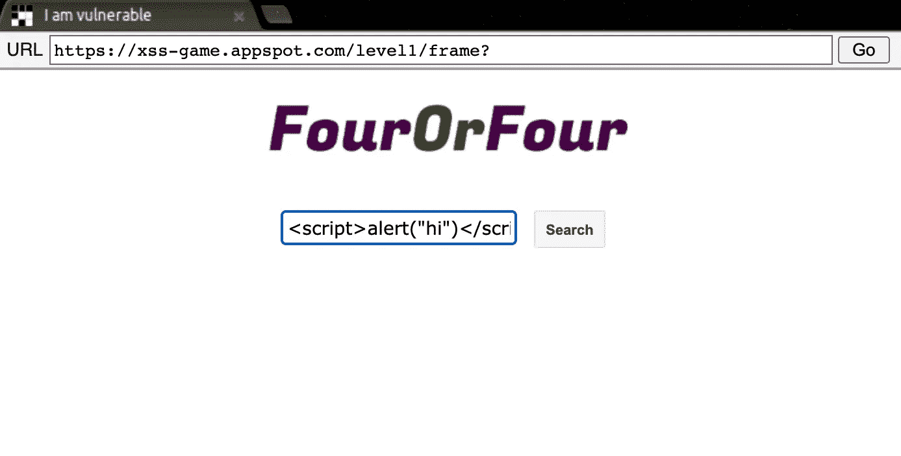

# 如何针对 MongoDB 注入和跨站点脚本清理您的 Express 应用程序

> 原文：<https://javascript.plainenglish.io/how-to-sanitize-your-express-app-against-mongodb-injection-cross-site-scripting-6a22f4e822aa?source=collection_archive---------1----------------------->


Image by Author via [Canva](https://www.canva.com/)

作为一名 web 开发人员，解决应用程序中可能出现的每一个*安全问题不是你的工作。web 应用程序中的安全性是一个完全不同的领域，如果您在生产环境中工作，会有不同的团队来担心安全性问题。*

*话虽如此，但是，您可以采取一些初步措施来防范最常见和最基本的安全问题。一旦完成了应用程序的开发，您就可以在部署之前针对这种潜在的攻击实现某种级别的基本安全性。*

***MongoDB 注入(NoSQL 注入)**和**跨站脚本(XSS)** 就是这样一些你需要解决的基本安全漏洞。首先，让我们看看这些术语的含义，以及为什么会有问题。*

# *MongoDB 注射液*

*你可能以前听说过 SQL 注入和 NoSQL 的注入在概念上非常相似。简单来说，这意味着，*注入一些查询/命令作为用户输入的一部分，目的是操纵存储在我们数据库中的数据。*这可能会有问题，因为注入的命令将在服务器端执行，并且对存储的数据存在潜在威胁。*

*在关系数据库的情况下，注入命令相对容易，因为查询和语法非常相似。*

*考虑以下查询:*

```
***const** user = "SELECT * FROM users WHERE name = '" + userName + "'";*
```

*这个“用户名”可以来自搜索输入。现在，当用户在搜索字段中输入一些纯 SQL 而不是搜索词时，就会发生 SQL 注入，就像这样，*

```
*a';**DROP** **TABLE** users; **SELECT** * **FROM** userinfo **WHERE** 't' = 't*
```

*这将导致下面的总体查询，*

```
***SELECT** * **FROM** users **WHERE** name = 'a';**DROP** **TABLE** users; **SELECT** * **FROM** userinfo **WHERE** 't' = 't';*
```

*执行上述查询将删除“ *users* ”表，还将显示来自“ *userinfo* ”表的记录。这说明了注入命令是如何有害的。*

*在 NoSQL 数据库中，语法和查询会根据您使用的具体数据库而有很大的不同。MongoDB 查询与 Apache Cassandra 或 Redis 的查询非常不同。此外，这些查询是用后端语言编写的，如 JavaScript、Python 或 Java，而不是用 SQL 编写的关系数据库中的统一查询。*

*MongoDB 使用*二进制 JSON (BSON)* 数据格式，并附带一个安全的 BSON 查询组装工具。所以与 SQL 不同，它不可能注入直接的字符串。然而，我们开发的 plain express 应用程序也不能免受 NoSQL 注入漏洞的影响。*

*我们举个例子。*

*考虑一个类似的情况，我们在主页上有一个搜索字段(不安全的用户输入)，允许用户搜索特定的项目。这个搜索字段应该接受纯文本，对吗？我们可以搜索“john”或“ice cream ”,匹配的结果需要被取出来给我们看。Mongo 查询将如下所示，*

**

*想象“用户 Id”来自搜索字段。那么，如果用户在搜索栏中输入类似这样的内容会怎么样呢？*

**

*这样修改了原始查询，*

**

*执行该查询将获取所有用户,因为从技术上讲，每个用户 id 都大于一个空字符串。简单地说，这将导致查询出数据库中的每个用户。*

# *防止 MongoDB 注射*

*现在我们知道了注射意味着什么，我们需要找到方法来阻止它在我们的 express 应用程序中发生。多亏了[特快猫鼬消毒](https://www.npmjs.com/package/express-mongo-sanitize) npm 包，这并不困难。我们所要做的就是，安装它，然后需要它并使用它。*

```
*npm install express-mongo-sanitize*
```

*你可以像这样使用它，*

**

*这将完全消除 MongoDB 中任何带有禁止字符的输入，如' $ '符号。*

```
*app.use(
  mongoSanitize({
    replaceWith: '_',
  }),
);*
```

*您可以添加上面的代码片段，用'-'字符替换任何禁止的字符。*

# *跨站点脚本*

*我们在应用程序中必须解决的另一个常见和普遍的安全问题是跨站点脚本，也称为 XSS。如果一个糟糕的演员可以在别人的网站上运行客户端脚本，那么它可以被解释为 XXS。跨站脚本是一种对网站的恶意攻击方式，它可以在网站中造成许多不必要的操纵行为。*

**

*[XSS-game.appspot](https://xss-game.appspot.com/) 是一款演示游戏，在这里你可以体验将客户端脚本注入网站的概念。这里，我在搜索栏中添加了一个' *<脚本>alert(" hi ")</script>*'，它提示我一个 alert，说*“hi”。**

*现在，这在现实世界中可能会有很大的问题，因为作为用户，我们不应该弄乱网站的功能。你可能认为提醒一些事情没什么大不了的，但是它很容易失控，迫使攻击者在网站上进行不必要的行为。*

*XSS 的概念可能导致许多攻击，如**窃取 cookies、劫持用户帐户、泄露敏感数据**等。因此，在我们的 express 应用程序中至少实现一个基本机制以防止任何可能的 XSS 攻击是极其重要的。*

# *防止跨站点脚本*

*如果你正在使用 [express-validator](https://express-validator.github.io/docs/) 来验证你的输入，那么这对你有好处，因为转义 HTML 功能是内置的。但是如果你依赖于 joi 进行验证，那么你需要做一些额外的工作来避免 HTML 和基本上停止跨站点脚本。*

*joi 允许我们创建自己的扩展，我们可以利用它来实现自己的 HTML 转义功能。*

```
*const joi = require('joi');
const sanitizeHtml = require('sanitize-html');const extension = (joi) => ({
 type: 'string',
 base: joi.string(),
 messages: {
  'string.escapeHTML': '{{#label}} must not include HTML!'
 },
 rules: {
  escapeHTML: {
   validate(value, helpers) {
    const clean = sanitizeHtml(value, {
     allowedTags: [],
     allowedAttributes: {}
    });
    if (clean !== value) return helpers.error('string.escapeHTML', { value });
    return clean;
   }
  }
 }
});*
```

*我在这里所做的是，我在“ *joi.string()* 的基础上创建了一个扩展来转义 HTML。随着扩展的完成，我们可以添加*。escapeHTML()* 方法，从而清理 HTML。*

```
*module.exports.userSchema = Joi.object({ name: Joi.string().required().escapeHTML(),});*
```

*我还使用了一个名为 [sanitize-html](https://www.npmjs.com/package/sanitize-html) 的包来实际剥离扩展中输入的 html 标签，如 *<脚本>、< p >* 等。所以你还需要安装 [sanitize-html](https://www.npmjs.com/package/sanitize-html) npm 包。这个*清理 Html()* 来自为我们完成工作的那个包。我通过将 *allowedTags* 设置为一个空数组来禁止每个标签，但是如果你愿意，你可以有选择地允许一些标签。*

*我希望你对 express 应用程序中的基本漏洞以及如何将危害最小化有所了解。下次见！*

**更多内容看* [*说白了. io*](http://plainenglish.io/) *。报名参加我们的* [*免费周报在这里*](http://newsletter.plainenglish.io/) *。**