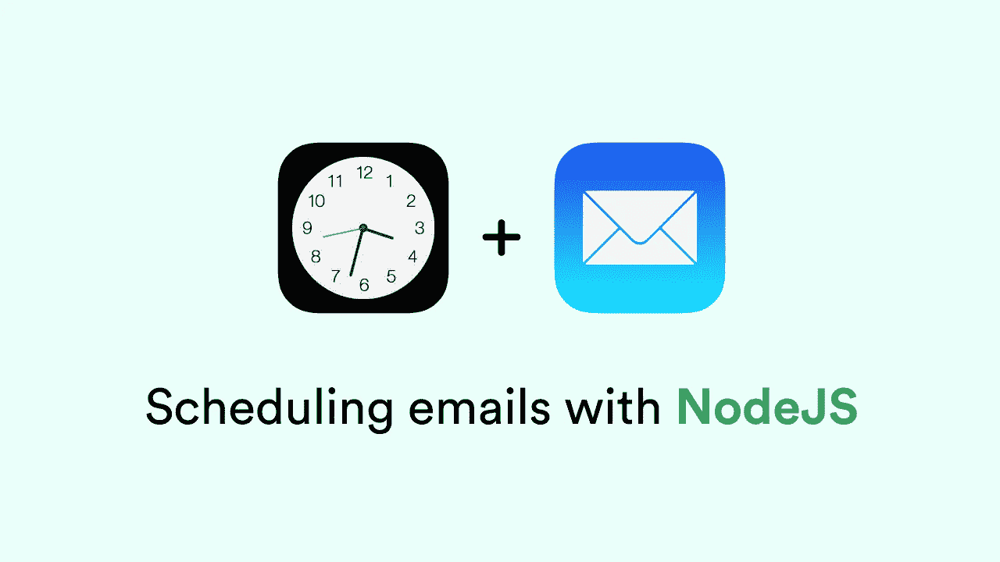
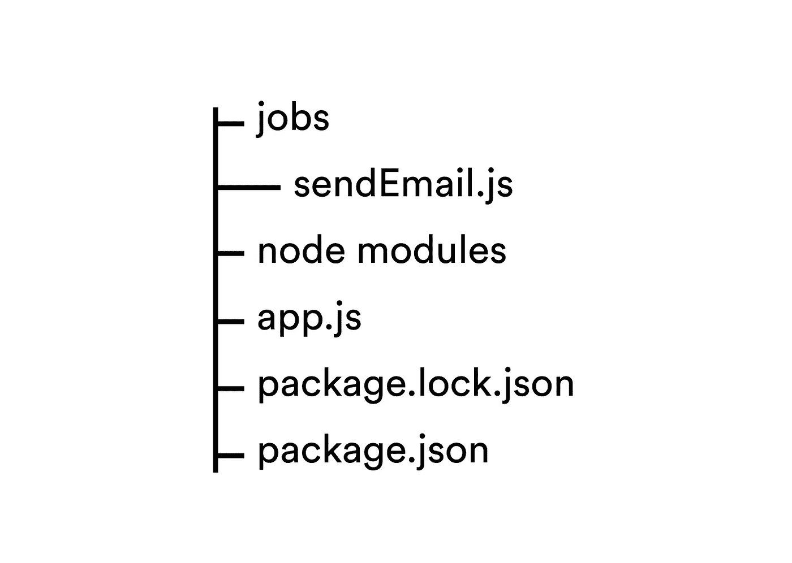
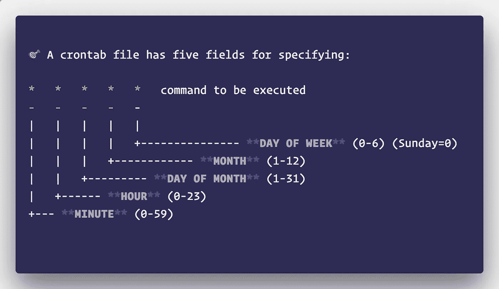
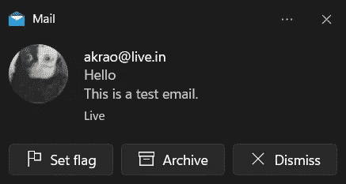

# 如何用 Node.js 安排邮件

> 原文：<https://javascript.plainenglish.io/how-to-schedule-emails-with-node-js-31e9a61e7c57?source=collection_archive---------2----------------------->



每个组织都在幕后执行一系列任务，而我们大多数人甚至都没有意识到。例如，当网飞告诉你，你的帐户即将到期，这不是一些家伙谁实际上在监控你的帐户，并向你发送到期通知。这是一项持续运行 BTS 并保持跟踪的工作。同样，当你每天收到来自你最喜欢的网上时装商店的电子邮件时，这可能是一项为你和其他订阅它的人安排的工作。在这篇博文中，我们将尝试做一些类似于上面例子的东西。我们将创建一个电子邮件调度程序，使用我们自己的 Node.js 以特定的时间间隔向用户发送电子邮件。

> [**你也可以在 youtube 上查看这个教程的视频版本。**](https://youtube.com/playlist?list=PL62km_yqC3ZEyoJa7JtdPOmzMgKuuZZ-x)

## 项目设置

我假设您的系统中已经安装了 Node.js。如果没有，可以从[这里](https://nodejs.org/en/download/)下载安装。

通过在终端中键入`**npm init -y**`来初始化一个节点项目。这将创建一个" **package.json"** 文件，该文件主要保存与您的项目相关的信息。我们需要" **express"** 和一些其他的依赖项，所以要安装它们，在你的项目终端中输入这个

```
npm i express bree nodemailer dotenv
```

**bree:** 我们将使用的作业调度库
**nodemailer:** 库来创建和发送电子邮件
**dotenv** :使用环境变量来保护我们的凭证的库

## 创建作业调度程序

首先，让我们创建我们的主服务器文件。在我们的根目录中，我们将添加一个名为 app.js 的文件。我们还将在同一个目录中添加一个 jobs 文件夹，其中包含我们打算创建的所有作业。将我们的组件分开是一个很好的做法，默认情况下，Bree 也建议有一个单独的“**jobs”**文件夹，尽管这不是绝对必要的。

现在我们的项目文件夹结构应该看起来像这样。



Folder structure

你在 jobs 目录中看到的“**senemail . js**”文件将包含我们稍后将添加的邮件程序逻辑。我们将看看服务器文件(app.js)中的代码。

我们首先从各自库中导入 express 和 Bree。之后，我们将创建一个" **Bree 实例"**，我们最终将使用它来执行我们的工作。在这个实例中，我们可以传入一些选项。你可以通过[点击](https://www.npmjs.com/package/bree#instance-options)查看我们可以使用的实例选项的完整列表。我们将使用“**乔布斯”**选项，这也是最重要的一个选项。

这个作业选项也有自己的一组[选项](https://www.npmjs.com/package/bree#job-options)。它将保存与您要运行的作业相关的所有信息。因为它将是一个数组，所以您可以添加具有不同属性的多个作业。在我们的工作中，

**名称:**我们在“**作业**”目录中的作业文件的名称。
**cron:**cron 表达式，作业将参考该表达式运行(稍后将详细介绍)。
**worker:** Bree 在幕后使用“ **worker threads** ”。因此，您运行的每个作业都是在节点流程中的不同工作线程上执行的。因此，如果需要，可以使用这个 worker 属性将附加数据传递给作业。

你可以点击查看选项列表。为了这个例子，我们将只使用" **workerData"** 属性。

在这之后，我们只需要在这个实例上使用“ **start** ”方法，我们的作业将开始执行。

## Cron 语法

现在，您在上例中看到的 cron 键需要有特定的语法才能工作。cron 表达式中的每个块都有特定的含义。如果你看一下这张图片，



从左边开始，我们为“**每分钟”**、“**每小时”**、“**每月的每一天”**、“**每月的每一天”**和“**一周的每一天”**。这些块中的每一个都有一个*号，这意味着它们取所有可能的值。因此，这个 cron 作业实际上将在一周的所有月份中的每一天、每小时的每一分钟运行😅。如果我将第一个*更改为 5，这意味着现在它将在每小时的第 5 分钟运行(00:05、01:05、02:05 等等)。我们再来看几个例子。

*   * 10 * * *
    10:00 后每分钟运行一次。
*   * * 4 * *
    在每月第 4 天的每一分钟运行。
*   * * * 3 *
    在三月的每一分钟运行。
*   * * * * 6
    在星期六每分钟运行一次。

还有一些其他的**操作符**可以添加到 cron 语法中以获得更多的好处。我已经详细解释了一切，在这个 [**视频**](https://youtu.be/LmDw-nbVLQk?t=350) 中，你可以观看它来更好地了解如何创造 cron 就业机会。您还可以尝试不同的 cron 作业，或者使用这个 [**在线工具**](https://crontab.guru/#*_*_*_*_6) **创建您自己的定制 cron 作业。**

如果您根本不想在 Bree 实例中使用 cron，您可以随时切换到日期语法或人类可读的语法，因此您可以用以下内容代替 cron 表达式

```
...
cron : "* * * * *"    //Remove this
interval : "Every 1 minute" //Add this
...
```

这会给你同样的结果。

因此，如果您现在通过在终端中键入“ **node app.js** ”来启动您的服务器，那么每分钟您都会看到一条类似于以下内容的消息

```
Worker for job "dummy" online
Worker for job "dummy" exited with code 0 
```

这意味着您已经成功创建了每分钟都会运行的 cron 作业。我们现在将邮件程序逻辑添加到我们的应用程序中。将以下代码复制到 sendEmail.js 文件中。

让我们把它分成多个部分。我们首先在文件内部导入" **Nodemailer"** 和" **WorkerData"** 。WorkerData 允许您访问您在调度器的 worker 键中传递的数据。所以，如果你回到 app.js，看看 Bree 实例，我们在里面添加了一个对象

有一些描述的 WorkerData。现在可以使用 WorkerData 在我们的作业中访问它。( ***WorkerData 与 emailer 无关，如果愿意可以跳过。***

在这之后，我们创建一个 main 函数，在这个函数中我们有邮件程序的所有逻辑。然后在脚本的结尾调用这个主函数。

我们的电子邮件程序首先需要一个 transporter 对象。这个对象接受一个选项列表。

**主机**:我们正在连接的主机名(因为我使用我的 outlook 电子邮件帐户，所以我将使用他们的主机名。你可以在这里使用 Gmail，但是你需要先完成几个额外的步骤。你可以在[这里](https://nodemailer.com/usage/using-gmail/)了解更多。)

**端口**:我们需要连接的端口(默认为 587)

**secure** :如果为 true，连接到服务器时将使用传输层安全性(默认为 false)。

**auth** :定义认证数据(电子邮件发送者帐户的用户名和密码)

你可以在[这里](https://nodemailer.com/smtp/)找到传送器选项的完整列表。

一旦我们准备好了传输器配置，我们需要配置我们的电子邮件消息。您可以在运输商的 sendMail 方法本身中配置您的电子邮件。

**从&到:**您的电子邮件的发件人和收件人列表。

**主题:**您电子邮件的主题。

**文本/html:** 邮件正文以文本或 html 的形式

你可以在[这里](https://nodemailer.com/message/)找到邮件信息选项的完整列表。

现在，如果您再次运行您的服务器，并等待下一分钟(Bree 实例中的 cron 作业每分钟都在运行)，您应该会在终端上看到这条消息。

```
Worker for job "sendEmail" online undefined
This job will send emails.   
Worker for job "sendEmail" exited with code 0
```

在此之后，你现在可以检查你的收件箱，看看你是否收到了电子邮件。



Email message inside my inbox

## 结论

这基本上就是通常在 Node.js 应用程序中调度 cron 作业的要点。Bree 是一个文档丰富、健壮的库，它的特性比我们在这里看到的要多得多。它还将工作线程用于其作业，这使得它本质上是非阻塞的，因此它还具有性能优势。你可以浏览它的[文档](https://www.npmjs.com/package/bree)来更好地了解它的真正潜力。

[**你也可以在 youtube 上查看这个教程的视频版本。**](https://youtube.com/playlist?list=PL62km_yqC3ZEyoJa7JtdPOmzMgKuuZZ-x)

如果你有任何疑问或建议，你可以在评论中提出来，或者你也可以通过我的社交网站与我联系。干杯！

[LinkedIn](https://www.linkedin.com/in/akilesh-rao-610357137/)
[Twitter](https://twitter.com/themangalorian)
[GitHub](https://github.com/AkileshRao)
[YouTube](https://www.youtube.com/channel/UCaktnqx_IENyT5T2lJ3F09w)

*更多内容请看*[***plain English . io***](http://plainenglish.io/)***。*** *报名参加我们的* [***免费每周简讯这里***](http://newsletter.plainenglish.io/) ***。***