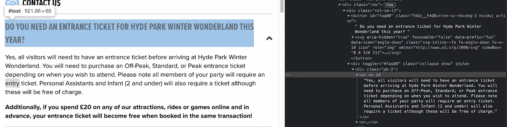
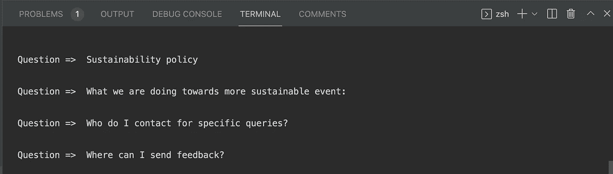

# 如何用 Node.js 刮一个真实的网站

> 原文：<https://javascript.plainenglish.io/how-to-scrape-a-real-website-with-node-js-5ca9402bd954?source=collection_archive---------3----------------------->

## 一个简单而强大的工具，适合任何 web 开发人员！


Photo by [Monoar Rahman](https://www.pexels.com/@monoar-rahman-22660?utm_content=attributionCopyText&utm_medium=referral&utm_source=pexels) from [Pexels](https://www.pexels.com/photo/silver-laptop-next-to-coffe-cup-smartphone-and-glasses-114907/?utm_content=attributionCopyText&utm_medium=referral&utm_source=pexels)

所以你需要一些数据。你一直在找，在网上找到了。但是它不是你可以简单地复制和粘贴的东西，因为你可能想把它存储在某个地方(可能在数据库中或者以 JSON 格式)

但是手动复制粘贴是一项枯燥的工作。你是一个聪明的人，喜欢将事情自动化。

好了，不要再说了！你要找的工具是刮刀。

## 刮痧到底是什么？

根据 [zyte](https://www.zyte.com/learn/what-is-web-scraping/) ，

> Web 抓取是以自动方式收集结构化 web 数据的过程。

是啊，没错。今天我们将从该网站的常见问题部分提取数据。

# 要求

刮擦的概念可以分为以下几个步骤。

*   从网站获取数据 HTML 文件(我们将使用`axios`)
*   解析数据(我们将使用`cheerio`)

就是这样！这么简单对吧？

# 初始化您的项目

让我们首先初始化一个空的 Node.js 项目。转到您的终端，运行以下命令

```
mkdir web-scrapercd web-scrapernpm init -y
```

这将为你创建一个`package.json`文件。

然后创建我们的根文件

```
touch index.js
```

所以我们现在有了一个 skeleton Node.js 项目。让我们使用它！

# 安装依赖项

运行以下命令获取所需的依赖项

```
npm i axios cheerio
```

打开您的`index.js`文件并导入它们

```
**const** axios = require("axios");**const** cheerio = require("cheerio");
```

# 从网站获取数据

正如我们之前讨论的，首先要做的是从网站上获取原始数据。这意味着获得完整的`.html`文件。我们可以这样做。

注意第 5 行。我们已经将 HTML 文件加载到了`cheerio`中。因为 cheerio 和`Jquery`有很多相似之处，所以我们使用`**$**`作为变量名。可以用别的！。

好了，现在我们有了 HTML 格式的数据。

# 但是我们如何解析它呢？

要理解这一点，我们必须访问该网站，并打开目标网站的 inspect 工具。并尝试理解 HTML 文件的结构。



target website structure

**Cheerio** 能够根据`classname`或元素类型(div、button 等)进行选择。我们将设法找到我们能得到问题的地方。

## 得到问题

如果我们仔细观察，问题在一个`button`里面，而这个`button`在一个`div`和`classname = "row"`里面

这意味着，如果我们得到所有带有`classname="row"`的 div，我们将得到所有的 faq，并从中提取问题。

就这么办吧！

index.js

之后，转到您的控制台并运行

```
node index.js
```

看看你的控制台



Questions

所以你把所有的问题都从网站上刮了下来。现在你想怎么用就怎么用。试着自己找出答案。

如果你不能，你可以找出逻辑来找到答案，并在下面的报告中检查完整的代码。

[](https://github.com/Mohammad-Faisal/web-scraper) [## GitHub-Mohammad-fais al/网络刮刀

### 此时您不能执行该操作。您已使用另一个标签页或窗口登录。您已在另一个选项卡中注销，或者…

github.com](https://github.com/Mohammad-Faisal/web-scraper) 

今天到此为止！祝您愉快！

**通过** [**LinkedIn**](https://www.linkedin.com/in/56faisal/) 与我联系