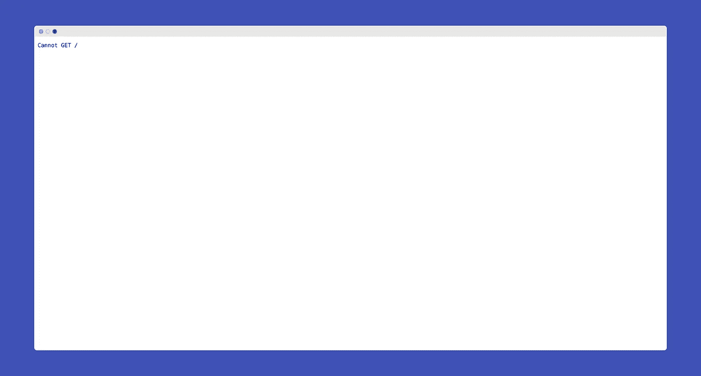
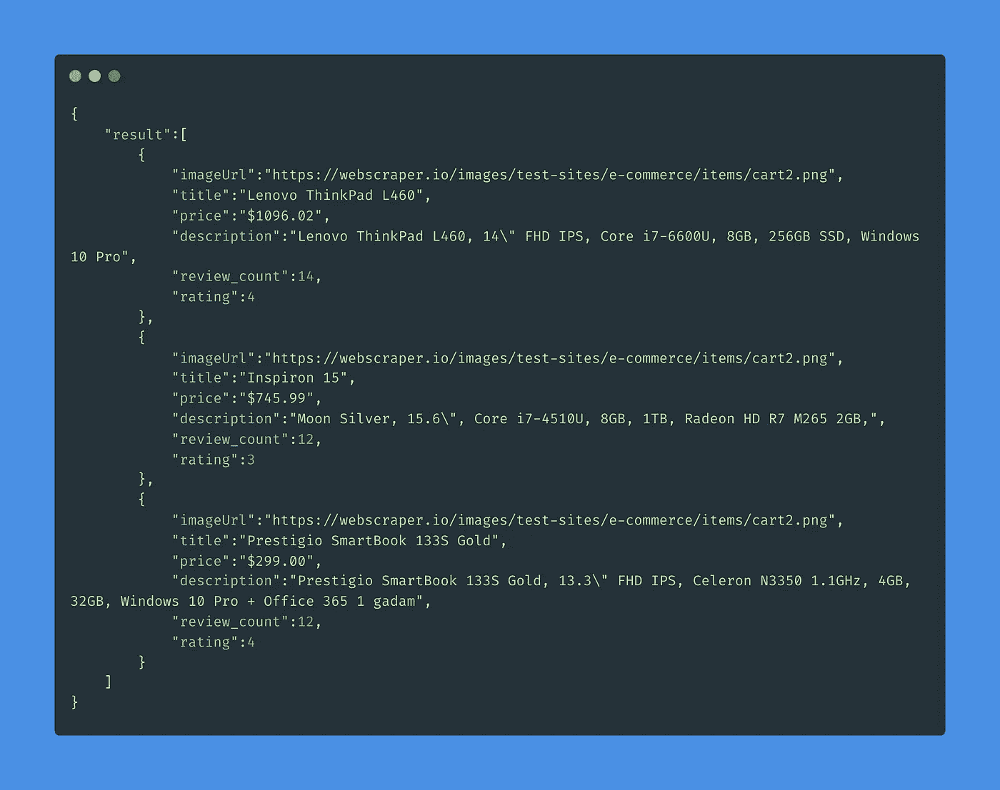

# 如何使用 Cheerio 抓取 Node.js 中的 Web 应用

> 原文：<https://javascript.plainenglish.io/how-to-scrape-web-applications-in-node-js-using-cheerio-44dd5e331b3e?source=collection_archive---------14----------------------->

## 探索 Node.js 中网页抓取的可能性


Photo by [fauxels](https://www.pexels.com/@fauxels?utm_content=attributionCopyText&utm_medium=referral&utm_source=pexels) from [Pexels](https://www.pexels.com/photo/flatlay-display-of-electronics-next-to-eyeglases-3184454/?utm_content=attributionCopyText&utm_medium=referral&utm_source=pexels)

抓取 web 应用程序对我来说是最有趣的主题之一，也许对你也是如此。除了有趣之外，它还是数据科学中最重要的话题之一。

我们中的许多人可能知道如何使用 Python 或一些在线工具来抓取 web 数据。然而，本文将演示我们如何使用 Node.js 从静态网站中抓取数据。

# 创建新的 Node.js 项目

首先，让我们创建一个新的 Node.js 项目。要创建新项目，请在工作目录中打开一个新的终端，并键入以下命令:

```
mkdir my-scraper && cd ./my-scraper
```

它将创建一个名为`my-scraper`的新文件夹。要启动一个新的 Node.js 项目，请在终端的`my-scraper`目录中键入以下命令。

```
npm init -y
```

它将在我们的项目目录中创建名为`package.json`的文件。让我们通过键入以下命令来安装所有必需的依赖项以及`express`:

```
npm install express
```

# 设置基本代码

现在让我们在项目目录的根文件夹中创建一个名为`index.js`的文件。在`index.js`文件中，让我们添加下面的基本代码:

现在，如果我们在终端中输入以下命令，我们的服务器将启动:

```
node .
```

通过访问 URL `[http://localhost:8080](http://localhost:8080.)`，我们可以看到我们的服务器正在运行。我们可以看到一个类似如下的网页:



# 安装 Cheerio 和 Axios

[Cheerio](https://cheerio.js.org/) 是一个节点框架，可以用 Node.js 来抓取 web 数据，先安装一下。要安装 Cheerio，您必须在终端中输入以下命令:

```
npm install cheerio
```

它将在我们的项目中安装 Cheerio。

让我们也安装`axios`来获取 HTML 代码。

```
npm install axios
```

# 我们开始刮吧

到目前为止，我们已经启动了 Node.js 项目并安装了所有需要的依赖项。现在，我们将开始从网站收集数据的旅程。

首先，让我们获取抓取数据的 HTML 代码。我们将首先下载我们的目标网站的主页。如下所示更改`index.js`代码:

现在，让我们从“*当前最重要的商品*”部分获取所有商品列表。点击`CTRL+U`，观察 HTML 代码结构。或者你可以通过敲击键盘上的`CTRL+SHIFT+I`来检查代码。

通过观察 HTML 代码，我们可以看到 HTML 中的卡片位于以下步骤中:

```
div[class="wrapper"] > div[class="container test-site"] > div[class="row"] > div[class="col-md-9"] > div[class="row"] > div[class="col-sm-4 col-lg-4 col-md-4"] > div[class="thumbnail"]
```

通过观察卡片，我们可以看到每张卡片都有图片、标题、价格、描述、评分和评论总数。所以让我们先获取这些记录:

结果如下:



# 结论

现在，您已经对如何在 Node.js 中从 web 应用程序中抓取数据有了明确的理解。

使用 Cheerio 抓取网络数据适用于静态网站。然而，这种方法可能不适用于动态网站，因为在大多数框架中，网站在客户端呈现。

同样，网络抓取违反某些网络应用程序的条款和条件。你应该检查你是否有权限从网站上抓取信息。

尽管有其局限性，我们可以从其他网站抓取必要的信息，并轻松地将其存储在我们的数据库中。虽然我们不能直接从动态网站获取数据，但有一个使用 Cheerio 获取数据的变通方法。也许我会在另一篇文章中讨论它。

如果您感兴趣，这里有完整的项目资源库。

[](https://github.com/ludehsar/my-scraper) [## ludehsar/我的刮刀

### 中等教程项目。在 GitHub 上创建一个帐户，为 ludehsar/my-scraper 的开发做出贡献。

github.com](https://github.com/ludehsar/my-scraper) 

祝您愉快！

*更多内容看*[***plain English . io***](http://plainenglish.io/)