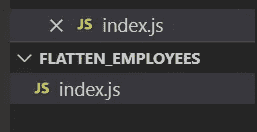
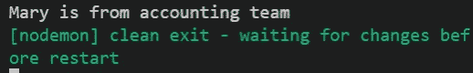

# 如何用 JavaScript 在嵌套的 JSON 对象中搜索

> 原文：<https://javascript.plainenglish.io/how-to-search-in-nested-json-object-with-javascript-8ccfc957e95e?source=collection_archive---------7----------------------->

## 用 JavaScript 在嵌套的 JSON 对象中按键查找。

这是我在嵌套 JSON 中搜索的方法，欢迎你回复这篇文章分享你的方法。我将在这里分享流程和编程部分。


Photo by [Mulyadi](https://unsplash.com/@mullyadii?utm_source=medium&utm_medium=referral) on [Unsplash](https://unsplash.com?utm_source=medium&utm_medium=referral)

[源代码](https://www.youtube.com/channel/UCu4-4FnutvSHVo9WHvq80Ww/join)

有时候，我需要在 JSON 对象上处理一些稍微复杂的操作。

例如，我们有一个名为 employees 的 JSON 对象。我想知道玛丽的部门是什么，也就是说我想拿到关键的“会计”。

```
{"accounting" : [{ "firstName" : "John","lastName"  : "Doe","age"       : 23 },{ "firstName" : "Mary","lastName"  : "Smith","age"      : 32 }],"sales"      : [{ "firstName" : "Sally","lastName"  : "Green","age"      : 27 },{ "firstName" : "Jim","lastName"  : "Galley","age"       : 41 }]}
```

在这篇文章中，我不会做很多检查，只想分享流量。

我做的第一步是展平这个 JSON 对象，然后我想得到“Mary”的键。这次的关键是“accounting.1.firstName”。然后我会用“.”来分割这个字符串，那么得到第一个词，就是“会计”。

```
{
  'accounting.0.firstName': 'John',
  'accounting.0.lastName': 'Doe',
  'accounting.0.age': 23,
  'accounting.1.firstName': 'Mary',
  'accounting.1.lastName': 'Smith',
  'accounting.1.age': 32,
  'sales.0.firstName': 'Sally',
  'sales.0.lastName': 'Green',
  'sales.0.age': 27,
  'sales.1.firstName': 'Jim',
  'sales.1.lastName': 'Galley',
  'sales.1.age': 41
}
```

## 编程部分

创建一个随意命名的文件夹，比如“flatten_employees”。在根文件夹中创建一个 index.js。



转到终端并键入

```
npm init --y
```

稍后安装扁平包来扁平 JSON

```
npm i flat
```

转到 index.js

```
import flatten from "flat"const employees = {"accounting" : [{ "firstName" : "John","lastName"  : "Doe","age"       : 23 },{ "firstName" : "Mary","lastName"  : "Smith","age"      : 32 }],"sales"      : [{ "firstName" : "Sally","lastName"  : "Green","age"      : 27 },{ "firstName" : "Jim","lastName"  : "Galley","age"       : 41 }]}const flatten_employees = flatten(employees);const name = "Mary"const found = Object.keys(flatten_employees).find(key=>flatten_employees[key]===name);const team = found.split(".",1);console.log(`${name} is from ${team} team` )
```

在本例中，我们使用 flatten_employees 来存储扁平化的 JSON。

例如，如果我们想知道玛丽在哪个部门，我们将名称设置为“玛丽”。

然后我们使用 Object.keys 来查找哪个键的值等于 Mary。

我们得到密钥`accounting.1.firstName`并将其存储在常量“found”中。

然后，我们通过将`.`作为分隔符来分割它。并且只取第一个字，存储为常量“team”。

通过在终端内部运行`nodemon index`，句子的输出是



# 关注我们: [YouTube](https://www.youtube.com/channel/UCu4-4FnutvSHVo9WHvq80Ww?sub_confirmation=1) ， [Medium](https://ckmobile.medium.com/) ， [Udemy](https://www.udemy.com/user/cyruschan2/) ， [Linkedin](https://www.linkedin.com/company/ckmobi/) ， [Twitter](https://twitter.com/ckmobilejavasc1) ， [Instagram](https://www.instagram.com/ckmobile8050) ， [Gumroad](https://app.gumroad.com/ckmobile)

*更多内容看* [***说白了***](http://plainenglish.io/)