# 如何在单页应用程序中保护 JWT

> 原文：<https://javascript.plainenglish.io/how-to-secure-jwt-in-a-single-page-application-6a46e69fc393?source=collection_archive---------1----------------------->

在 React 应用程序中安全地进行基于 JWT 的身份验证


在本文中，我们将了解如何在单页面应用程序中安全地存储 JWT 令牌以进行身份验证。

## **我们在浏览器中存储令牌的所有选项是什么？**

1.  局部存储器
2.  记忆
3.  饼干

## **JWT 在本地存储**

本地存储存储令牌安全吗？让我们找出答案。本地存储只能从客户端访问，因此如果状态为“成功”, API 提供程序会将 API 响应授权头中的 JWT 设置为登录或注册 API 中的无记名令牌。在 React 中，我们将获取 JWT 并将其存储在本地存储中，如下所示:

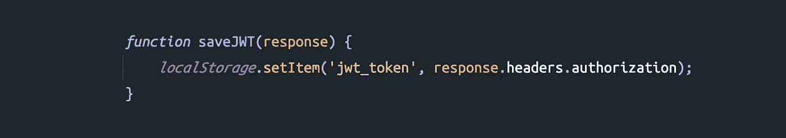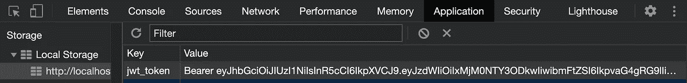

对于 React 应用程序发出的后续请求，将从本地存储中获取 JWT，并在 API 请求授权头中进行设置，以维护用户会话。

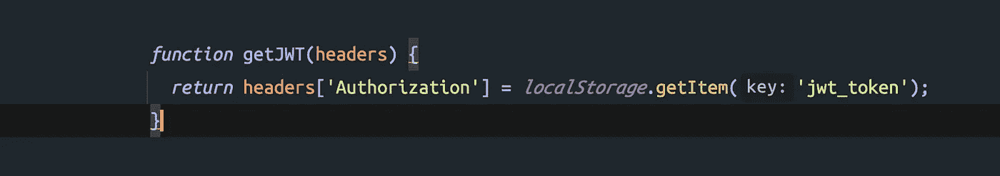

JavaScript 可以访问本地存储中的值，因此任何跨站点脚本都可以从本地存储中获取 JWT，并获得您的帐户访问权限。

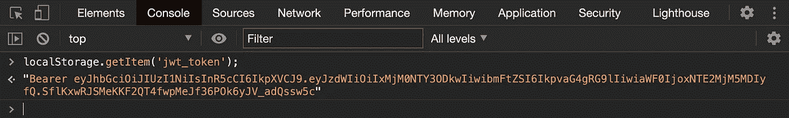

Script used to get local storage value

所以我们应该**不使用本地存储来存储** JWT。请更新您的身份验证体系结构，因为本地存储不安全，无法存储令牌。接下来，让我们来回忆一下

## **内存中的 JWT(反应状态)**

当应用程序刷新或在新标签页中打开时，React 状态变量将被赋予默认值。因此，如果默认值为 null，当应用程序刷新或在新标签中打开时，它将被设置为 null。所以当我们在状态变量中设置 JWT 时，它会消失。每次刷新应用程序或在新标签中打开应用程序或关闭应用程序时，用户都需要登录。会导致用户体验不佳。所以我们不能在状态变量中存储 JWT。

在转到 cookie 中的 **JWT 之前，让我们来看看什么是 cookie 及其主要属性。**

## **饼干**

cookie 是浏览器中另一个可用的存储选项，它有一个过期时间。cookie 还有一些有用的属性来保护它免受跨站点脚本(XSS)攻击。让我们详细看看它们是什么。

## **HttpOnly**

JavaScript 无法访问具有 HttpOnly 属性的 cookie，因此我们无法获得如下 cookie。

```
let cookie= document.cookie;
```

**HttpOnly** cookie 只能由服务器端脚本设置和访问。如果使用 **SameSite=strict 设置，该属性有助于防止跨站点脚本(XSS)攻击。**

## **安全**

具有**安全**属性的 cookie 将仅通过 HTTPS 请求发送到服务器，而不是通过 HTTP 请求。 **Secure** cookie 在请求和响应中被加密，因此通过使用 **Secure** 属性和 **HttpOnly** 和 **SameSite=strict 来防止**中间人**攻击。**

## **同一地点**

一个带有 **SameSite=strict** 的 cookie 提到该 cookie 只适用于同一站点源请求，不适用于跨站点请求。现在让我们看看如何使用 cookie 来存储 JWT。

## **饼干里的 JWT**

cookie 可以在服务器端设置，也可以在客户端设置，首先我们可以看到如何在 React 和使用浏览器控制台设置和获取 cookie 中的 JWT。

服务器将 JWT 设置为授权响应报头中的承载令牌。在客户端，脚本可以访问报头中的令牌。我们从响应头中获取令牌，并将其设置在 cookie 中，如下所示。

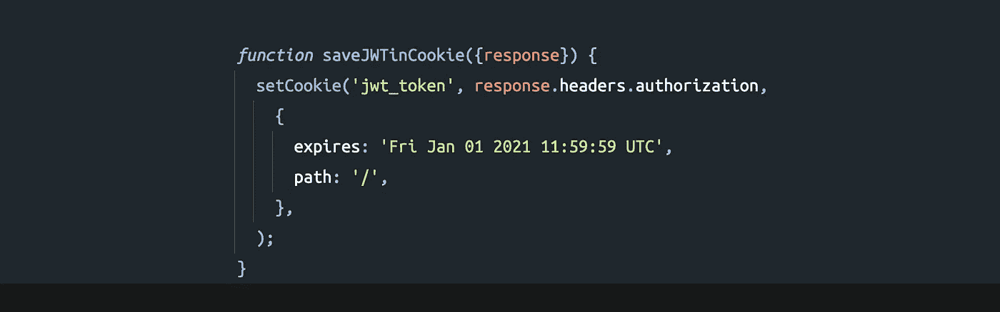

Using React

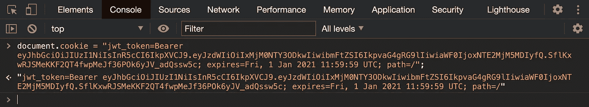

Using Browser console

默认情况下，cookie 设置为当前域，到期日期设置为 2021 年 1 月 1 日。到期日基于令牌有效性，因此一旦到期日到来，令牌将从浏览器 cookie 中删除。

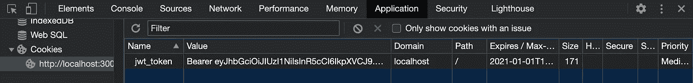

cookie 需要在客户端发出的每个请求的 API 请求头中作为一个承载令牌发送。因此，为此，我们可以使用下面的 **document.cookie** 属性从 cookie 中获取它。

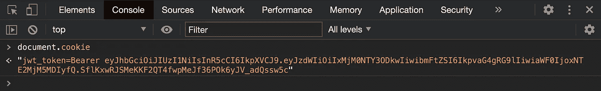

document.cookie 将返回域中存在的所有 cookie，因此我们可以使用 [react-cookie](https://github.com/reactivestack/cookies/tree/master/packages/react-cookie) 包来获取特定的 cookie，如下所示。


正如我们可以看到的，令牌是使用脚本设置和获取的，因此我们可以得出结论，在 react 中处理 JWT 将导致 XSS(跨站点脚本)攻击，就像我们之前在使用本地存储时看到的一样，但我们之前看到了两个属性 **HttpOnly** 和 **Secure** ，通过设置这些属性可以避免这些攻击。但是 JavaScript 无法访问 **HttpOnly** 属性，只有服务器端脚本可以访问 **HttpOnly** 属性。让我们看看如何从服务器端设置 JWT。

> 在前面的例子中，我们看到 JWT 在授权头中被设置为承载令牌，但是在服务器端处理 cookie 我们需要在 **Set-cookie** 头中设置 Cookie，并且不需要提到令牌类型为**承载**，我们可以直接在 **Set-Cookie 中设置 JWT。**

在这里，我使用 Express 从服务器将 JWT 设置在 cookie 中，我们将 **secure** 和 **HttpOnly** 设置为 **true** 以限制 JWT 在 cookie 中的 JavaScript 访问，如下所示。

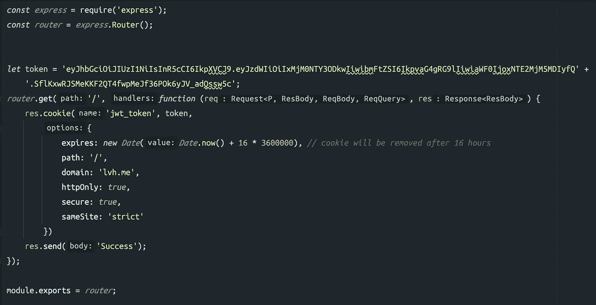

API 响应 **Set-Cookie** 头中的令牌将保存到浏览器 Cookie 中，如下图所示。

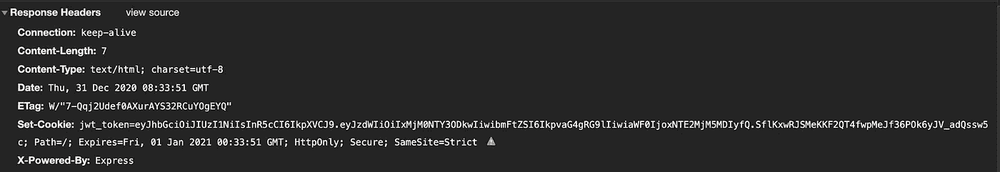

JWT in Set-Cookie

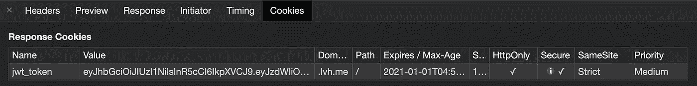

存储在 cookie 中的 JWT 将自动追加到每个 API 请求头中，如下图所示。

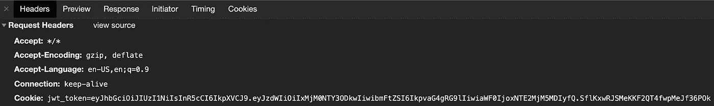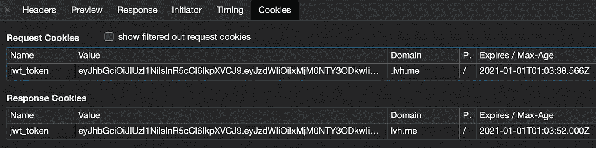

> 但是请记住，只有当 React 应用程序和后端服务器位于同一个域中时，这种方法才有效。

现在，您的应用可以免受跨站点脚本(XSS)攻击。