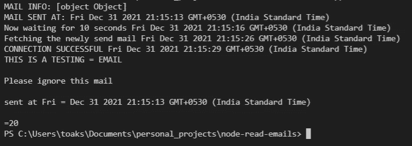

# 如何使用 Node.js 以最简单的方式发送和阅读电子邮件

> 原文：<https://javascript.plainenglish.io/how-to-send-and-read-emails-using-node-js-the-easiest-way-48e137ea8eb4?source=collection_archive---------0----------------------->

## 使用 Nodemailer 发送电子邮件，使用 IMAP 库阅读。

嗨，伙计们，这篇文章介绍了发送电子邮件，然后使用两种不同的服务阅读它们。对于发送电子邮件，我将使用 Nodemailer，对于阅读/解析电子邮件，我将使用 IMAP 库。现在让我们进入流程。


Photo by [Stephen Phillips - Hostreviews.co.uk](https://unsplash.com/@hostreviews?utm_source=medium&utm_medium=referral) on [Unsplash](https://unsplash.com?utm_source=medium&utm_medium=referral)

# 步骤 1:设置发送和接收邮件的配置。

我创建了一个 config.js 文件来存储这两个服务的配置对象。文件代码非常简单，看起来像。

# 步骤 2:设置电子邮件发送服务

要通过 node-mailer 发送邮件，我们需要创建一个 transporter 对象，其配置在 config 对象中定义，如前所示。它主要关注 4 个参数，即

1.  发件人//发件人
2.  收件人//发送至，可以是收件人数组
3.  主题//邮件主题
4.  HTML//HTML 主体(如果有模板的话)
5.  text //您要发送的文本(也可以与 HTML 一起使用)

邮件发出后，我们会在文章末尾打印详细信息和交叉验证结果的时间。

# 步骤 3:创建邮件阅读服务

这个文件解释起来相当复杂。我会尽力解释这里发生的事情。

> 第 5 行的 readMail 函数是 imap 服务的包装器，它本身使用回调。文档中的代码很难理解。为了更好的可读性，我将其转换为使用异步 await 语法。
> 
> 当该函数启动时，我们试图与我们传递的邮件配置建立连接。如果连接成功，我们打印信息。否则，它会捕获块并打印错误。
> 
> 第 10 行的 searchCriteria 用于确定我们正在查看的邮件类型。它可能是可见的，也可能是不可见的，同时你可以传递一个自定义配置，比如

```
const searchCriteria = [ 'UNSEEN', ['SINCE', 'May 20, 2021']
// Meaning to fetch all the mails unread emails since May 20, 2021
```

> 获取选项定义了我们希望过滤的电子邮件内容。对于我的例子，我包括了标题和文本部分。markSeen 设置为 true 时将获取未读邮件(如果 searchCriteria 不可见)，然后将它们标记为已读。
> 
> 第 15 行的结果返回了大量需要解析的数据。第 15 行之后的代码完全取决于您要搜索的内容。您可以使用 regex 提取相关数据，但它可能并不总是有效。

因为我在第 15 行后提到过，你需要一个自定义代码功能来定位你正在寻找的邮件的确切部分。我瞄准了邮件的文本，以便我们可以验证我们发送的内容和我们收到的内容。

给定搜索条件和 fetchOptions，这就是阅读邮件所需做的全部工作。

# 步骤 4:组装所有模块

因此，在这一部分，出于演示的目的，我将简单地发送一封邮件，等待 10 秒钟，并尝试阅读已发送的邮件。主 app.js 文件也非常简单。

最后让我们看看输出



请注意执行程序流的时间段。

邮件是在 21 点 15 分 13 秒发出的

程序将等待的信息在 21 点 15 分 16 秒到达

超时后，在 21:15:26 [10 秒]
开始获取详细信息，在 21:15:29 [3 秒]连接成功

程序完全按照提到的那样工作。最后需要注意的是，我使用了一个名为 html-to-text 的库来将 html 转换成文本。这就是阅读和发送邮件有多简单。对于其他信息，这里有一些可能对你有用的链接。

***链接到完整代码***

[](https://github.com/akshay271703/node-email-read-send) [## GitHub-akshay 271703/节点-电子邮件-阅读-发送

### 此时您不能执行该操作。您已使用另一个标签页或窗口登录。您已在另一个选项卡中注销，或者…

github.com](https://github.com/akshay271703/node-email-read-send) 

***IMAP 包***

[](https://www.npmjs.com/package/imap) [## 交互邮件访问协议

### node-imap 是 node.js 的 imap 客户端模块。这个模块不执行任何魔法，比如自动解码…

www.npmjs.com](https://www.npmjs.com/package/imap) 

***node mailer 包***

[](https://nodemailer.com/about/) [## 节点邮件程序

### Nodemailer 是 Node.js 应用程序的一个模块，可以轻松发送电子邮件。该项目始于…

nodemailer.com](https://nodemailer.com/about/) 

***html 转文本包***

[](https://www.npmjs.com/package/html-to-text) [## html 到文本

### 先进的转换器，解析 HTML 并返回美丽的文字。内联和块级标记。具有列跨度的表格和…

www.npmjs.com](https://www.npmjs.com/package/html-to-text) 

*更多内容看* [*说白了就是*](http://plainenglish.io/) *。报名参加我们的* [*免费每周简讯*](http://newsletter.plainenglish.io/) *。在我们的* [*社区不和谐*](https://discord.gg/GtDtUAvyhW) *获得独家获得写作机会和建议。*