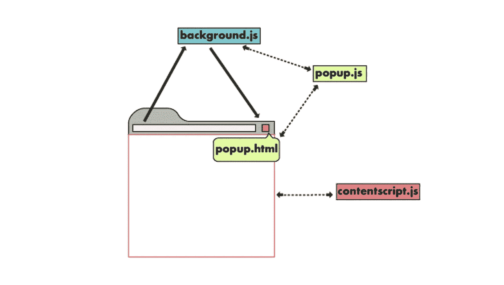

# 如何在 Chrome 扩展脚本之间发送数据

> 原文：<https://javascript.plainenglish.io/how-to-send-data-between-chrome-extension-scripts-1182ce67b659?source=collection_archive---------1----------------------->

## 一次性消息传递和长期连接


# 介绍

如果你想创建一个具有复杂功能的 Chrome 扩展，很可能你需要你的背景、内容和弹出脚本一起工作并相互作用。

在本教程中，我想解释我们如何用一次性消息和长期连接在 Chrome 扩展的不同组件之间发送数据。

在继续阅读之前，由于这篇文章只讨论了消息传递，你应该已经很好地了解了如何创建一个 chrome 扩展并上传到 Chrome 扩展页面进行测试。

本教程将使用清单 v3 编写。与 v2 的一个很大区别是使用 async/await 的能力。但是如果你使用 v2，你可以只使用回调而不是 async/await。

# 架构的简要概述

要真正理解不同组件之间的消息传递是如何工作的，理解一个扩展的架构并知道每个部分负责什么是很重要的。

对于扩展，我们关心 3 个主要组件:

*   UI 元素
*   背景脚本
*   内容脚本



[https://developer.chrome.com/docs/extensions/mv3/architecture-overview/](https://developer.chrome.com/docs/extensions/mv3/architecture-overview/)

UI 元素是单击扩展图标时显示的内容，它可以包含一个 JavaScript 文件(popup.js ),这使得它可以与用户交互。然而，由于 JavaScript 逻辑仅用于弹出窗口，它不能应用于用户当前查看的实际网页。

为了操作和阅读网页，我们需要使用内容脚本。内容脚本将在加载到浏览器中的页面的上下文中执行，因此，如果我们想要更改某些信息或站点的美观性，它将非常有用。

最后，后台脚本(或 v3 中的 service worker)主要用于事件处理。它被加载一次，如果没有感兴趣的事件被触发，它就保持空闲。它不能直接访问 DOM，但是对于拦截站点的传出和传入请求非常有用。

正如您所看到的，所有 3 个组件有不同的用途，它们可以在浏览器中访问不同的内容。因此，我们需要让它们相互对话，并对不同的消息做出反应，以实现复杂的功能。

需要记住的一个关键点是，内容脚本存在于当前活动选项卡的上下文中。因此，任何时候我们想要从弹出窗口或后台脚本与内容脚本通信，我们都需要指定将消息发送到哪个选项卡，对于一次性消息和长期连接都是如此。

# 一次性消息

如果您希望向扩展的其他部分发送单个消息，一次性消息非常有用。您可以从内容脚本向 popup 发送一次性请求，反之亦然，并对回复消息做出反应。

从高层次上来说，这个想法是，其中一个脚本将作为消息发送者，而接收者将设置一个消息监听器来监听任何传入的消息。当收到消息时，侦听器运行，并可以选择向消息发送方发回响应。使用`chrome.runtime.onMessage.addListener`添加监听器。

根据接收者的不同，Chrome 为我们公开了两种方法:`chrome.runtime.sendMessage`和`chrome.tabs.sendMessage`。知道何时使用哪种方法很重要。

当向内容脚本发送消息时，我们需要指定将消息发送到哪个选项卡。因此，我们需要先检索活动选项卡信息，然后使用`tabs.sendMessage`。要使用选项卡 API 并访问活动选项卡，您需要在您的`manifest.json`中的权限下添加`tabs`和`activeTab`。

如果我们从内容脚本发送消息，那么我们应该使用`runtime.sendMessage`,因为我们想把它发送到应用程序或扩展页面。

上面的代码显示了一个扩展的弹出动作如何触发站点外观的改变。当用户点击`sendMessageButton`时，处理程序将查询当前活动的选项卡，并使用`sendMessage`向该选项卡的内容脚本发送消息。

该方法接受 3 个参数:

*   **标签 Id:** 活动标签 Id
*   **消息**:可以是包含数据的 JSON 对象
*   **响应回调**:接收方回复后运行的函数

在`content.js`端，也就是接收者，它需要监听传入的消息。这是通过使用`chrome.runtime.onMessage.addListener`设置一个监听器来完成的。listener 函数是这样一个函数:

```
(message: any, sender: [MessageSender](https://developer.chrome.com/docs/extensions/reference/runtime/#type-MessageSender), sendResponse: function) => {...}
```

message 参数是使用`sendMessage`发送的消息发送者，sender 是一个包含发送消息的脚本上下文信息的对象，而`sendResponse`是一个函数，它接受一个 JSON-fiable 对象来回复发送者。

如果您正在从内容脚本向弹出窗口发送消息，那么您只需要使用`chrome.runtime.sendMessage`而不是`tabs.sendMessage`。`runtime.sendMessage`没有将页签标识作为第一个参数，但是函数签名的其余部分与`tabs.sendMessage`相同。接收方代码保持不变:`chrome.runtime.onMessage.addListener`。

`popup.js`中可以有多个元素向接收者发送不同的消息，以对用户正在查看的当前活动网站执行不同的操作。

# 长期联系

长寿命连接允许您打开比单个请求持续时间更长的连接。您可以分别使用`runtime.connect`和`tabs.connect`进行操作。

让我们直接进入打开从弹出窗口到内容脚本的连接的代码:

popup.js

在第 8 行，我们打开了一个到活动标签的内容脚本的连接，我们传递了一个带有名称字段的 JSON 对象。该名称字段允许我们区分多个开放连接(如果您的分机有)。`connect`方法返回一个端口对象，我们可以用这个对象通过`port.postMessage`发送消息，也可以选择添加一个`onMessage`监听器来监听任何回复。

在第 14 行，我们将向接收端发送一条消息(内容脚本)。该消息是一个 JSON 对象，包含您想要的任何数据。在我们的例子中，我们正在传递`idInput`输入框的值。

在第 18 行，我们正在设置`onMessage`监听器，当接收者回复时会被触发。我们希望回复信息有一个`exists`字段，我们将根据该值将按钮背景颜色设置为绿色或黄色。

content.js

为了监听传入的消息，我们需要在`runtime.onConnect`事件监听器中实现监听器功能，这对于`popup.js`和`content.js`都是一样的。

当调用`.connect`、`onConnect`事件的弹出脚本被激发时，一个端口对象被包含在监听器中。我们可以使用这个对象使用`.onMessage.addListener`添加消息监听器，或者使用`port.postMessage`回复。

在第 3 行，我们检查端口对象的名称。可以想象，您可能有其他不同名称的连接，这是您可以定制内容脚本行为的地方。然后，监听器试图在活动页面上找到一个 ID 来自`msg`对象的元素。这个`msg`对象是从弹出菜单传入`postMessage`的参数。

在第 6 行和第 10 行，我们向发件人发回了一条消息。这将启动在`popup.js`中定义的`onMessage`监听器，完成通信周期。

# 结论

如果您试图创建一个具有复杂功能的扩展，希望本教程能对您有所帮助。关于消息传递的更深入的信息， [Chrome 文档](https://developer.chrome.com/docs/extensions/mv3/messaging/)总是真实的来源。

***感谢阅读！***

*更多内容请看*[*plain English . io*](http://plainenglish.io/)