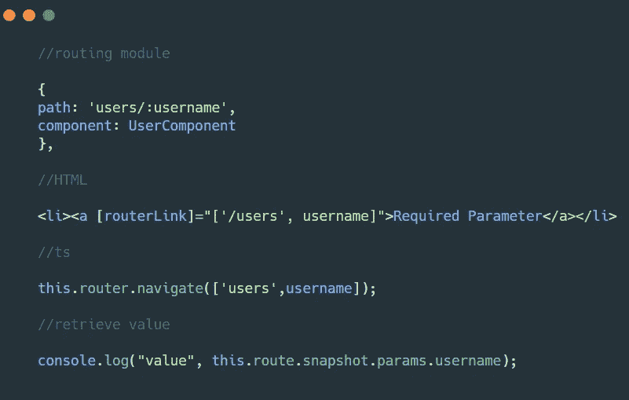
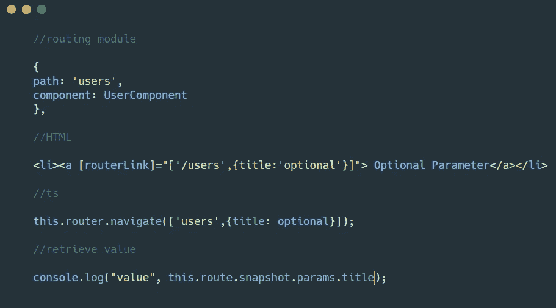
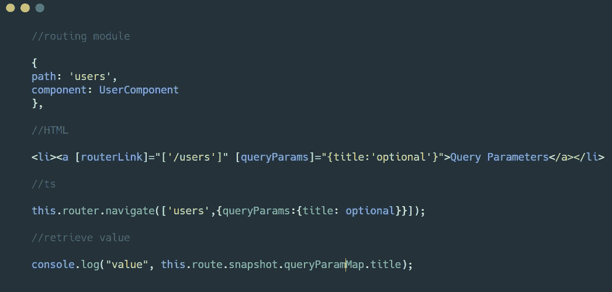
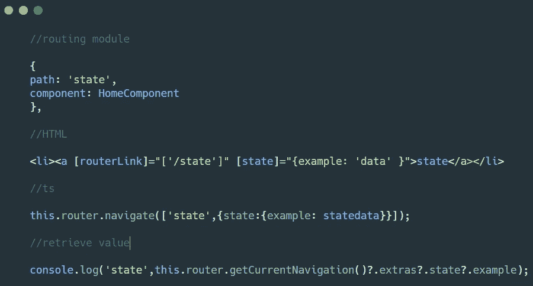

# 如何在 Angular 中通过路由路径发送数据

> 原文：<https://javascript.plainenglish.io/how-to-send-data-through-routing-paths-in-angular-8db09af7e755?source=collection_archive---------12----------------------->

## 每日角度提示、技巧和最佳实践

作为开发人员，学无止境。我们总是需要与时俱进的技术，以及即将到来的或当前的市场趋势特征。

Photo by [Ben White](https://unsplash.com/@benwhitephotography?utm_source=medium&utm_medium=referral) on [Unsplash](https://unsplash.com?utm_source=medium&utm_medium=referral)

最近，我在寻找最好的技术来写干净和优化我的 angular 代码。我看了很多文章，我们知道，是无限的。然后我想到用不同的基本角度的主题来巩固清单，这些主题对我有帮助，将来也可能对别人有帮助。

这些小文章不仅能帮助你写出更好更干净的 Angular 代码，还能让你清楚前端技术的概念。这将有助于你建立强大的基础，并能在即将到来的前端面试中帮助你。

> *让我们进入主要讨论。*

**在组件之间传递数据**是我们在前端开发中的常见任务之一。有时，当我们的应用程序中没有维护状态时，我们可以使用角度路由器特性在组件之间传递数据。

我们可以使用支持路由状态的`@angular/router`和接受类似于`queryParams`的对象文字的 **navigationExtras** 来实现这一点

让我们来看看实现这些功能的不同方法。

## 1.使用所需的路由参数:

## 2.使用路由可选参数:

## 3.使用路线查询参数:

## 4.使用路线导航附加

# **你可以在这里查看我以前的文章:**

*更多内容请看*[***plain English . io***](http://plainenglish.io/)