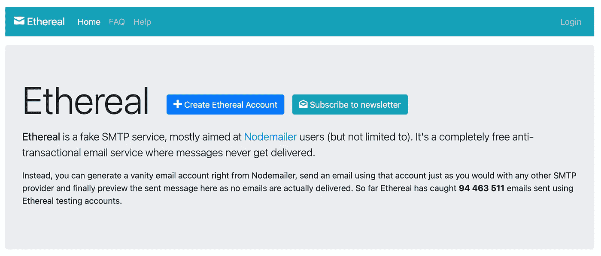
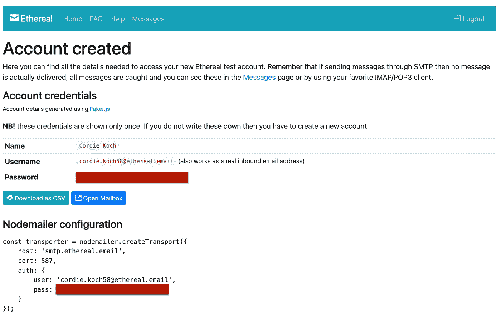

# 如何用 Nodemailer 发送电子邮件并举例说明

> 原文：<https://javascript.plainenglish.io/how-to-send-email-with-nodemailer-with-examples-356b348dccac?source=collection_archive---------3----------------------->


Photo by [Campaign Creators](https://unsplash.com/@campaign_creators?utm_source=medium&utm_medium=referral) on [Unsplash](https://unsplash.com?utm_source=medium&utm_medium=referral)

如果你正在使用 Node.js 作为你的后端开发技术，并且希望给你的客户发送电子邮件，本教程将在开发过程中帮助你。

# Nodemailer 简介

Nodemailer 是 Node.js 开发的一个非常好的模块，它使得发送电子邮件变得非常容易。

许多 Node.js 开发人员使用 Nodemailer 作为他们的默认电子邮件模块。因为它很容易集成到您的应用程序中，并且有许多令人惊叹的功能。

这是一个零依赖性的单一模块，是安全的，有表情符号支持😎并支持 SMTP 服务器配置。

## 要求

Node.js v6.0.0 或更新版本

**如果你还没有 Node.js 项目，**你可以看看我的其他教程马上开始。这里有一个完整的初学者 Node.js(速成)教程，可以让你熟悉基础。

[](/express-js-getting-started-basic-routing-938d8b629fe2) [## 快速入门和基本路线

### 什么是 Express.js？Express.js & installation 入门，并学习如何使用实现基本路由…

javascript.plainenglish.io](/express-js-getting-started-basic-routing-938d8b629fe2) 

## 发送电子邮件

用最基本的步骤发送电子邮件，我们需要做什么

*   安装节点邮件程序
*   使用 SMTP 或其他传输机制创建节点邮件传输器
*   创建电子邮件选项(发送什么、发送谁、发送谁)
*   使用 Nodemailer transporter 中创建的 sendMail 方法发送电子邮件

## 例子

**创建示例节点邮件传输器**

```
*const* transporter = Nodemailer.*createTransport*({
  host: 'smtp.ethereal.email',
  port: 587,
  secure: *false*,
  requireTLS: *true*,
  auth: {
    user: 'ethereal.username',
    pass: 'ethereal.password',
  },
  logger: *true* });
```

**发送电子邮件示例**

```
*// send mail with defined transport object
let* info = *await* transporter.sendMail({
  from: '"Fred Foo 👻" <foo@example.com>', *// sender address* to: "bar@example.com, baz@example.com", *// list of receivers* subject: "Hello ✔", *// Subject line* text: "Hello world?", *// plain text body* html: "<b>Hello world?</b>", *// html body* });
```

## 使用示例凭据进行测试

为了能够马上测试它，我们可以使用 [**以太邮件**](https://ethereal.email/) 服务

打开 Ethereal 网站后，可以点按“创建 Ethereal 帐户”。



Ethereal 将为您创建一个虚拟电子邮件服务，您可以立即使用 **Nodemailer** 。正如您在下图中看到的，Ethereal 甚至为您创建了一个 Nodemailer 配置，我们将在我们的示例中使用它。



创建 Ethereal 帐户后，我们可以更新现有的示例代码，并开始测试 Ethereal 服务。

## 完整示例

下面是带有 TypeScript 的 Express 应用程序示例，它能够使用 Nodemailer。每当用户点击`/`路线，我们就通过 Ethereal 发送一封电子邮件。

这就是能够通过 Node.js 发送电子邮件所需的全部内容。您可以为您的环境创建另一个 SMTP 凭据，并开始向✉️.发送电子邮件\

*如果您觉得这篇文章很有帮助，您可以通过使用我的推荐链接注册一个* [***中级会员来访问类似的***](https://melihyumak.medium.com/membership) *。*

***跟我来*** [**推特**](https://twitter.com/hadnazzar)


Subscribe for more on [Youtube](https://www.youtube.com/c/TechnologyandSoftware?sub_confirmation=1)

# 快乐编码！

Melih

*更多内容参见* [***普通英语。io***](http://plainenglish.io/)