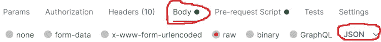

# 如何用 Postman 发送加密数据

> 原文：<https://javascript.plainenglish.io/how-to-send-encrypted-data-with-postman-6d5a052e21f5?source=collection_archive---------1----------------------->

## 用 crypto-js 加密数据，用内置的 Node.js 加密模块解密。


Photo by [Bundo Kim](https://unsplash.com/@bundo?utm_source=medium&utm_medium=referral) on [Unsplash](https://unsplash.com?utm_source=medium&utm_medium=referral)

***必备:****JavaScript、Node.js 知识，以及* [*邮差*](https://www.postman.com/downloads/) 基础知识

最近，我开始与一个项目的后端交互，该项目只接受[加密的](https://en.wikipedia.org/wiki/Encryption)dat——也就是说，明文在被发送到后端之前被转换成[密文](https://en.wikipedia.org/wiki/Ciphertext)。在后端，密文被解密回明文。后端是用 Java 写的，所以我考虑了如何用 Node.js 来完成这个。

由于我以前没有做过这样的事情，我不得不做一些研究，看看这是如何做到的。一旦我发现了我要找的东西，我就必须检验我的发现。在不创建前端的情况下测试 API 的最快方法是使用 [Postman](https://www.postman.com/downloads/) 。

> 根据 [BlazeMeter](https://www.blazemeter.com/blog/how-use-postman-manage-and-execute-your-apis) **的说法，Postman** 是一个流行的 API 客户端，可以让开发者轻松创建、共享、测试和记录 API。这是通过允许用户创建和保存简单和复杂的 HTTP/s 请求，以及读取它们的响应来实现的。结果是，工作效率更高，更简单。

即使我有使用 Postman 的经验，我也不知道如何在发出请求之前加密数据。因此，我开始了另一轮研究，并在 Postman 上发现了一个名为**预请求脚本的标签。**顾名思义，这是一个在发送请求之前运行的脚本。


Orange underlined tab

此外，Postman 预装了一些流行的 JavaScript 包，这些包可以在处理数据的预请求脚本中使用。其中一个包是 [crypto-js](https://cryptojs.gitbook.io/docs/#ciphers) ，我们将使用它来加密请求前脚本中的数据。现在让我们看看如何在下面的代码中使用[crypto-js](https://cryptojs.gitbook.io/docs/#ciphers)AES 规范加密数据:

Pre-request Script encryption code

我想你已经让邮递员开门了。因此，导航到**预请求脚本**选项卡，将上述代码复制粘贴到其中。现在，让我们单步执行代码。

我们只需要`line 1`上的`crypto-js`,因为包裹存在于 Postman 上。对于 AES(默认为 AES256)加密，我们需要 32 字节(256 位)的`key`和 16 字节(128 位)的`iv`，因此在`line 4`上，我们生成 16 个随机字节作为`IV(Initialization Vector)`。

> *初始化向量应该是不可预测的和唯一的，通常要求是随机的或伪随机的—* [*密码*](https://nodejs.org/en/knowledge/cryptography/how-to-use-crypto-module/#ciphers)

在`line 8`上，我们找到密钥字符串的 sha-256 散列，这返回 32 个字节(256 位)用作`key`。现在我们有了`key`和`iv`，我们进入`encrypt`函数。在`line 11`上，我们首先用`JSON.stringify`将数据(它将是一个对象)转换成一个字符串，然后我们将结果字符串转换成一个[字数组](https://www.davidebarranca.com/2012/10/crypto-js-tutorial-cryptography-for-dummies/#word-array-and-encodings)，这样`AES.encrypt`方法将能够处理它。

从`line 12`到`14`，我们将`key`、`iv`和`val`(现在是一个字数组)传入 AES 加密方法，最后将其转换为 base64，这样就完成了`encrypt`函数的声明。

现在，是我们使用`encrypt`函数的时候了，这就是我们在`line 20`上所做的，`line 17`上的 JSON 数据将是我们的原始请求数据，作为参数传递给`encrypt`函数，产生的 base 64 字符串被设置在名为`“encrypted”`的 [Postman 局部变量](https://learning.postman.com/docs/sending-requests/variables/)中。此外，`IV`(初始化向量)必须被传递到后端，这就是我们在`line 21`，`IV`上所做的，被转换成一个字符串，然后被设置到另一个名为`“IV”`的 Postman 局部变量上。

接下来，我们将完成我们的预请求脚本。现在让我们看看如何在请求体中使用两个 Postman 局部变量(“encrypted”和“IV”)。

首先，我们切换到 Postman 上的`body`选项卡，将数据格式设置为 JSON。



body tab on postman

然后，我们添加一个请求体，并从我们的预请求脚本中访问 Postman 局部变量，方法是将变量名用双花括号括起来，就像这样`*{{variable_name}}*`。在我们的预请求脚本中有两个局部变量(“encrypted”和“IV”)。下面让我们看看如何访问它们。

```
{ "encrypted": "*{{encrypted}}*", "IV": "*{{IV}}*"}
```

在上面的代码中，我们通过用双花括号(`*{{encrypted}}*` *)* 将`“encrypted”`局部变量值括起来，然后将其设置为名为“encrypted”的 JSON 键(JSON 键可以随意命名)来访问它。本地变量`“IV”`也是如此。现在我们准备好从 Postman 发送加密数据，但是我们没有后端来接收它。让我们解决这个问题。

Node decryption code

我们的 Node.js 后端已经设置在 CodeSandbox 上。现在让我们看看那边发生了什么。

我们将使用内置的 Node.js `crypto`模块进行解密，使用`express`模块处理 HTTP 请求。我们的下一个关注点是解密处理程序，我们[析构](https://developer.mozilla.org/en-US/docs/Web/JavaScript/Reference/Operators/Destructuring_assignment#object_destructuring)请求体(`req.body`)并从中取出“加密”和“IV”密钥。接下来，我们找到变量“keyString”的 sha256 散列(与 Postman 上使用的 keyString 相同)，这相当于我们在 Postman 的预请求脚本上使用 crypto-js 所做的，但是在这种情况下，我们得到一个 32 字节的缓冲区作为`key`，这个缓冲的密钥然后被用作`crypto.createDecipheriv()`方法中的[加密密钥](https://en.wikipedia.org/wiki/Key_(cryptography))。

接下来，我们将`IV`和`encrypted`数据转换到一个缓冲区，并将它们传递到各自的方法中，然后运行解密。你可以在这里阅读解密是如何工作的[。现在，我们要做的最后一件事是在返回响应之前向对象添加一个额外的属性，以验证请求在后端得到了解密。](https://nodejs.org/en/knowledge/cryptography/how-to-use-crypto-module/#ciphers)

最后，我们需要一种从 Postman 连接到 CodeSandbox 的方法，这将通过 CodeSandbox 的浏览器 URL 来完成。在我的例子中，它是`https://m98ph.sse.codesandbox.io`，然后解密处理程序的路径名是`/decrypt`，这意味着在 Postman 上使用的最终 URL 将是`https://m98ph.sse.codesandbox.io/decrypt`。现在，邮递员应该看起来像这样。


postman pointing at codesandbox

现在剩下的就是发送一个 **POST** 请求，我们应该会得到类似这样的响应。


Decryption response

万岁！我们已经成功地加密了数据，将它发送到服务器，解密它，处理它，并发回响应。希望你能得到类似这样的回答。如果没有，你可以回溯，看看你可能错过了什么。

## 摘要

总之，我们看到了如何在 Postman 上创建一个`Pre-request Script`,如何为 Postman 局部变量设置值，以及如何在请求体上利用局部变量。我们还学习了如何在客户端用`crypto-js`加密，在服务器端用 Node.js `crypto`模块解密。

此外，我们看到了如何将 CodeSandbox 用作服务器端主机，如果你问我，我会觉得这很棒。

## 参考和有用的链接

*   **如何使用加密模块**——[https://nodejs . org/en/knowledge/cryptography/How-to-use-crypto-module](https://nodejs.org/en/knowledge/cryptography/how-to-use-crypto-module)
*   **Crypto-js 教程**—[https://www . davidebarranca . com/2012/10/Crypto-js-Tutorial-cryptography-for-dummies](https://www.davidebarranca.com/2012/10/crypto-js-tutorial-cryptography-for-dummies/#word-array-and-encodings)
*   **如何使用 Postman**—[https://www . blaze meter . com/blog/How-use-Postman-manage-and-execute-your-API](https://www.blazemeter.com/blog/how-use-postman-manage-and-execute-your-apis)
*   **使用邮递员变量**—[https://learning . Postman . com/docs/sending-requests/variables/](https://learning.postman.com/docs/sending-requests/variables/)

***附言——****请不要犹豫，在下面留下您的问题和建议。你也可以通过*[*Twitter*](https://twitter.com/baystizzle)*联系我，如果你想亲自问我或者联系我。*

感谢阅读！

[*更多内容尽在 plainenglish.io*](http://plainenglish.io/)