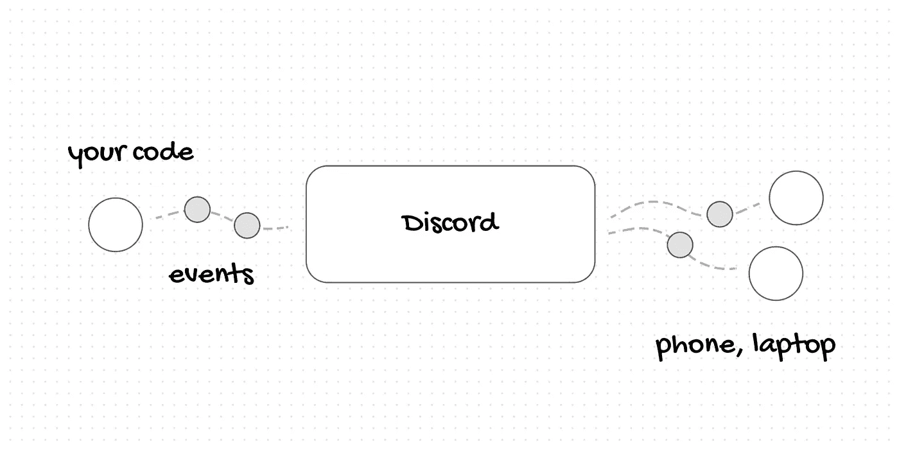
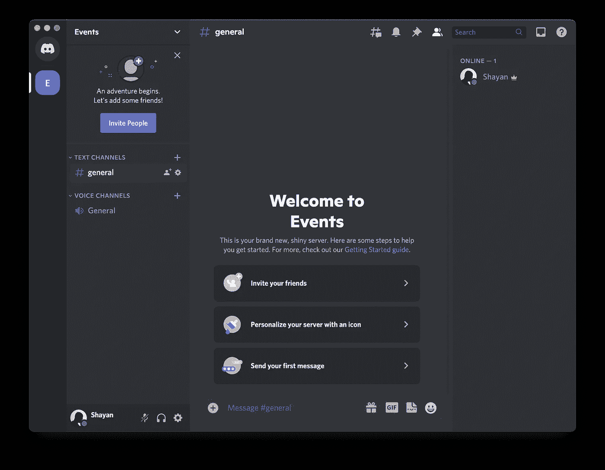
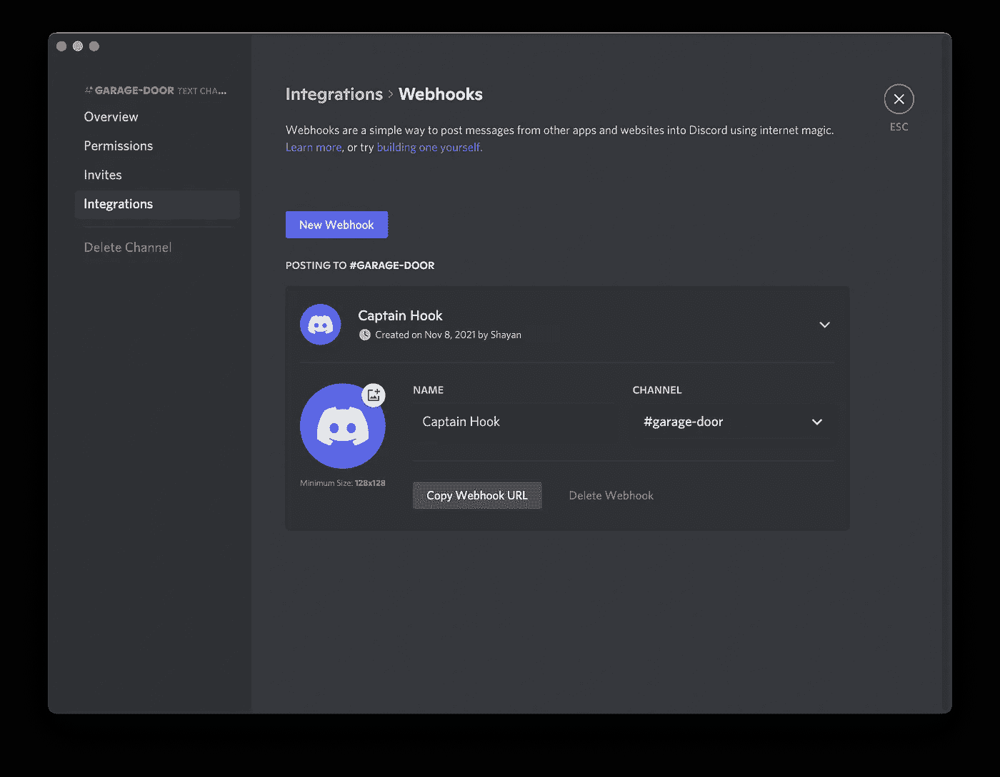

# 如何通过 Python 或 JavaScript 将您的事件和日志发送到 Discord

> 原文：<https://javascript.plainenglish.io/how-to-send-your-events-and-logs-to-discord-via-python-or-javascript-6be2859234c2?source=collection_archive---------14----------------------->



在我的软件开发生涯中，有很多次当我的项目中发生一些事情时，我想得到即时的更新和提醒。

以此为例；您正在开发一个 SaaS，并且有多个有价值的事件，您希望在它们发生时立即知道。例如，用户加入你的等待名单或简讯，用户注册，产品销售和用户转换。不得不在远程机器上运行长时间的训练或爬行任务是另一种情况，我需要即时更新进度，以及是否有什么地方出错了。我的意思是，你可以定期检查机器，看看事情进展如何，但我宁愿完全忘记它，让它给我发送更新。最后一个例子是当我想通过 raspberry pi 自动化我的车库门时，我想知道车库门什么时候打开、关闭，或者开了太久。

那么我为什么要给你们讲这些例子呢？我希望你开始思考类似的情况，你可能也需要一种方法来给自己发送即时更新，并在一个地方拥有所有这些事件的历史记录。

不和谐让这个问题相对容易解决！我们可以专门创建一个 Discord 服务器，为我们的项目创建单独的频道，并使用 webhook URL 来推送我们的活动！

首先，我们需要那个不和谐服务器。登录 Discord，点击**添加服务器**按钮，开始创建您自己的服务器。一旦完成，您应该能够看到并打开您的 Discord 服务器



为了更容易组织我的项目和事件，我通常为每个项目创建一个新的文本通道，或者在某些情况下，为每种类型的事件创建一个文本通道。为此，点击文本频道旁边的 **+** 按钮并创建一个。我打算把我的叫做**车库门**，让它成为一个私人频道。

然后，点击该频道的设置图标，打开**集成**选项卡并创建一个新的 Webhook。添加后，您可以看到**复制 Webhook URL** ，这正是我们推送事件所需要的！所以把它复制并粘贴到你机器上的某个安全的地方。现在，我们基本上解决了不和谐的问题，我们可以开始写代码了！我已经提供了 Python 和 JavaScript 的例子；请随意跳到您认为更相关的内容。



# 通过 Python 发送事件

首先，我想将我的 webhook URL 作为环境变量传入，所以我将它设置为 **WEBHOOK_URL** ，并使用 python 中的标准库来访问该值。当然，您可以跳过整个过程，直接将您的 URL 添加到代码中。

```
export WEBHOOK_URL=https://discord.com/api/...
```

一旦我们设置了环境变量，我们就可以通过导入 **os** 并使用 **os.environ.get** 方法来访问它。

```
import osWEBHOOK_URL = os.environ.get('WEBHOOK_URL')
print(WEBHOOK_URL)
```

我将使用[请求](https://pypi.org/project/requests/)包来处理我的 HTTP 请求。您可以运行以下命令通过 PyPi 安装。

```
pip install requests
```

最后，我们需要做的就是导入**请求**并向 webhook url 发出 **POST** 请求，然后用**内容**键在 JSON 主体中传递我们的事件。

```
import requestsrequests.post(WEBHOOK_URL, { "content": "🦄 garage door is open" })
```

一旦我们运行这个代码，我们应该在**车库门**通道中得到一个新消息，告诉我们我们的车库门已经被打开了。


# 通过 JavaScript 发送事件

这里的过程与我们在 Python 中所做的非常相似。首先，为我们从 discord 复制的 webhook URL 定义一个名为 **WEBHOOK_URL** 的新环境变量。同样，您可以跳过这一步，直接将 URL 设置为一个变量。

```
export WEBHOOK_URL=https://discord.com/api/...
```

然后，读取这个值**process . env . web hook _ URL**并将其设置为一个变量。

```
const WEBHOOK_URL = process.env.WEBHOOK_URL
console.log(WEBHOOK_URL)
```

我将使用 Axios 包来处理我的 HTTP 请求。您可以通过运行以下命令，通过 NPM 安装。

```
npm i axios
```

最后，我们可以导入 **Axios** 并向 webhook url 发出 **POST** 请求，并在 JSON 主体中传递我们的事件。

```
import axios from 'axios';await axios.post(WEBHOOK_URL, { content: "💰 User sign up" })
```

一旦我们运行了这段代码，我们应该会在我们的 Discord 通道中看到另一条消息。


正如你所看到的，这个设置非常简单，而且非常强大！我在几乎所有的项目中使用这种设置来了解他们是如何做的！

我写过一篇类似的文章，用电报代替不和谐。如果你感兴趣，可以通过下面的链接查看:)

[](https://sh4yan.medium.com/use-python-or-javascript-to-send-your-events-and-logs-to-telegram-via-their-chatbot-api-57f407f2c7e3) [## 使用 Python 或 Javascript 通过其 Chatbot API 将您的事件和日志发送到 Telegram。

### 使用 Python 或 Javascript 来通知自己来自应用程序或脚本的日志和事件，只需几分钟…

sh4yan.medium.com](https://sh4yan.medium.com/use-python-or-javascript-to-send-your-events-and-logs-to-telegram-via-their-chatbot-api-57f407f2c7e3) 

*更多内容请看*[***plain English . io***](http://plainenglish.io/)